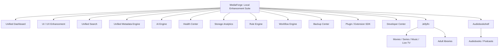
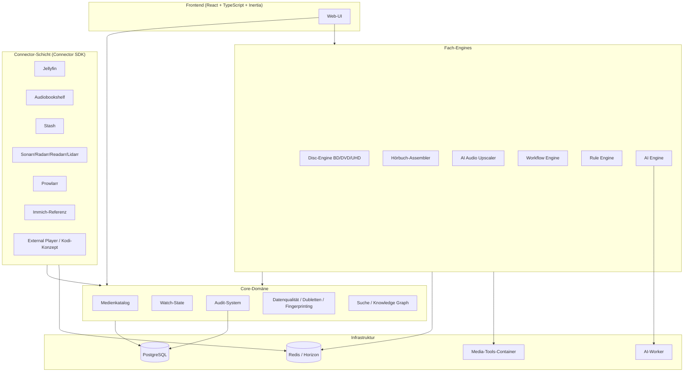

# MediaForge Master Engineering Specification

Status: Draft  
Target: Claude Code  
Language: de-AT  

Diese Datei ist die zentrale technische Spezifikation für MediaForge.

---

## Über dieses Dokument

Dieses Handbuch ist die verbindliche Engineering-Spezifikation für MediaForge, eine vollständig lokale Enhancement Suite für Jellyfin und Audiobookshelf. Es richtet sich an Senior Developer, die das System ohne weiteren mündlichen Kontext implementieren können sollen. Jedes Kapitel ist so geschrieben, dass Architekturentscheidungen nachvollziehbar begründet, Datenmodelle vollständig als PostgreSQL-DDL spezifiziert und Laravel-Klassen bis auf Interface-Ebene ausdefiniert sind.

Die Masterdatei — dieses Dokument — ist die einzige Einstiegsdatei. Sie enthält die Vision, den Technologie-Stack samt Begründung, die Gesamtarchitektur, die verbindlichen Architekturregeln, die Analyse der Referenzprojekte, die Dokumentkonventionen, das Glossar sowie das vollständige Inhaltsverzeichnis über alle Modul-Spezifikationen. Die eigentlichen Tiefenkapitel liegen in Unterordnern und sind aus dem Inhaltsverzeichnis am Ende dieser Datei verlinkt. Es existiert keine zweite Masterdatei und wird auch nie eine geben; dieses Dokument wird ausschließlich erweitert, nie ersetzt.

Wer das System implementieren will, liest in dieser Reihenfolge: zuerst diese Masterdatei vollständig, dann [architecture/overview.md](architecture/overview.md), dann [database/core-schema.md](database/core-schema.md), dann [modules/audit.md](modules/audit.md) — diese drei bilden das Fundament, auf dem alle übrigen Module aufbauen. Danach können die Fachmodule in beliebiger Reihenfolge gelesen werden, wobei jedes Modul seine harten Abhängigkeiten am Kapitelanfang deklariert.

---

## Vision und Produktumfang

### Offizielles Projektziel

MediaForge ist das offizielle Projekt. Das Projekt baut keine neue Medienplattform, keinen Jellyfin-Klon und keinen Audiobookshelf-Klon. MediaForge ist eine vollständig lokale Super-Erweiterung für bestehende Open-Source-Mediensysteme. Die Kernsysteme bleiben Jellyfin und Audiobookshelf; MediaForge erweitert sie, verbindet sie und stellt darüber professionelle lokale Verwaltung, Analyse, Automatisierung, Suche, Metadatenpflege, Backups, Health Checks, AI-Funktionen und UI-/UX-Verbesserungen bereit.

Die Zielarchitektur ist damit eindeutig:



### Lokal bedeutet lokal

Alle Kernfunktionen müssen ohne Cloudpflicht, ohne SaaS-Abhängigkeit und ohne Online-Zwang funktionieren. API bedeutet in dieser Dokumentation zuerst lokale Kommunikation zwischen lokalen Diensten: MediaForge zu lokaler Jellyfin-API, lokaler Audiobookshelf-API, lokaler Laravel-API, PostgreSQL, Redis, lokalen Worker-Containern und lokalen Dateien. Optionale externe Metadatenquellen sind erlaubt, wenn sie explizit als optional markiert sind. Externe AI-Dienste sind höchstens Zusatzoptionen; der Kern der AI Engine ist lokal gedacht.

### Systemgrenzen

Jellyfin bleibt zuständig für Filme, Serien, Musik, Live TV, normale Videobibliotheken, Adult-Bibliotheken, Playback, Transcoding, Client-Zugriff und Jellyfin-seitige Bibliotheksverwaltung. Audiobookshelf bleibt zuständig für Hörbücher, Podcasts, Kapitel, Fortschritt, Wiedergabe und Audiobookshelf-seitige Bibliotheksverwaltung. MediaForge verbessert beide Systeme, ersetzt sie aber nicht.

Stash ist kein Pflichtsystem. Stash wird nur noch als optionale Inspirationsquelle, optionale lokale Datenquelle, optionaler Importer oder optionale Migrationsquelle beschrieben. Der zentrale Adult-Bereich entsteht primär aus Jellyfin-Bibliotheken plus MediaForge Adult Enhancement.

### Ausgangslage

Wer heute eine große private Mediensammlung betreibt — Filme, Serien, Hörbücher, Musik, Fotos, Comics, E-Books, dazu Disc-Images von gekauften Blu-rays und DVDs — betreibt in der Praxis einen Zoo aus Spezialwerkzeugen: Jellyfin oder Plex für Video, Audiobookshelf für Hörbücher, Immich für Fotos, Kavita oder Komga für Comics, Stash für Adult-Content, dazu die *arr-Familie (Sonarr, Radarr, Readarr, Lidarr, Prowlarr) für Beschaffung und Bibliothekspflege. Jedes dieser Werkzeuge ist in seiner Nische exzellent. Aber sie teilen keinen gemeinsamen Zustand: Watch-States leben in Jellyfin, Hörfortschritte in Audiobookshelf, Metadaten-Korrekturen werden in jedem System einzeln gepflegt, und niemand hat einen Gesamtblick über Datenqualität, Dubletten oder den Zustand der Sammlung.

Drei Problemklassen bleiben in diesem Zoo systematisch ungelöst:

Erstens die **Disc-Image-Lücke**. Wer seine gekauften Blu-rays und DVDs als ISO oder BDMV/VIDEO_TS-Ordner archiviert, verliert in allen gängigen Systemen die Episodengranularität. Eine Serien-Blu-ray mit sechs Folgen ist für Jellyfin eine einzige Videodatei; Kodi kann zwar das Disc-Menü abspielen, führt den Watch-State aber pro Disc, nicht pro Folge. Wer Folge 2 geschaut hat, hat in keinem System „Folge 2 gesehen" — er hat entweder „nichts gesehen" oder „die Disc gesehen". Das ist fachlich falsch, und MediaForge behandelt es als Kernproblem erster Ordnung.

Zweitens die **Hörbuch-Assemblierungs-Lücke**. Hörbücher liegen real als Sammelsurium vor: 97 nummerierte MP3s in einem Ordner, drei CD-Unterordner mit jeweils eigener Tracknummerierung, generische Tracknamen wie „Track 01", manchmal eine CUE-Datei, manchmal ein M4B mit eingebetteten Kapiteln, manchmal gar nichts. Audiobookshelf spielt das ab, aber es assembliert nicht: Es erzeugt keine verlässliche Kapitelstruktur aus offiziellen Quellen, keine CUE-Dateien, keine M4B-Container mit sauberen Kapitelmarken. MediaForge baut dafür einen eigenen Kapitel-Assembler mit klarer Quellen-Hierarchie: offizielle Kapitelquellen vor eingebetteten Metadaten vor KI-Vorschlägen, wobei KI-Ergebnisse immer als nicht-offiziell gekennzeichnet bleiben.

Drittens die **Enhancement-Lücke**. Es gibt kein lokales System, das die Spezialisten verbindet: das Watch-States bidirektional mit Jellyfin synchronisiert, Hörfortschritte mit Audiobookshelf abgleicht, die *arr-Familie als optionales Beschaffungs-Backend beobachtet, dabei aber Metadaten-Overrides, Zustände, Qualitätsbewertungen und Audit-Trail lokal nachvollziehbar hält. MediaForge ist genau dieses System: keine Ablöse der Spezialisten, sondern die Enhancement-, Integrations- und Referenzschicht darüber.

### Was MediaForge ist

Normativ formuliert ist MediaForge ein **Enhancement Layer**. MediaForge besitzt lokale Referenzen, Metadaten-Overrides, Analyseergebnisse, Health Scores, Workflows, Regeln, Plugin-Daten, Audit-Logs, UI-Einstellungen, Adult-Erweiterungsdaten und Suchindexdaten. MediaForge besitzt nicht zwingend die Medienhoheit und übernimmt nicht die Rolle der Player- und Streaming-Systeme.

Zu den verbindlichen Enhancement-Bereichen gehören Unified Dashboard, Unified Search, Unified Metadata Engine, UI-/UX-Enhancements für Jellyfin und Audiobookshelf, Adult Enhancement, Health Center, Storage Analytics, AI Engine, Rule Engine, Workflow Engine, Backup Center, Developer Center sowie Plugin SDK und Extension SDK.

MediaForge ist eine lokal betreibbare Web-Anwendung auf Basis von Laravel 12, React mit TypeScript, Inertia.js und Tailwind CSS, mit PostgreSQL als primärem lokalen Persistenzspeicher, Redis für Queues und Caching, und Docker Compose als Deployment-Einheit. Funktional umfasst der Produktumfang:

* **Lokaler Enhancement-Katalog als Koordinations- und Referenzschicht**: ein kanonisches Datenmodell für lokale Referenzen, Filme, Serien, Episoden, Hörbücher, Musik, Fotos, Comics und E-Books, mit Editions-/Versions-Modell, Provider-ID-Mapping und vollständigem Audit-Trail.
* **Blu-ray/DVD/UHD-Engine**: Modellierung von Disc-Images (ISO, BDMV, VIDEO_TS) bis auf Playlist-, Clip- und Segment-Ebene, Episoden-Mapping mit Confidence-Modell und Review-Workflow, Watch-State und Resume-Position pro Episode innerhalb einer Disc, Disc-Menü-Playback über externe Player.
* **Hörbuch-Kapitel-Assembler**: Zusammenführung fragmentierter Hörbuch-Ordner zu sauber gekapitelten Werken, CUE- und M4B-Erzeugung, Abgleich mit offiziellen Kapitelquellen, Audiobookshelf-kompatibler Export.
* **AI Audio Upscaler**: optionale, nachvollziehbar dokumentierte Klangverbesserung verlustbehafteter Quellen in neue Artefakte (FLAC/WAV/M4B), niemals destruktiv, immer mit Modell-, Parameter- und Metrik-Protokoll.
* **Connector-Schicht**: bidirektionale bzw. lesende lokale Integrationen zu Jellyfin und Audiobookshelf, optionale Integrationen zu Sonarr, Radarr, Readarr, Lidarr, Prowlarr und Immich sowie ein optionaler Stash-Import/Connector — alle auf Basis eines gemeinsamen Connector SDK.
* **Automatisierung**: Workflow Engine für mehrstufige Verarbeitungsketten, Rule Engine für deklarative Bibliotheksregeln, AI Engine als kontrollierte Schnittstelle zu ML-Modellen.
* **Qualitätssicherung**: Datenqualitätsbewertung, Dublettenerkennung, Audio-/Video-Fingerprinting, semantische Suche, Knowledge Graph.
* **Betrieb**: Admin-Dashboard, Health Monitoring, Backup/Restore, rollenbasierte Security, vollständige Auditierbarkeit jeder Änderung.

### Was MediaForge nicht ist

Zusätzlich gilt: MediaForge ist kein Jellyfin-Fork als Pflichtarchitektur, kein Audiobookshelf-Fork als Pflichtarchitektur, kein Cloudservice, keine internetzentrierte Streaming-Plattform und kein Monolith, der bewährte Open-Source-Projekte neu implementiert. Wenn später eine tiefe Änderung an Jellyfin oder Audiobookshelf sinnvoll wäre, wird sie als optionale Plugin-, Upstream-, Pull-Request- oder Fork-Strategie dokumentiert, nicht als Voraussetzung für MediaForge.

Ebenso wichtig wie der Umfang sind die Nicht-Ziele, weil sie Architekturentscheidungen begründen:

* **Kein Streaming-Server.** MediaForge transkodiert nicht in Echtzeit und streamt nicht an TV-Clients. Playback delegiert MediaForge an Jellyfin (Streaming), Audiobookshelf (Hörbücher) oder externe Player (Disc-Menüs). MediaForge hält den Zustand, nicht den Videostrom. Damit entfallen die kompliziertesten und wartungsintensivsten Teile eines Media-Servers (Transcoding-Pipeline, Client-Kompatibilitätsmatrix, DLNA), und die Spezialisten dürfen tun, was sie am besten können.
* **Kein Downloader und kein Indexer.** Beschaffung bleibt bei der *arr-Familie und Prowlarr. MediaForge steuert und beobachtet diese Systeme über Connectoren, implementiert aber selbst keine Usenet-/Torrent-Logik.
* **Kein Photo-Backup-Dienst.** Immich bleibt für Foto-Ingestion von Mobilgeräten zuständig; MediaForge integriert Immich über eine Referenzarchitektur (Katalog-Spiegelung, keine Binärdaten-Übernahme).
* **Kein Cloud-Dienst.** MediaForge ist ausschließlich self-hosted. Es gibt keine Telemetrie nach außen, keine verpflichtenden externen Dienste; Metadaten-Provider und KI-Modelle sind optionale, konfigurierbare Abhängigkeiten.
* **Kein DRM-Umgehungswerkzeug.** MediaForge verarbeitet vorhandene, bereits entschlüsselte Disc-Images und Ordnerstrukturen. Ripping und Entschlüsselung sind ausdrücklich außerhalb des Produktumfangs; die Disc-Engine setzt lesbare Strukturen (BDMV, VIDEO_TS) voraus.

### Leitszenarien

Vier Szenarien ziehen sich als Prüfsteine durch alle Modulkapitel. Jede Architekturentscheidung muss sich an ihnen messen lassen.

**Szenario 1 — Die Serien-Blu-ray.** Ein Benutzer legt `Staffel_3_Disc_2.iso` in eine überwachte Bibliothek. MediaForge erkennt das Image, parst die BDMV-Struktur, findet acht Playlists, identifiziert davon sechs als Episodenkandidaten (Laufzeit ~43 min) und eine als Play-All-Playlist (Laufzeit ~258 min), gleicht die Laufzeiten gegen die Episodendauern des Provider-Katalogs ab und schlägt ein Mapping „Playlist 00003 → S03E05" bis „Playlist 00008 → S03E10" vor. Zwei Zuordnungen haben Confidence unter dem Schwellwert; MediaForge erzeugt einen Review-Task statt zu raten. Der Benutzer bestätigt das Mapping im Review-UI. Später schaut er über einen externen Player Folge S03E07 über das Disc-Menü; der Player meldet Playback-Positionen zurück, MediaForge mappt sie über das Segment-Modell auf die Episode und markiert genau S03E07 als gesehen. Die Disc selbst zeigt den abgeleiteten Status „teilweise gesehen (3/6)". Niemals wird die Disc als Ganzes automatisch „gesehen", weil eine einzelne Folge lief.

**Szenario 2 — Das fragmentierte Hörbuch.** Ein Ordner enthält drei Unterordner `CD1`, `CD2`, `CD3` mit insgesamt 97 MP3s, deren Tags leer und deren Dateinamen generisch sind (`Track01.mp3`). MediaForge erkennt den Ordner als Hörbuch-Kandidaten, ordnet die Tracks über CD-Ordner und Tracknummern in eine Gesamtsequenz, findet über die Provider-Suche das Werk und eine offizielle Kapitelliste mit 31 Kapiteln, verteilt die Kapitelmarken per Laufzeit-Alignment auf die Tracksequenz, erzeugt eine CUE-Datei sowie optional ein M4B mit eingebetteten Kapiteln — als neue Artefakte neben den unveränderten Originalen — und exportiert die Struktur Audiobookshelf-kompatibel. Findet MediaForge keine offizielle Kapitelquelle, darf die KI eine Kapitelstruktur vorschlagen (Stilleanalyse, Sprecherwechsel), aber das Ergebnis trägt dauerhaft die Kennzeichnung „nicht offiziell" und wird nie stillschweigend als bestätigter Stand aktiviert.

**Szenario 3 — Der bidirektionale Watch-State.** Ein Benutzer schaut eine Episode in Jellyfin zu Ende. Der Jellyfin-Connector empfängt das Ereignis (Webhook bzw. Polling-Fallback), übersetzt die Jellyfin-Item-ID über die Provider-ID-Mapping-Tabelle auf das kanonische MediaForge-Medium und schreibt den Watch-State mit Herkunftskennzeichnung `connector:jellyfin` und vollem Audit-Eintrag. Umgekehrt: Markiert der Benutzer in MediaForge eine Episode als gesehen, propagiert der Connector die Änderung nach Jellyfin. Konflikte (beide Seiten geändert) löst eine dokumentierte, konfigurierbare Strategie — nie stilles Überschreiben.

**Szenario 4 — Der Audio-Upscale.** Ein Hörbuch liegt als 64-kbit/s-MP3 vor. Der Benutzer stößt einen Upscale-Job an. MediaForge analysiert die Quelle (Bandbreite, Artefakte, Dynamik), wendet das konfigurierte Modell an, erzeugt eine FLAC-Version als neues Artefakt, misst Qualitätsmetriken vorher/nachher, speichert Modellname, Modellversion, Parameter und Processing-History, und präsentiert einen A/B-Vergleich. Die MP3-Originale bleiben byte-identisch erhalten. Nirgendwo behauptet MediaForge, das Ergebnis sei „das Original in verlustfrei" — es ist eine gekennzeichnete, rekonstruierte Verbesserung.

---

## Technologie-Stack

Der Stack ist bewusst konservativ gewählt: ein etabliertes Full-Stack-Framework, eine relationale Datenbank, ein Queue-Backend, ein Deployment-Standard. MediaForge ist ein Langzeitprojekt für den Heimserver-Betrieb; Wartbarkeit über Jahre schlägt Neuheit. Die vollständige Abwägung ist in [ADR-0001](adr/0001-technology-stack.md) festgehalten; dieser Abschnitt fasst die tragenden Argumente zusammen.

### Laravel 12 als Backend-Framework

Laravel liefert genau die Bausteine, die eine Orchestrierungsplattform braucht, als kohärentes Ganzes: Eloquent ORM mit sauberer Relation-Modellierung, ein ausgereiftes Queue-System mit Redis-Backend, Horizon zur Queue-Überwachung, Scheduler für periodische Jobs, Event-System, Policies für Autorisierung, Form Requests für Validierung und ein Migrations-System, das das SQL-Schema versionierbar macht. Für MediaForge ist insbesondere das Queue-System tragend: praktisch jede fachliche Operation — Disc-Scan, Kapitel-Assemblierung, Audio-Upscale, Connector-Sync — ist ein langlaufender, wiederaufnehmbarer Job.

Erwogene Alternativen: **Symfony** bietet vergleichbare Reife, aber weniger integrierte Batteries (Queues, Scheduler und Websockets sind Drittpakete bzw. mehr Eigenbau) bei höherem Verdrahtungsaufwand. **NestJS/Node** hätte Vorteile bei Streaming-I/O, aber MediaForge streamt nicht; dafür wären ORM-Reife (im Vergleich zu Eloquent für komplexe Schemata) und das Queue-Ökosystem schwächer. **Django** wäre gleichwertig solide, aber das Team-Umfeld und das Referenz-Ökosystem (viele Selfhosting-Projekte mit PHP-Deployment-Wissen) sprechen für PHP. **Go** böte die beste Laufzeiteffizienz, erkauft mit deutlich mehr Eigenbau bei ORM, Validierung, Admin-Tooling — für ein Ein-Team-Langzeitprojekt die falsche Stelle, um Komplexität einzukaufen.

Die schwerfälligste Konsequenz der PHP-Wahl — CPU-intensive Medienverarbeitung ist in PHP unpraktisch — wird architektonisch gelöst, nicht bekämpft: FFmpeg, Disc-Struktur-Parser und KI-Modelle laufen als externe Prozesse bzw. dedizierte Worker-Container, orchestriert von Laravel-Jobs. PHP orchestriert; native Werkzeuge rechnen. Dieses Muster ist in [architecture/overview.md](architecture/overview.md) verbindlich beschrieben.

### React mit TypeScript, Inertia.js und Tailwind CSS als Frontend

Inertia.js eliminiert die API-Doppelbuchführung zwischen Backend und SPA: Controller geben direkt Inertia-Responses mit typisierten Props zurück, Routing bleibt serverseitig in Laravel, und trotzdem fühlt sich das UI wie eine SPA an. Für ein Admin- und Verwaltungs-UI mit Dutzenden Formularen, Tabellen und Review-Flows ist das der produktivste Schnitt: kein separates API-Gateway für das eigene Frontend, keine doppelte Validierung, keine Client-State-Synchronisationsprobleme.

Die REST-API existiert trotzdem — aber ausschließlich für externe Konsumenten (Connectoren anderer Systeme, Automatisierung, CLI), nicht als Unterbau des eigenen UI. Diese Trennung ist verbindlich: Inertia für das eigene Frontend, REST für Dritte. Sie verhindert, dass API-Versionierung das eigene UI bremst oder UI-Bedürfnisse die öffentliche API verunreinigen.

**TypeScript ist verbindlicher, nicht optionaler Teil des Frontend-Stacks.** Jede React-Komponente wird als typisierte `.tsx`-Funktionskomponente umgesetzt ([developer-handbook/coding-standards.md](developer-handbook/coding-standards.md)); reines JavaScript ist neuem Frontend-Code nur bei zwingendem technischem Grund erlaubt, nie aus Bequemlichkeit. Jedes Modulkapitel definiert Props-Verträge für seine Seiten als Teil des verbindlichen Modul-Templates (Dokumentkonventionen, Punkt 10 „React-/Inertia-Komponenten"). TypeScript-Interfaces machen diese Verträge zur Kompilierzeit prüfbar.

Tailwind CSS trägt das Design-System als Utility-Layer ([ui/design-system.md](ui/design-system.md)): Die semantischen Farb-Tokens (`color-confidence-*`, `color-status-*`, `color-origin-*`) sind als Tailwind-Theme-Erweiterung definiert, nicht als separates CSS-System. Tailwind ersetzt kein Komponenten-Framework — `resources/js/components/base/` bleibt die einzige gemeinsame MediaForge-eigene Komponentenbasis; Tailwind liefert nur die Utility-Klassen, mit denen diese Basis und jede Modul-Komponente gestylt wird.

Erwogene Alternativen: **Livewire** wäre noch backend-zentrischer, skaliert aber schlecht für die interaktiven UIs, die MediaForge braucht. **React-SPA + REST** erzeugt genau die Doppelbuchführung, die Inertia vermeidet. **Blade + Alpine** reicht für die komplexen Editoren nicht. **React mit reinem JavaScript** wurde verworfen, weil die Props-Verträge des Modul-Templates die Kompilierzeit-Prüfung durch TypeScript brauchen. Die frühere Vue-Entscheidung ist historisch in ADR-0001 dokumentiert und durch [ADR-0013](adr/0013-react-inertia-typescript-and-roadmap-governance.md) abgelöst.

### PostgreSQL als primärer lokaler Persistenzspeicher

PostgreSQL ist für MediaForge ohne ernsthafte Alternative, weil mehrere harte Anforderungen zusammenkommen, die nur dort gemeinsam erfüllt sind:

* **Echte relationale Integrität** für das Kern-Datenmodell (Medien, Editionen, Dateien, Discs, Playlists, Mappings) mit deferrable Constraints und partiellen Unique-Indizes — etwa „genau ein primäres Episode-Mapping pro Playlist, aber beliebig viele verworfene Vorschläge".
* **JSONB mit Disziplin**: flexible Ablage für Provider-Rohantworten, Scan-Rohdaten und Modellparameter, ohne dafür das relationale Modell aufzugeben. Die Grenze ist als Architekturregel fixiert (siehe unten) und in [database/core-schema.md](database/core-schema.md) operationalisiert.
* **Volltextsuche und Trigram-Ähnlichkeit** (`pg_trgm`) für Titel-Matching und Dublettenkandidaten direkt in SQL.
* **pgvector** für semantische Suche und Embedding-basierte Ähnlichkeit, ohne eine zweite Datenbank (Vektor-Store) betreiben zu müssen.
* **Range-Typen und Exclusion Constraints** für Segment- und Zeitbereichs-Modellierung der Disc-Engine (keine überlappenden Segment-Zuordnungen innerhalb einer Playlist-Zeitachse).
* **Transaktionale Korrektheit** für den Audit-Trail: Fachänderung und Audit-Eintrag committen atomar oder gar nicht.

**MySQL/MariaDB** scheitert an pgvector, Range-Typen, Exclusion Constraints und der schwächeren JSONB-Indizierung. **SQLite** ist für Ein-Benutzer-Szenarien charmant, aber Queue-Worker-Parallelität, JSONB-Äquivalente und Online-Backups sprechen dagegen. Ein **Polyglot-Ansatz** (z. B. zusätzlich Elasticsearch, Neo4j für den Knowledge Graph) wurde bewusst verworfen: Jede zusätzliche Datenbank ist im Selfhosting-Kontext ein eigenes Backup-, Update- und Ausfallproblem. Der Knowledge Graph wird relational in PostgreSQL modelliert (siehe [modules/knowledge-graph.md](modules/knowledge-graph.md)); erst wenn nachgewiesene Anforderungen das sprengen, wird eine Graph-Datenbank erwogen — das ist als offener Punkt dokumentiert, nicht als stille Vorentscheidung.

### Redis für Queues, Cache und Koordination

Redis dient als Queue-Backend (Laravel Horizon), Cache, Rate-Limiter-Speicher für Connector-Aufrufe und als Koordinationsprimitive (Locks gegen parallele Scans derselben Bibliothek, `Cache::lock()`-basierte Mutexe für idempotente Jobs). Redis ist ausdrücklich **kein** Persistenzspeicher für fachliche Zustände: Jeder Redis-Datenverlust darf maximal Performance kosten, nie Daten. Jobs müssen nach einem Redis-Flush aus dem PostgreSQL-Zustand rekonstruierbar sein; diese Anforderung prägt das Job-Design (siehe Architekturregeln und [architecture/overview.md](architecture/overview.md)).

### Docker Compose als Deployment-Einheit

MediaForge wird als Docker-Compose-Stack ausgeliefert: `app` (PHP-FPM + Nginx bzw. FrankenPHP), `worker-*` (Queue-Worker, nach Workload-Klassen getrennt), `scheduler`, `postgres`, `redis`, optional `media-tools` (FFmpeg/Disc-Analyse-Container) und optional ein GPU-fähiger `ai-worker`. Compose statt Kubernetes ist eine bewusste Zielgruppenentscheidung: MediaForge läuft auf Heimservern und Einzelhosts, nicht in Clustern. Die Container-Topologie, Volume-Strategie (Medien read-only in Verarbeitung-Container!) und Upgrade-Pfade sind in [architecture/deployment.md](architecture/deployment.md) spezifiziert.

### Externe Werkzeuge

MediaForge orchestriert etablierte native Werkzeuge, statt ihre Funktionen nachzubauen:

| Werkzeug | Zweck | Einbindung |
|---|---|---|
| FFmpeg/ffprobe | Audio-/Video-Analyse, M4B-Erzeugung, Extraktion | CLI-Aufruf aus Jobs, gekapselt in Service-Klassen |
| libbluray-basierte Analyse | BDMV-/MPLS-/CLPI-Parsing | dedizierter Analyse-Container, JSON-Output |
| libdvdread-basierte Analyse | VIDEO_TS-/IFO-Parsing | dedizierter Analyse-Container, JSON-Output |
| Chromaprint (fpcalc) | Audio-Fingerprinting | CLI-Aufruf aus Jobs |
| KI-Modelle (Audio-Upscaling, Embeddings) | AI Engine | eigener Worker-Container mit definierter Job-Schnittstelle |

Kein PHP-Code parst jemals selbst binäre Disc-Strukturen oder dekodiert Audio; PHP konsumiert ausschließlich die JSON-Ergebnisse der Analyse-Container. Diese Grenze hält den PHP-Code testbar und die native Komplexität austauschbar.

---

## Gesamtarchitektur

Die vollständige Architekturspezifikation steht in [architecture/overview.md](architecture/overview.md). Dieser Abschnitt gibt den Überblick, der zum Verständnis aller Modulkapitel nötig ist.

### Architekturstil: modularer Monolith

MediaForge ist ein modularer Monolith: eine Laravel-Codebasis, ein Deployment-Artefakt, aber intern streng nach Fachmodulen geschnitten (`app/Modules/DiscEngine`, `app/Modules/AudiobookAssembler`, `app/Modules/Connectors/Jellyfin`, …). Module kommunizieren über definierte Verträge — Interfaces, Events, Jobs — niemals über direkte Zugriffe auf fremde Eloquent-Models oder Tabellen. Die Begründung gegen Microservices ist in [ADR-0002](adr/0002-modular-monolith.md) festgehalten: Im Selfhosting-Kontext ist jede Netzwerk-Grenze zwischen eigenen Services reiner Betriebsaufwand ohne Skalierungsnutzen; Parallelität entsteht über Queue-Worker, nicht über Service-Instanzen.

### Schichtenmodell

Innerhalb jedes Moduls gilt ein einheitliches Schichtenmodell:

```
HTTP-Controller / Inertia-Controller / API-Controller   ← dünn: validieren, delegieren, antworten
        │
     Actions                                            ← ein fachlicher Use-Case pro Klasse
        │
     Services                                           ← wiederverwendbare Fachlogik, extern gekapselt
        │
     Models / Repositories                              ← Persistenz, Eloquent
        │
     Jobs / Events / Listeners                          ← asynchrone Ausführung, Entkopplung
```

Controller enthalten keine Businesslogik — sie validieren (Form Requests), rufen genau eine Action auf und formen die Antwort. Actions sind die Einheit fachlicher Nachvollziehbarkeit: `ConfirmDiscEpisodeMapping`, `AssembleAudiobookChapters`, `MarkEpisodeWatched`. Services kapseln wiederverwendbare Logik und alle Aufrufe externer Werkzeuge. React-Komponenten enthalten ebenfalls keine Businesslogik: Sie rendern Props, sammeln Eingaben und senden sie an Controller; jede fachliche Entscheidung fällt serverseitig.

### Modulkarte



Die Pfeilrichtung ist verbindlich: Connectoren und Engines hängen vom Core ab, nie umgekehrt. Der Core kennt keine Connector-Namen; er publiziert Events und konsumiert kanonische Schreiboperationen. Ein Connector, der Core-Verhalten bräuchte, das es nicht gibt, führt zu einer Core-Erweiterung — nie zu Fachlogik im Connector ([Architekturregel 3](#verbindliche-architekturregeln)).

### Zentrale Datenflüsse

**Scan-Pipeline (Bibliothek → Katalog):** Ein Scheduler- oder Filesystem-Trigger startet `ScanLibraryJob`. Dieser inventarisiert Dateien und Ordner, klassifiziert Kandidaten (Videodatei, Disc-Image, Hörbuch-Ordner, …) und dispatcht pro Kandidat spezialisierte Analyse-Jobs (`AnalyzeDiscImageJob`, `AnalyzeAudiobookFolderJob`, …). Analyse-Jobs rufen die Media-Tools-Container auf, persistieren strukturierte Ergebnisse und emittieren Events, auf die Matching- und Enrichment-Jobs reagieren. Jeder Schritt ist idempotent: Ein erneuter Lauf über unveränderte Dateien (erkannt über Größe + mtime + Hash-Strategie) erzeugt keine Duplikate und keine erneute Arbeit.

**Watch-State-Fluss (Playback → Zustand):** Playback-Ereignisse erreichen MediaForge aus drei Quellen — Connector-Webhooks (Jellyfin, Audiobookshelf), External-Player-Rückmeldungen (Disc-Playback) und manuelle UI-Aktionen. Alle drei münden in dieselben kanonischen Actions (`RecordPlaybackProgress`, `MarkEpisodeWatched`), die Herkunft, Zeitpunkt und Kontext im Audit-Trail festhalten. Kein Pfad darf Watch-State direkt in die Tabelle schreiben; die Actions sind die einzige Schreibstelle und erzwingen die Episodengranularität.

**Connector-Sync (bidirektional):** Jeder Connector läuft als Paar aus Ingest-Richtung (fremdes System → MediaForge) und Egress-Richtung (MediaForge → fremdes System), mit eigener Sync-State-Tabelle (Cursor, letzte erfolgreiche Synchronisation, Fehlerzähler) und dokumentierter Konfliktstrategie. Details im [Connector SDK](connectors/connector-sdk.md).

### Queue-Topologie

Langlaufende Arbeit ist nach Workload-Klassen auf getrennte Queues verteilt, damit ein 40-GB-Disc-Scan keine Watch-State-Synchronisation blockiert:

| Queue | Workload | Beispiel-Jobs | Parallelität (Default) |
|---|---|---|---|
| `default` | kurze fachliche Jobs | Watch-State-Propagation, Notifications | hoch (8) |
| `scan` | I/O-lastige Inventarisierung | `ScanLibraryJob`, Datei-Hashing | niedrig (2) |
| `analyze` | CPU-lastige Analyse via Media-Tools | Disc-Struktur-Parsing, ffprobe, Fingerprinting | mittel (4) |
| `assemble` | Artefakt-Erzeugung | M4B-/CUE-Erzeugung, Exporte | niedrig (2) |
| `ai` | GPU-/modell-lastig | Audio-Upscaling, Embeddings | 1 pro AI-Worker |
| `connector` | netzwerk-lastig, rate-limitiert | Sync-Jobs aller Connectoren | mittel (4), pro Ziel rate-limitiert |

Die verbindlichen Job-Konventionen (Idempotenz, Wiederaufnahme, Batching, Timeouts, Backoff) stehen in [architecture/overview.md](architecture/overview.md).

---

## Verbindliche Architekturregeln

Diese Regeln gelten in jedem Modul und jedem Kapitel dieses Handbuchs. Sie sind nicht verhandelbar; Abweichungen erfordern eine ADR mit expliziter Begründung. Jede Regel nennt ihren Zweck und ihre Durchsetzung, denn eine Regel ohne Enforcement ist eine Hoffnung.

**Regel 1 — Keine Businesslogik in Controllern.** Controller validieren über Form Requests, rufen genau eine Action auf und formen die Antwort. Enthält ein Controller eine fachliche Verzweigung, gehört sie in eine Action. *Durchsetzung:* Architektur-Tests (Pest Arch) verbieten Eloquent-Query-Builder-Aufrufe und Transaktionen in `app/Http`.

**Regel 2 — Keine Businesslogik in React-Komponenten.** Komponenten rendern Props und senden Formulare. Berechnungen, die fachliche Bedeutung haben (z. B. „darf diese Disc als gesehen gelten?"), finden serverseitig statt und kommen als Props an. *Durchsetzung:* Code-Review-Checkliste; Props-Verträge sind pro Seite im jeweiligen Modulkapitel spezifiziert.

**Regel 3 — Connectoren enthalten keine Core-Geschäftslogik.** Ein Connector übersetzt zwischen Fremdsystem-Semantik und kanonischen Core-Operationen. Entscheidungen wie Konfliktauflösung, Statusableitung oder Mapping-Confidence trifft der Core. *Durchsetzung:* Connectoren dürfen nur das Connector SDK und die publizierten Core-Verträge importieren; Architektur-Tests prüfen die Import-Grenzen.

**Regel 4 — Originaldateien werden niemals überschrieben.** Jede Verarbeitung erzeugt neue Artefakte in getrennten Ablagen; Quellpfade werden in Verarbeitungscontainern read-only gemountet. Auch Metadaten-Tagging erzeugt Kopien oder Sidecars, nie In-Place-Änderungen an Originalen. *Durchsetzung:* Volume-Mounts read-only ([architecture/deployment.md](architecture/deployment.md)); der Storage-Service kennt für Originale schlicht keine Schreiboperation.

**Regel 5 — KI erfindet keine offiziellen Daten.** Jedes KI-erzeugte Datum (Kapitelvorschlag, Mapping-Vorschlag, Metadaten-Ergänzung) trägt eine dauerhafte Herkunftskennzeichnung (`source: ai`, Modell, Version) und einen Status, der es von offiziellen Quellen unterscheidet. KI-Daten werden nie automatisch zu offiziellen Daten; die Beförderung erfordert eine menschliche Bestätigung, die auditiert wird. *Durchsetzung:* Herkunft ist ein Pflichtfeld der betroffenen Schemata (NOT NULL, CHECK); die AI Engine kann Ergebnisse technisch nur mit Herkunftskennzeichnung abliefern.

**Regel 6 — Jede Änderung ist auditierbar.** Fachliche Schreiboperationen laufen durch Actions, die Audit-Einträge in derselben Transaktion erzeugen: Wer (User/Job/Connector/AI), was, wann, alter Wert, neuer Wert, Kontext. *Durchsetzung:* Audit-Integration ist Teil des Action-Basisvertrags ([modules/audit.md](modules/audit.md)); Schreibpfade an der Action vorbei gelten als Defekt.

**Regel 7 — Provider-IDs sind niemals Primärschlüssel.** Externe Identifikatoren (TMDB, TVDB, MusicBrainz, Audible, Jellyfin-Item-IDs, …) leben ausschließlich in Mapping-Tabellen mit Herkunft, Zeitstempel und Confidence. Kanonische Entitäten haben eigene ULID-Schlüssel. Provider können IDs recyceln, mergen oder löschen — das darf MediaForge-Identität nie beschädigen. *Durchsetzung:* Schema-Konvention ([database/core-schema.md](database/core-schema.md)); [ADR-0003](adr/0003-provider-id-mapping.md).

**Regel 8 — JSONB ersetzt keine Relationen.** JSONB ist erlaubt für: Rohantworten externer Systeme, Werkzeug-Rohoutput, freie Modellparameter, denormalisierte Lese-Caches mit relationaler Quelle. JSONB ist verboten für: alles, worauf Fremdschlüssel zeigen müssten, alles was gejoint oder einzeln aktualisiert wird, alles mit eigener Lebensdauer. Die Faustregel: Was einen Fremdschlüssel verdient, bekommt eine Tabelle. *Durchsetzung:* Schema-Review gegen die Kriterienliste in [database/core-schema.md](database/core-schema.md).

**Regel 9 — Alle langlaufenden Prozesse laufen über Queues.** Kein HTTP-Request führt Scans, Analysen, Assemblierungen oder Sync-Läufe synchron aus. Requests stoßen Jobs an und liefern Job-Referenzen zurück; das UI beobachtet Fortschritt über Polling bzw. Broadcast-Events. *Durchsetzung:* Timeout-Budget für HTTP (aggressiv niedrig) plus Architektur-Test, dass Service-Methoden der Verarbeitungsklassen nur aus Jobs aufrufbar sind.

**Regel 10 — Jobs sind idempotent und wiederaufnehmbar.** Jeder Job darf jederzeit abgebrochen und erneut gestartet werden, ohne Duplikate oder inkonsistenten Zustand zu erzeugen. Fortschritt wird in PostgreSQL persistiert (nicht in Redis), Arbeit wird in wiederholbare Schritte mit persistenten Checkpoints zerlegt. *Durchsetzung:* Job-Basisklassen-Vertrag und Testpflicht „Job zweimal ausführen ⇒ identischer Endzustand" ([architecture/overview.md](architecture/overview.md)).

**Regel 11 (fachliche Kernregel der Disc-Engine) — Watch-State ist episodenbasiert.** Der Wiedergabestatus lebt auf der Episode, nie auf der Disc. Der Disc-Status (ungesehen/teilweise/gesehen) ist ein abgeleiteter, nicht direkt setzbarer Wert. Enthält eine Disc sechs Folgen und wurde nur Folge 2 geschaut, ist genau Folge 2 gesehen und die Disc „teilweise gesehen". Bei unsicherem Episoden-Mapping wird ein Review erzeugt; niemals wird aus Playback auf einer ungemappten oder unsicher gemappten Playlist automatisch ein „gesehen" für irgendetwas abgeleitet, und niemals wird die ganze Disc automatisch als gesehen markiert, weil eine Teilmenge lief. *Durchsetzung:* Es existiert schlicht keine Schreiboperation für Disc-Watch-State; das Schema kennt nur episodenbezogene Zustände plus eine abgeleitete Sicht ([modules/disc-engine.md](modules/disc-engine.md)).

---

## Referenzprojekt-Analyse

MediaForge entsteht nicht im luftleeren Raum. Zwölf Projekte dienen als Referenz — nicht zum Kopieren, sondern als Evidenz dafür, was funktioniert, was fehlt und welche Fehler nicht wiederholt werden sollen. Die Detail-Analysen mit Schema- und API-Bezügen stehen in den jeweiligen Connector- und Modulkapiteln; hier steht die Essenz: Was übernimmt MediaForge, was macht MediaForge bewusst anders.

### Jellyfin

Jellyfin ist der Maßstab für selbst gehostetes Video-Streaming: Bibliotheksverwaltung, Metadaten-Scraping, Transcoding, breite Client-Landschaft. Sein Datenmodell zeigt aber die Grenzen einer datei-zentrischen Sicht: Ein Disc-Image ist ein einzelnes „Movie"-Item; Mehrfach-Episoden auf einer Disc sind nicht modellierbar. Watch-State hängt am Item, Provider-IDs hängen direkt an den Items.

*MediaForge übernimmt:* die Rolle Jellyfins als Playback-Spezialist — MediaForge streamt bewusst nicht selbst, sondern nutzt Jellyfin dafür ([connectors/jellyfin.md](connectors/jellyfin.md)); die Idee bibliotheksweiter Scan-Pipelines mit nachgelagertem Enrichment.  
*MediaForge macht anders:* kanonische Entitäten mit eigener Identität statt datei-zentrischer Items; Provider-IDs in Mapping-Tabellen statt am Item; Disc-Images als strukturierte Objekte mit Playlist-/Episoden-Ebene statt als eine große Videodatei.

### Audiobookshelf

Audiobookshelf (ABS) ist die beste verfügbare Hörbuch-Plattform: Fortschritts-Tracking pro Benutzer, Kapitelanzeige, Podcast-Support, solide Apps. Aber ABS konsumiert Kapitelstrukturen, es erzeugt sie nicht: Fehlen eingebettete Kapitel oder sind Tracks chaotisch benannt, bleibt die Struktur chaotisch. Eine Quellen-Hierarchie (offizielle Kapitel vs. abgeleitete) existiert nicht.

*MediaForge übernimmt:* das Fortschrittsmodell (Position + Fertig-Markierung pro Benutzer und Werk), die Ordner-Konventionen als Export-Ziel ([connectors/audiobookshelf.md](connectors/audiobookshelf.md)).  
*MediaForge macht anders:* Der Kapitel-Assembler ([modules/audiobook-assembler.md](modules/audiobook-assembler.md)) erzeugt Kapitelstrukturen aktiv — mit Quellen-Priorität (offiziell > eingebettet > KI-Vorschlag), CUE-/M4B-Erzeugung und ABS-kompatiblem Export. ABS bleibt Player; MediaForge erzeugt kuratierte Artefakte.

### Immich

Immich zeigt, wie ein modernes Selfhosting-Projekt ML integriert (Gesichtserkennung, CLIP-Embeddings, semantische Suche) und wie eine saubere Job-Architektur (getrennte ML-Worker, Queue pro Workload) aussieht. Seine Architektur — API-Server, dedizierte ML-Container, PostgreSQL mit pgvector — ist das direkte Vorbild für die MediaForge-AI-Engine und die Queue-Topologie.

*MediaForge übernimmt:* pgvector-in-Postgres statt separatem Vektor-Store; dedizierte ML-Worker-Container mit definierter Job-Schnittstelle; Workload-getrennte Queues.  
*MediaForge macht anders:* Fotos bleiben in Immich — MediaForge spiegelt nur Katalogdaten über die Referenzarchitektur ([connectors/immich.md](connectors/immich.md)) und übernimmt keine Foto-Binärdaten.

### Kodi

Kodi ist die einzige verbreitete Software, die Blu-ray- und DVD-Menüs aus ISO/BDMV/VIDEO_TS tatsächlich abspielen kann (via libbluray/libdvdread). Das ist der Existenzbeweis, dass Disc-Menü-Playback ohne physisches Laufwerk technisch möglich ist — und exakt darauf beschränkt sich Kodis Referenzrolle. Kodis Watch-State-Modell ist ausdrücklich **kein** Vorbild: Kodi führt Wiedergabestatus pro Datei bzw. Disc; eine Serien-Disc mit sechs Folgen wird als Einheit „gesehen", sobald sie als gesehen gilt — die Episodengranularität innerhalb der Disc existiert nicht.

*MediaForge übernimmt:* den Nachweis der technischen Machbarkeit von Menü-Playback und die Rolle des externen Players ([connectors/external-player.md](connectors/external-player.md)).  
*MediaForge macht anders (fachlicher Kern):* Watch-State liegt in MediaForge, pro Episode, mit Segment-basiertem Playback-Mapping. Der externe Player ist Anzeigegerät, nie Zustandsführer. Siehe Regel 11 und [modules/disc-engine.md](modules/disc-engine.md).

### Stash

Stash demonstriert konsequentes Datei-Fingerprinting (Hashes, perceptual Hashes) als Identitätsanker, ein flexibles Tag-/Performer-Modell und eine Plugin-Architektur mit externen Scrapern. 

*MediaForge übernimmt:* Fingerprinting als Identitätsfundament ([modules/dedup-fingerprinting.md](modules/dedup-fingerprinting.md)); die Trennung Scraper/Core.  
*MediaForge macht anders:* GraphQL wird nicht übernommen (REST + Inertia genügen und halten die API-Fläche klein); Stash ist kein Pflichtsystem und wird nur optional als lokale Datenquelle, Importer oder Migrationsquelle integriert ([connectors/stash.md](connectors/stash.md)).

### Sonarr, Radarr, Readarr, Lidarr

Die *arr-Familie ist das Vorbild für zustandsbehaftete Beschaffungs-Pipelines: gewünschter Zustand (Monitoring), beobachteter Zustand (vorhandene Dateien), Differenz → Aktion. Ihre Provider-ID-Disziplin (TVDB/TMDB/MusicBrainz als Verknüpfung, eigene interne IDs) und ihre Queue-/History-Modelle sind solide. Ihre Schwäche: Jede *arr-Instanz ist ein eigener Silo mit eigener Datenbank, eigenem Kalender, eigener Benutzerverwaltung.

*MediaForge übernimmt:* das Desired-State-Muster für die Workflow Engine; die Trennung von Monitoring und Vorhandensein im Katalogmodell.  
*MediaForge macht anders:* MediaForge dupliziert keine Beschaffungslogik, sondern konsumiert die *arr-APIs über Connectoren ([connectors/arr-family.md](connectors/arr-family.md)) und bildet den familienübergreifenden Gesamtzustand ab, den die Silos selbst nicht bieten.

### Prowlarr

Prowlarr zentralisiert Indexer-Verwaltung für die gesamte *arr-Familie und zeigt damit das Muster „ein Verwaltungs-Hub, viele Konsumenten" — strukturell dasselbe Muster, das MediaForge eine Ebene höher für die gesamte Medienlandschaft anwendet. *MediaForge übernimmt:* das Hub-Muster konzeptionell; die Prowlarr-Integration beschränkt sich auf Status- und Health-Sicht ([connectors/prowlarr.md](connectors/prowlarr.md)). MediaForge spricht selbst nie mit Indexern (Nicht-Ziel).

### Kavita und Komga

Beide zeigen ausgereifte Comic-/E-Book-Verwaltung: Serien-/Band-Modelle, Lesefortschritt pro Seite, Metadaten aus ComicInfo.xml/EPUB. Für MediaForge sind sie Referenz für das Lesefortschritts-Modell (strukturell analog zum Hörbuch-Fortschritt: Position in einem geordneten Werk) und Kandidaten für spätere Connectoren. Im Modulplan sind sie als geplante Connectoren geführt, aber bewusst nach den primären Jellyfin-/Audiobookshelf-Integrationen priorisiert.

### Synthese

Quer über alle Referenzen ergeben sich vier wiederkehrende Lehren, die MediaForge als Architekturprinzipien verankert hat: (1) Eigene Identität schlägt Fremd-Identität — jedes reife Projekt hält interne IDs und mappt Provider-IDs (Regel 7). (2) Worker-Trennung nach Workload — Immich macht es vor, MediaForge übernimmt es (Queue-Topologie). (3) Der Spezialist bleibt Spezialist — kein Referenzprojekt scheitert an seiner Kernfunktion, alle scheitern an den Rändern; MediaForge besetzt genau die Ränder (Orchestrierung, Disc-Granularität, Assemblierung) und lässt die Kerne in Ruhe. (4) Fehlende Herkunftskennzeichnung rächt sich — kein Referenzprojekt unterscheidet sauber zwischen offiziellen, abgeleiteten und geratenen Daten; MediaForge erzwingt diese Unterscheidung im Schema (Regel 5).

---

## Dokumentkonventionen

### Modul-Template

Jedes große Modulkapitel folgt verbindlich dieser Gliederung, in dieser Reihenfolge. Abschnitte dürfen bei echter Irrelevanz entfallen (dann mit einem Satz Begründung), nie stillschweigend:

1. **Motivation** — warum das Modul existiert, welches Leitszenario es bedient
2. **Problemstellung** — die fachlichen und technischen Probleme, präzise und mit Beispielen
3. **Analyse bestehender Lösungen** — was Referenzprojekte tun, wo sie scheitern
4. **Architekturentscheidung** — der gewählte Ansatz mit Begründung
5. **Alternativen** — erwogene und verworfene Ansätze mit Verwerfungsgrund
6. **Datenmodell** — Entitäten, Beziehungen, Invarianten in Prosa
7. **SQL-Schema** — vollständige PostgreSQL-DDL mit Indizes und Constraints
8. **Laravel-Klassen** — Models, Interfaces, Services, Actions, Jobs, Events mit Signaturen
9. **API-Endpunkte** — REST-Routen mit Request/Response-Verträgen
10. **React-/Inertia-Komponenten** — Seiten, Komponenten, Props-Verträge
11. **UI-Flows** — Benutzerabläufe Schritt für Schritt
12. **Edge Cases** — die unangenehmen Fälle, einzeln durchgespielt
13. **Performance** — Mengengerüste, Indizes, Batching, Caching
14. **Security** — Berechtigungen, Eingabevalidierung, Angriffsflächen
15. **Tests** — Teststrategie mit konkreten Testfällen
16. **ADR-Verweise** — betroffene Architekturentscheidungen
17. **Offene Punkte** — ehrlich benannte Lücken und Vertagungen

### Stil

Überschriften sind klein und fachlich (`## Disc Scanner`, `### Episoden-Mapping`), niemals nummerierte „Kapitel N"-Header. Fließtext dominiert; Aufzählungen nur, wo sie echte Aufzählungen sind (Optionslisten, Feldlisten). Code-Beispiele sind vollständig genug, um Verträge eindeutig zu machen (Signaturen, DDL, Routen), aber keine lückenlose Implementierung — das Handbuch spezifiziert, der Code implementiert. Deutsch ist die Dokumentsprache; Code, SQL, Klassennamen, Feldnamen und API-Pfade sind englisch.

### Diagramme

Diagramme sind Mermaid-Blöcke direkt im jeweiligen Kapitel (Flowcharts, Sequenzdiagramme, ER-Diagramme). Wiederverwendete oder besonders große Diagramme liegen zusätzlich als `.mmd`-Quelldateien in [diagrams/](diagrams/). Kein Diagramm ohne erklärenden Text; kein Diagramm, das nur wiederholt, was ein Satz sagen kann.

### ADR-Prozess

Architekturentscheidungen werden als nummerierte ADRs in [adr/](adr/) geführt (`0001-technology-stack.md`, …), Format: Kontext, Entscheidung, Konsequenzen, erwogene Alternativen, Status (proposed/accepted/superseded). ADRs werden nie gelöscht oder umgeschrieben; eine revidierte Entscheidung erzeugt eine neue ADR, die die alte als „superseded" markiert. Der ADR-Index am Ende dieser Masterdatei ist die vollständige Liste.

### Schema-Konventionen (Kurzfassung)

Vollständig in [database/core-schema.md](database/core-schema.md); die für das Lesen aller Kapitel nötige Kurzfassung: Primärschlüssel sind ULIDs (`CHAR(26)`), Tabellennamen snake_case Plural, Zeitstempel `TIMESTAMPTZ` mit `created_at`/`updated_at`, Soft Deletes nur wo fachlich begründet, Fremdschlüssel immer mit explizitem `ON DELETE`-Verhalten, Enum-artige Felder als `TEXT` mit `CHECK`-Constraint (nicht als native Postgres-Enums, wegen Migrationsstarrheit), Herkunftsfelder (`source`, `source_detail`) überall dort Pflicht, wo Daten aus mehreren Quellen stammen können.

---

## Glossar

| Begriff | Bedeutung |
|---|---|
| **Medium (media item)** | Kanonische fachliche Einheit des Katalogs: Film, Serie, Episode, Hörbuch, Album, Track, Foto, Comic-Band, E-Book. Träger von Identität, Metadaten und Watch-State. |
| **Edition/Version** | Konkrete Ausprägung eines Mediums (Director's Cut, Remaster, Sprachfassung, Bitraten-Variante). Ein Medium hat 1..n Editionen; Dateien hängen an Editionen. |
| **Disc Image** | ISO-Datei oder Ordnerstruktur (BDMV, VIDEO_TS), die eine Blu-ray, UHD-Blu-ray oder DVD repräsentiert. Container für Playlists, Clips, Menüs. |
| **Disc Set** | Zusammengehörige Gruppe von Discs, z. B. „Staffel 3, Discs 1–4" einer Serienbox. |
| **Playlist** | Abspielsequenz auf einer Disc (Blu-ray: MPLS; DVD: Title/PGC). Referenziert eine geordnete Folge von Clips bzw. Zellen. Kandidat für Episoden- oder Film-Zuordnung. |
| **Clip** | Physische Medieneinheit auf einer Disc (Blu-ray: M2TS-Stream mit CLPI-Info; DVD: VOB-Bereich). Kann von mehreren Playlists referenziert werden. |
| **Segment** | Zeitabschnitt innerhalb einer Playlist mit fachlicher Bedeutung (Episodenanteil, Intro, Credits, Bonusanteil). Grundlage des Playback-zu-Episode-Mappings. |
| **Episode Mapping** | Zuordnung Playlist/Segment → kanonische Episode, mit Quelle (Heuristik, Provider, manuell), Confidence und Status (suggested/confirmed/rejected). |
| **Watch-State** | Wiedergabezustand eines Benutzers für ein Medium: ungesehen/in Arbeit/gesehen plus Resume-Position. Existiert auf Episoden-/Werk-Ebene, nie auf Disc-Ebene. |
| **Aggregierter Disc-Status** | Abgeleitete, nicht direkt setzbare Sicht: ungesehen/teilweise/vollständig, berechnet aus den Episode-Watch-States der auf der Disc gemappten Episoden. |
| **Review(-Task)** | Vom System erzeugte Aufgabe für menschliche Entscheidung, wenn Automatik unsicher ist (Mapping-Confidence unter Schwellwert, Dubletten-Verdacht, KI-Vorschlag). |
| **Kapitel-Assembler** | MediaForge-Modul, das aus fragmentierten Hörbuch-Quellen (viele Tracks, CD-Ordner, CUE, M4B) eine kanonische Kapitelstruktur baut. |
| **Offizielle Kapitelquelle** | Externe, verlagsseitige bzw. plattformseitige Kapitelliste (z. B. aus Provider-Metadaten). Höchste Priorität in der Kapitel-Hierarchie. |
| **Artefakt** | Von MediaForge erzeugte Datei (M4B, CUE, FLAC-Upscale, Export). Artefakte sind immer von Originalen getrennt und auf ihre Quellen rückverfolgbar. |
| **Provider** | Externe Metadatenquelle (TMDB, TVDB, MusicBrainz, Audible, …) oder externes System mit eigenen IDs (Jellyfin, ABS, Stash, *arr). |
| **Provider-ID-Mapping** | Tabelle, die kanonische MediaForge-Entitäten mit Provider-IDs verknüpft — mit Herkunft, Zeitstempel, Confidence. Provider-IDs sind nie Primärschlüssel. |
| **Connector** | MediaForge-Modul auf Basis des Connector SDK, das ein externes System integriert (Sync, Übersetzung, Rate-Limiting), ohne Core-Geschäftslogik zu enthalten. |
| **Action** | Laravel-Klasse, die genau einen fachlichen Use-Case kapselt und die einzige legitime Schreibstelle für ihre Domäne ist (inkl. Audit). |
| **Workflow** | Mehrstufige, persistierte Verarbeitungskette der Workflow Engine mit definierten Schritten, Zuständen und Wiederaufnahmepunkten. |
| **Rule** | Deklarative Regel der Rule Engine: Bedingung über Katalogzustand → Aktion (Job, Notification, Review). |
| **Fingerprint** | Inhaltsbasierte Kennung einer Datei (Hash, Chromaprint-Audio-Fingerprint, perceptual Hash) zur Identitäts- und Dublettenprüfung. |
| **Knowledge Graph** | Relational modelliertes Netz typisierter Beziehungen zwischen Katalog-Entitäten (Person→Werk, Werk→Reihe, Werk→Werk-Bezüge). |

---

## Inhaltsverzeichnis — Gesamtbauplan

Dieses Inhaltsverzeichnis ist der verbindliche Bauplan des Handbuchs über alle Ausbaustufen. Status: ✅ geschrieben · 🚧 in Arbeit · 📋 geplant. Geplante Kapitel sind mit Zielpfad fixiert, damit Querverweise aus geschriebenen Kapiteln stabil bleiben.

### Enhancement-Ausrichtung und Roadmap

| Kapitel | Datei | Status |
|---|---|---|
| Enhancement-Überblick | [enhancements/overview.md](enhancements/overview.md) | ✅ |
| Modul-Katalog | [modules/module-catalog.md](modules/module-catalog.md) | ✅ |
| Jellyfin Enhancement | [enhancements/jellyfin-enhancements.md](enhancements/jellyfin-enhancements.md) | ✅ |
| Audiobookshelf Enhancement | [enhancements/audiobookshelf-enhancements.md](enhancements/audiobookshelf-enhancements.md) | ✅ |
| Adult Enhancement | [enhancements/adult-enhancement.md](enhancements/adult-enhancement.md) | ✅ |
| Upstream-Strategie | [enhancements/upstream-contributions.md](enhancements/upstream-contributions.md) | ✅ |
| Plugin-Entwicklung | [enhancements/plugin-development.md](enhancements/plugin-development.md) | ✅ |
| Kompatibilitätsrichtlinie | [enhancements/compatibility-policy.md](enhancements/compatibility-policy.md) | ✅ |
| Roadmap | [roadmap.md](roadmap.md) | ✅ |

### Produktfeatures

| Kapitel | Datei | Status |
|---|---|---|
| Unified Dashboard | [features/unified-dashboard.md](features/unified-dashboard.md) | ✅ |
| Unified Search | [features/unified-search.md](features/unified-search.md) | ✅ |
| Unified Metadata Engine | [features/unified-metadata-engine.md](features/unified-metadata-engine.md) | ✅ |
| AI Engine | [features/ai-engine.md](features/ai-engine.md) | ✅ |
| Health Center | [features/health-center.md](features/health-center.md) | ✅ |
| Storage Analytics | [features/storage-analytics.md](features/storage-analytics.md) | ✅ |
| Developer Center | [features/developer-center.md](features/developer-center.md) | ✅ |
| Backup Center | [features/backup-center.md](features/backup-center.md) | ✅ |
| Rule Engine | [features/rule-engine.md](features/rule-engine.md) | ✅ |
| Workflow Engine | [features/workflow-engine.md](features/workflow-engine.md) | ✅ |

### UI-/UX-Enhancement

| Kapitel | Datei | Status |
|---|---|---|
| Design-System | [ui-ux/design-system.md](ui-ux/design-system.md) | ✅ |
| Jellyfin UI Enhancement | [ui-ux/jellyfin-ui-enhancement.md](ui-ux/jellyfin-ui-enhancement.md) | ✅ |
| Audiobookshelf UI Enhancement | [ui-ux/audiobookshelf-ui-enhancement.md](ui-ux/audiobookshelf-ui-enhancement.md) | ✅ |
| Adult UI Enhancement | [ui-ux/adult-ui-enhancement.md](ui-ux/adult-ui-enhancement.md) | ✅ |
| Dashboard UX | [ui-ux/dashboard.md](ui-ux/dashboard.md) | ✅ |
| Accessibility | [ui-ux/accessibility.md](ui-ux/accessibility.md) | ✅ |
| Performance | [ui-ux/performance.md](ui-ux/performance.md) | ✅ |

### Fundament

| Kapitel | Datei | Status |
|---|---|---|
| Masterdatei (dieses Dokument) | `MediaForge_Master_Engineering.md` | ✅ |
| Gesamtarchitektur: Laufzeit-Topologie, Module, Jobs, Events | [architecture/overview.md](architecture/overview.md) | ✅ |
| Job-Gesamtreferenz | [architecture/jobs-reference.md](architecture/jobs-reference.md) | ✅ |
| Event-Gesamtreferenz | [architecture/events-reference.md](architecture/events-reference.md) | ✅ |
| Settings-Gesamtreferenz | [architecture/settings-reference.md](architecture/settings-reference.md) | ✅ |
| Deployment: Docker Compose, Volumes, Upgrades | [architecture/deployment.md](architecture/deployment.md) | ✅ |
| Kern-Datenmodell und Schema-Konventionen | [database/core-schema.md](database/core-schema.md) | ✅ |
| Migrationsstrategie und Schema-Evolution | [database/migrations.md](database/migrations.md) | ✅ |
| Datenbank-Gesamtreferenz (Inventar, Constraints, Register) | [database/schema-reference.md](database/schema-reference.md) | ✅ |
| Query-Katalog und Performance-Budgets | [database/query-catalog.md](database/query-catalog.md) | ✅ |
| API-Konventionen: Auth, Versionierung, Fehlerformat, Pagination | [api/conventions.md](api/conventions.md) | ✅ |
| API-Endpunkt-Gesamtkatalog | [api/endpoint-catalog.md](api/endpoint-catalog.md) | ✅ |
| API-Fehlercode-Gesamtkatalog | [api/error-catalog.md](api/error-catalog.md) | ✅ |
| API-Webhook-Gesamtkatalog | [api/webhook-catalog.md](api/webhook-catalog.md) | ✅ |
| UI-Design-System | [ui/design-system.md](ui/design-system.md) | ✅ |
| Seiten- und Komponenten-Gesamtkatalog | [ui/page-catalog.md](ui/page-catalog.md) | ✅ |
| Audit-System | [modules/audit.md](modules/audit.md) | ✅ |
| Watch-State (Core-Modul) | [modules/watch-state.md](modules/watch-state.md) | ✅ |
| Review-System (Core-Modul) | [modules/review-system.md](modules/review-system.md) | ✅ |

### Fach-Engines

| Kapitel | Datei | Status |
|---|---|---|
| Blu-ray/DVD/UHD-Disc-Engine | [modules/disc-engine.md](modules/disc-engine.md) | ✅ |
| Hörbuch-Kapitel-Assembler | [modules/audiobook-assembler.md](modules/audiobook-assembler.md) | ✅ |
| Adult Enhancement Modul | [modules/adult-enhancement.md](modules/adult-enhancement.md) | ✅ |
| AI Audio Upscaler | [modules/audio-upscaler.md](modules/audio-upscaler.md) | ✅ |
| Audioanalyse und Audioverbesserung | [modules/audio-analysis.md](modules/audio-analysis.md) | ✅ |
| Workflow Engine | [modules/workflow-engine.md](modules/workflow-engine.md) | ✅ |
| Rule Engine | [modules/rule-engine.md](modules/rule-engine.md) | ✅ |
| AI Engine | [modules/ai-engine.md](modules/ai-engine.md) | ✅ |
| Semantische Suche | [modules/search.md](modules/search.md) | ✅ |
| Knowledge Graph | [modules/knowledge-graph.md](modules/knowledge-graph.md) | ✅ |
| Datenqualitätsbewertung | [modules/data-quality.md](modules/data-quality.md) | ✅ |
| Dublettenerkennung und Fingerprinting | [modules/dedup-fingerprinting.md](modules/dedup-fingerprinting.md) | ✅ |
| Metadata Enrichment | [modules/enrichment.md](modules/enrichment.md) | ✅ |

### Connectoren und SDKs

| Kapitel | Datei | Status |
|---|---|---|
| Connector SDK | [connectors/connector-sdk.md](connectors/connector-sdk.md) | ✅ |
| Jellyfin-Connector | [connectors/jellyfin.md](connectors/jellyfin.md) | ✅ |
| Audiobookshelf-Connector | [connectors/audiobookshelf.md](connectors/audiobookshelf.md) | ✅ |
| Immich-Referenzarchitektur | [connectors/immich.md](connectors/immich.md) | ✅ |
| Optionaler Stash-Import/Connector | [connectors/stash.md](connectors/stash.md) | ✅ |
| Sonarr/Radarr/Readarr/Lidarr-Connectoren | [connectors/arr-family.md](connectors/arr-family.md) | ✅ |
| Prowlarr-Connector | [connectors/prowlarr.md](connectors/prowlarr.md) | ✅ |
| External-Player-/Kodi-Konzept (Disc-Menüs) | [connectors/external-player.md](connectors/external-player.md) | ✅ |
| Plugin SDK | [developer-handbook/plugin-sdk.md](developer-handbook/plugin-sdk.md) | ✅ |

### Betrieb und Qualität

| Kapitel | Datei | Status |
|---|---|---|
| Admin-Dashboard | [modules/admin-dashboard.md](modules/admin-dashboard.md) | ✅ |
| Health Monitoring | [modules/health-monitoring.md](modules/health-monitoring.md) | ✅ |
| Health-Check- und Metrik-Referenz | [modules/health-monitoring/health-check-reference.md](modules/health-monitoring/health-check-reference.md) | ✅ |
| Backup und Restore | [modules/backup-restore.md](modules/backup-restore.md) | ✅ |
| Security-Gesamtkonzept | [architecture/security.md](architecture/security.md) | ✅ |
| Betriebs-Runbooks | [developer-handbook/runbooks.md](developer-handbook/runbooks.md) | ✅ |
| Test-Gesamtstrategie | [developer-handbook/testing.md](developer-handbook/testing.md) | ✅ |
| Developer Handbook: Setup, Standards, Release | [developer-handbook/getting-started.md](developer-handbook/getting-started.md) | ✅ |
| Code-Standards: vollständige Referenz | [developer-handbook/coding-standards.md](developer-handbook/coding-standards.md) | ✅ |
| Modul-Anlage: durchgerechnetes Kochrezept | [developer-handbook/module-cookbook.md](developer-handbook/module-cookbook.md) | ✅ |
| Wiederkehrende Architekturmuster: Vertragsreferenz | [developer-handbook/contracts-reference.md](developer-handbook/contracts-reference.md) | ✅ |

### ADR-Index

| ADR | Titel | Status |
|---|---|---|
| [0001](adr/0001-technology-stack.md) | Technologie-Stack: Laravel 12, Vue 3 + TypeScript, Inertia, Tailwind CSS, PostgreSQL, Redis, Docker Compose | superseded in frontend/roadmap by ADR-0013 |
| [0002](adr/0002-modular-monolith.md) | Modularer Monolith statt Microservices | accepted |
| [0003](adr/0003-provider-id-mapping.md) | Provider-IDs ausschließlich als Mapping-Tabellen | accepted |
| [0004](adr/0004-episode-granular-watch-state.md) | Watch-State auf Episoden-Granularität, Disc-Status nur abgeleitet | accepted |
| [0005](adr/0005-immutable-originals.md) | Originaldateien immutable, Verarbeitung erzeugt Artefakte | accepted |
| [0006](adr/0006-action-level-audit.md) | Audit auf Action-Ebene | accepted |
| [0007](adr/0007-disc-domain-separate.md) | Disc-Strukturen als eigene Domäne neben dem Katalog | accepted |
| [0008](adr/0008-chapter-source-hierarchy.md) | Kapitelquellen-Hierarchie mit KI als nie-automatischer Untergrenze | accepted |
| [0009](adr/0009-workflow-definitions-as-code.md) | Abläufe als Code, Betreiber-Automatik als beschränkte Deklaration | accepted |
| [0010](adr/0010-postgres-hybrid-search.md) | Hybride Suche in PostgreSQL statt externem Suchserver | accepted |
| [0011](adr/0011-relational-knowledge-graph.md) | Knowledge Graph relational in PostgreSQL | accepted |
| [0012](adr/0012-plugin-trust-model.md) | Plugin-Vertrauensmodell: informierte In-Process-Verträge statt Sandbox-Illusion | accepted |
| [0013](adr/0013-react-inertia-typescript-and-roadmap-governance.md) | React + Inertia + TypeScript und V0–V34-Roadmap-Governance | accepted |

Weitere ADRs entstehen mit den jeweiligen Modulen und werden hier ergänzt.
