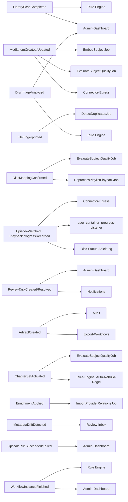

# Event-Gesamtreferenz

Zurück zur [Masterdatei](../MediaForge_Master_Engineering.md). Vertiefung zu [architecture/overview.md](overview.md), Abschnitt „Event-Konventionen". Konsolidierte Sicht auf **jedes** Event des Systems: Produzent, Payload-Kern, Konsumenten und Dispatch-Eigenschaften. Modulkapitel definieren ihre Events normativ (vollständige Payload-DTOs); dieser Katalog beantwortet die Querschnittsfrage, die nur über alle Events hinweg sichtbar wird: **Wer hört eigentlich auf wen?** — die Antwort ist der De-facto-Abhängigkeitsgraph des Systems, der die verbotenen direkten Modul-Kopplungen ([overview.md](overview.md), Modulgrenzen-Diagramm) ersetzt.

## Event-Fluss-Graph (Produzent → Konsumenten)

Leseregel: Jeder Pfeil ist eine Listener-Registrierung im Service Provider des konsumierenden Moduls — der Graph ist damit direkt aus den `EventServiceProvider`-Klassen ableitbar (Contract-Test unten) und keine freihändige Dokumentation.

## Vollständiges Event-Inventar

Gruppiert nach Produzent. **Sync/Async**: alle Events dispatchen nach Commit (`overview.md`); die Spalte zeigt, ob **Listener** synchron (trivial: Cache-Invalidierung, Log) oder als Queue-Job (`ShouldQueue`) laufen.

### Fundament

| Event | Payload-Kern | Konsumenten | Listener-Modus |
|---|---|---|---|
| `LibraryScanCompleted` | libraryId, Zähler (neu/geändert/entfernt) | Rule Engine, Admin-Dashboard | async |
| `MediaItemCreated` / `MediaItemUpdated` | mediaItemId, geänderte Feldgruppen | `EmbedSubjectJob` (Suche), `EvaluateSubjectQualityJob`, Connector-Egress | async |
| `FileFingerprinted` | fileId, Fingerprint-Typen | `DetectDuplicatesJob` | async |
| `EpisodeWatched` / `PlaybackProgressRecorded` | userId, mediaItemId, Quelle, Position | Connector-Egress, `user_container_progress`-Listener, Disc-Status-Ableitung | async (Egress), sync (Cache-Update trivial) |
| `ReviewTaskCreated` / `ReviewTaskResolved` | reviewTaskId, Typ, Subjekt | Admin-Dashboard, Notifications | async |
| `ArtifactCreated` | artifactId, Typ, Quell-IDs | Audit, Export-Workflows | async |

### Disc-Engine ([Modulkapitel](../modules/disc-engine.md))

| Event | Payload-Kern | Konsumenten | Listener-Modus |
|---|---|---|---|
| `DiscImageAnalyzed` | discImageId, libraryId, playlistCount, requiresMappingReview, analyzedAt | Rule Engine, Admin-Dashboard, UI-Echo-Kanal ([UI-Referenz](../modules/disc-engine/ui-reference.md)) | async + Broadcast |
| `DiscMappingConfirmed` | mappingId, playlistId, mediaItemId | `ReprocessPlaylistPlaybackJob` (Nachverrechnung), `EvaluateSubjectQualityJob` | async |
| `DiscPlaybackSessionEnded` | sessionId, discImageId, userId, credited/withheld-Zusammenfassung | Admin-Dashboard, Player-Client-Antwort ([API-Referenz](../modules/disc-engine/api-reference.md)) | sync (API-Antwort), async (Dashboard) |

### Hörbuch-Assembler ([Modulkapitel](../modules/audiobook-assembler.md))

| Event | Payload-Kern | Konsumenten | Listener-Modus |
|---|---|---|---|
| `AudiobookSequenced` | assemblyId, confidence, source | Admin-Dashboard | async |
| `ChapterSetActivated` | chapterSetId, assemblyId, origin | `EvaluateSubjectQualityJob`, Rule-Engine (Auto-Rebuild-Regel, [Artefakt-Builder](../modules/audiobook-assembler/artifact-builders.md)) | async |
| `AudiobookArtifactBuilt` | artifactId, assemblyId, kind | Audit, ABS-Connector-Sync-Anstoß | async |

### Audio-Upscaler ([Modulkapitel](../modules/audio-upscaler.md))

| Event | Payload-Kern | Konsumenten | Listener-Modus |
|---|---|---|---|
| `UpscaleRunSucceeded` | runId, resultEditionId, metricsDelta | Admin-Dashboard, Processing-History-Anzeige | async |
| `UpscaleRunFailed` | runId, errorClass, errorDetail | Admin-Dashboard, Health-Metrik | async |

### Enrichment ([Modulkapitel](../modules/enrichment.md))

| Event | Payload-Kern | Konsumenten | Listener-Modus |
|---|---|---|---|
| `EnrichmentApplied` | entityType/Id, runId, changedFields | `ImportProviderRelationsJob` (Knowledge Graph), Suche (Re-Embed bei Titel-/Summary-Änderung) | async |
| `MetadataDriftDetected` | entityType/Id, fieldClass, diff | Review-Inbox (`metadata_conflict`) | async |

### Workflow / Rule / Knowledge Graph / Data Quality / Dedup

| Event | Payload-Kern | Konsumenten | Listener-Modus |
|---|---|---|---|
| `WorkflowInstanceFinished` | instanceId, definitionId, outcome | Rule Engine, Admin-Dashboard | async |
| `RuleFiring` (intern, Trace) | ruleId, subjectId, actionsExecuted | Audit (Trace-Persistenz), Admin-Dashboard (Firing-Liste) | sync (Trace-Schreiben ist Teil der Ausführung) |

Knowledge Graph, Data Quality und Dedup **konsumieren** primär (Tabelle oben, Fundament-/Disc-/Assembler-Events) und **produzieren** aktuell keine eigenen Fundament-weiten Events — ihre Ergebnisse (Beziehungsvorschläge, Qualitäts-Scores, Dubletten-Gruppen) sind Datensätze, die über eigene Lese-Routen konsumiert werden, nicht über Events (bewusst: Ein Qualitäts-Score-Update für 300k Items als Event-Sturm wäre der falsche Kanal — die [Query-Katalog](../database/query-catalog.md)-Caches sind der richtige).

## Fehlende Events (bewusste Lücken)

Zwei Nicht-Events, die in einem naiven Entwurf existieren könnten, aber bewusst fehlen: **„Disc gesehen"** — es gibt kein solches Event, weil es keinen solchen Zustand gibt (Modulkapitel Disc-Engine, Architekturregel 11: der Disc-Status ist Ableitung, nie geschriebener Zustand). **„ContainerProgressChanged"** — der `user_container_progress`-Cache wird von bestehenden Watch-State-Events nachgeführt, nicht durch ein eigenes Event beworben; ein zusätzliches Event wäre redundant zur Quelle und eine zweite Quelle für denselben Fakt.

## Dispatch-Eigenschaften (Zusammenfassung der Fundament-Regeln)

Alle Events: Dispatch nach Commit (`overview.md`), Payload aus ULIDs + Werten (nie Eloquent-Models), Benennung `<Entität><PartizipPerfekt>`. Zwei Ausnahmen von „immer async": Broadcast-Events (Laravel Echo, z. B. `DiscImageAnalyzed` an die UI) laufen zusätzlich synchron als Broadcast **und** async als Queue-Listener — die Broadcast-Zustellung ist best-effort (Polling bleibt die verpflichtete Basis, [overview.md](overview.md) offener Punkt zu Reverb), der Queue-Listener ist die verlässliche Quelle.

## Event × Modul-Kopplungsmatrix

Die Kehrseite des Fluss-Graphen: Welches Modul hätte ohne Events eine verbotene direkte Abhängigkeit gebraucht ([overview.md](overview.md), Modulgrenzen)?

| Ohne Event nötig gewesen wäre | Ersetzt durch |
|---|---|
| Disc-Engine → Data-Quality (direkter Aufruf nach Mapping-Bestätigung) | `DiscMappingConfirmed` → `EvaluateSubjectQualityJob` |
| Assembler → Rule Engine (direkter Aufruf für Auto-Rebuild) | `ChapterSetActivated` → Regel-Evaluation |
| Enrichment → Knowledge Graph (direkter Aufruf für Beziehungs-Import) | `EnrichmentApplied` → `ImportProviderRelationsJob` |
| Fingerprinting → Dedup (direkter Aufruf) | `FileFingerprinted` → `DetectDuplicatesJob` |
| Watch-State-Core → alle Connectoren (direkter Egress-Aufruf je Connector) | `EpisodeWatched`/`PlaybackProgressRecorded` → Connector-Egress-Listener (jeder Connector registriert unabhängig) |

Diese Tabelle ist der praktische Beweis, dass die Modulgrenzen-Architektur-Tests ([overview.md](overview.md)) nicht nur verbieten, sondern durch tatsächlich genutzte Events ersetzt sind — ein Reviewer, der eine neue Kopplung sieht, prüft zuerst hier, ob ein Event der richtige Weg ist, bevor er einen Core-Vertrag vorschlägt.

## Contract-Test: Graph ↔ Code

Der Fluss-Graph ist gegen `EventServiceProvider::listens()` aller Module verankert (Architektur-Test, analog zu den Modulgrenzen-Tests): Für jedes hier dokumentierte Produzent→Konsument-Paar muss eine tatsächliche Listener-Registrierung existieren, und jede tatsächliche Registrierung muss hier dokumentiert sein. Ein Event, das ein Modul emittiert, aber niemand konsumiert, ist kein Fehler (Events sind für zukünftige Konsumenten offen), wird aber im Katalog als „aktuell ohne Konsument" markiert, damit es nicht für tot gehalten und versehentlich entfernt wird, während ein Plugin es bereits nutzt (Plugin-Listener sind per SDK-Vertrag nicht Teil dieses Kern-Contract-Tests, aber [Plugin SDK](../developer-handbook/plugin-sdk.md) verlangt von Plugins, sich in diese Liste einzutragen, wenn sie Kern-Events konsumieren).

## Prüfliste für neue Events (PR-Checkliste)

Benennung `<Entität><PartizipPerfekt>`, kein Imperativ · Payload nur ULIDs/Werte, kein Model · Dispatch nach Commit · Zeile im Fluss-Graph **und** im Inventar hier · Konsumenten-Zeile mit Listener-Modus (sync/async) · falls die Alternative eine direkte Modul-Abhängigkeit gewesen wäre: Eintrag in der Kopplungsmatrix · Broadcast nur zusätzlich zu, nie statt Queue-Listener.
