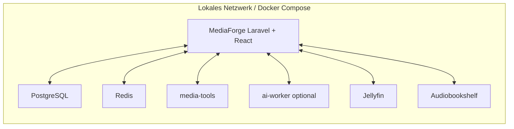
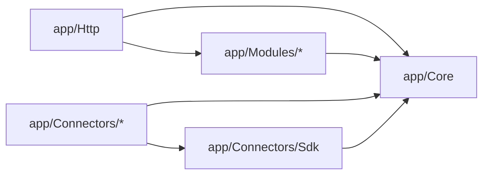
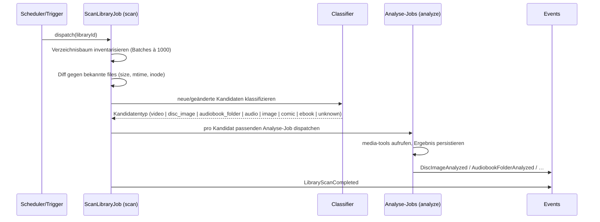

# Gesamtarchitektur

MediaForge ist in dieser Spezifikation ein lokaler Enhancement Layer: ein lokaler Enhancement Layer für Jellyfin und Audiobookshelf. Die Laufzeit-Topologie, Modulgrenzen, Jobs und Events bleiben wie unten beschrieben erhalten; ihre Aufgabe ist jedoch nicht, Jellyfin oder Audiobookshelf nachzubauen, sondern lokale Erweiterung, Verbindung, Analyse, Automatisierung und Verwaltung bereitzustellen.



API-Kommunikation in dieser Architektur ist lokale Dienstkommunikation. Externe Provider können optional angebunden werden; keine Kernfunktion verlangt Cloud, SaaS oder permanente Online-Verfügbarkeit.

Zurück zur [Masterdatei](../MediaForge_Master_Engineering.md). Dieses Kapitel spezifiziert die Laufzeit-Topologie, den Modulschnitt im Code, die Event- und Job-Konventionen sowie die verbindlichen Muster für Idempotenz und Wiederaufnahme. Es ist Voraussetzung für alle Modulkapitel: Jedes Modul verwendet die hier definierten Basisverträge, statt eigene zu erfinden.

**Vertiefungen**: [Job-Gesamtreferenz](jobs-reference.md) (alle Jobs, Queue-Konfliktmatrix, Timeout/Retry-Profile) · [Event-Gesamtreferenz](events-reference.md) (alle Events, Fluss-Graph, Modul-Kopplungsmatrix) · [Settings-Gesamtreferenz](settings-reference.md) (alle Konfigurationsschlüssel, Namespace-Governance)

## Laufzeit-Topologie

### Prozesslandschaft

MediaForge läuft als Docker-Compose-Stack aus folgenden Diensten. Die Aufteilung folgt einem einzigen Kriterium: unterschiedliche Ressourcenprofile und Lebenszyklen gehören in unterschiedliche Container, gleiche nicht.

| Dienst | Image-Basis | Aufgabe | Ressourcenprofil |
|---|---|---|---|
| `app` | PHP 8.4 FPM + Nginx (alternativ FrankenPHP) | HTTP: Inertia-UI, REST-API, Webhooks | RAM-moderat, CPU-niedrig |
| `worker-default` | identisches PHP-Image | Queues `default`, `connector` | CPU-niedrig, netzwerk-lastig |
| `worker-scan` | identisches PHP-Image | Queues `scan`, `assemble` | I/O-lastig |
| `worker-analyze` | identisches PHP-Image | Queue `analyze` | CPU-mittel |
| `scheduler` | identisches PHP-Image | `schedule:work` (Cron-Ersatz) | minimal |
| `horizon` | identisches PHP-Image | Queue-Dashboard und Supervisor | minimal |
| `postgres` | PostgreSQL 17 + pgvector | primärer lokaler Persistenzspeicher | RAM-/Disk-lastig |
| `redis` | Redis 7 | Queues, Cache, Locks | RAM-moderat |
| `media-tools` | Alpine + FFmpeg, libbluray-Tools, libdvdread-Tools, Chromaprint | Disc-/Audio-Analyse als Kommandodienst | CPU-Bursts |
| `ai-worker` (optional) | Python + PyTorch (CPU- oder CUDA-Variante) | Audio-Upscaling, Embeddings | GPU/CPU-schwer |

Alle PHP-Dienste teilen dasselbe Image; sie unterscheiden sich nur im Startkommando (`php-fpm` vs. `php artisan queue:work --queue=…` vs. `php artisan schedule:work`). Das hält Build und Upgrade trivial: ein Image, ein Tag, ein `docker compose pull && up -d`.

Der `media-tools`-Container ist bewusst **kein** Sidecar-Aufruf via `docker exec`, sondern ein kleiner HTTP-Kommandodienst (intern, nie exponiert): PHP-Jobs senden `POST /analyze/bluray {path}` und erhalten strukturiertes JSON. Begründung: `docker exec` erfordert Docker-Socket-Zugriff aus dem PHP-Container — ein Sicherheitsrisiko, das die Kapselung sprengt (Root-Äquivalenz auf dem Host). Der Kommandodienst hingegen ist ein normaler interner Netzwerkteilnehmer mit read-only-Mounts der Medienpfade. Der `ai-worker` folgt demselben Muster, konsumiert aber zusätzlich die `ai`-Queue direkt (Details in [modules/ai-engine.md](../modules/ai-engine.md)).

### Volume- und Mount-Strategie

Drei Speicherbereiche mit strikt getrennten Rechten:

* **Medienbibliotheken** (`/media/...`): in `app`, `worker-*` und `media-tools` grundsätzlich **read-only** gemountet. Kein MediaForge-Prozess kann Originale verändern — Architekturregel 4 ist damit physisch erzwungen, nicht nur konventionell.
* **Artefakt-Ablage** (`/artifacts`): read-write für `worker-scan`, `worker-analyze`, `ai-worker`; hier entstehen M4B, CUE, FLAC-Upscales, Exporte. Struktur: `/artifacts/{module}/{media_item_ulid}/…`, damit Artefakte ohne Datenbankzugriff ihrem Ursprung zuordenbar sind.
* **Systemdaten**: PostgreSQL-Datadir, Redis-AOF, Log-Verzeichnis — je eigenes benanntes Volume, nie unter den Medienpfaden.

Ein vierter Bereich, die **Inbox** (`/inbox`, optional), ist der einzige Ort, an dem MediaForge Dateien verschieben darf: Import-Workflows dürfen aus der Inbox in Bibliotheksstrukturen einsortieren. Auch dann gilt: verschieben oder kopieren, niemals in-place transformieren.

### Netzwerktopologie

Nur `app` exponiert einen Port (hinter einem vom Benutzer gestellten Reverse Proxy, TLS-Terminierung dort). `postgres`, `redis`, `media-tools`, `ai-worker` sind ausschließlich im internen Compose-Netz erreichbar. Ausgehende Verbindungen (Metadaten-Provider, Connector-Ziele wie Jellyfin/ABS/*arr) gehen direkt von den Worker-Containern aus; ein optionaler egress-Proxy ist als Konfigurationspunkt vorgesehen (Details in [architecture/deployment.md](deployment.md)).

## Code-Organisation

### Modulschnitt

Der Code ist domänenorientiert geschnitten. Laravel-Standardverzeichnisse bleiben für Framework-Belange erhalten; Fachlogik lebt unter `app/Modules`:

```
app/
├── Core/                          # gemeinsame Basisverträge (siehe unten)
│   ├── Actions/                   #   AuditableAction-Basisklasse
│   ├── Audit/                     #   Audit-Verträge (Recorder, Actor)
│   ├── Jobs/                      #   ResumableJob-Basisklasse, Checkpoint-Vertrag
│   ├── Media/                     #   kanonisches Katalogmodell (Models, Actions)
│   ├── Provider/                  #   Provider-ID-Mapping, Provider-Registry
│   └── WatchState/                #   Watch-State-Modell und -Actions
├── Modules/
│   ├── DiscEngine/
│   │   ├── Actions/  Jobs/  Events/  Models/  Services/  Http/  Support/
│   ├── AudiobookAssembler/
│   ├── AudioUpscaler/
│   ├── WorkflowEngine/
│   ├── RuleEngine/
│   ├── AiEngine/
│   ├── Search/
│   ├── KnowledgeGraph/
│   ├── DataQuality/
│   ├── Fingerprinting/
│   └── Admin/
├── Connectors/
│   ├── Sdk/                       # Connector SDK (Verträge, Basisklassen, Sync-State)
│   ├── Jellyfin/
│   ├── Audiobookshelf/
│   ├── Stash/
│   ├── ArrFamily/
│   ├── Prowlarr/
│   ├── Immich/
│   └── ExternalPlayer/
└── Http/                          # dünne Controller (Inertia + API), nach Modulen gruppiert
```

Jedes Modul hat einen eigenen Service Provider (`DiscEngineServiceProvider`), der Bindings, Event-Listener und Routen des Moduls registriert. Module sind über Composer-Autoloading Teil derselben Anwendung — der Monolith bleibt ein Deployment-Artefakt —, aber die Grenzen sind testbar.

### Modulgrenzen und ihre Durchsetzung

Erlaubte Abhängigkeitsrichtungen:



Verboten sind: `Core → Modules`, `Core → Connectors`, `Modules → Connectors`, `Connectors → Modules`, sowie jede Abhängigkeit zwischen zwei Fachmodulen, die nicht über Core-Verträge oder Events läuft. Wenn die Disc-Engine ein Review erzeugen will, ruft sie nicht das Admin-Modul auf, sondern die Core-Action `CreateReviewTask`; wenn der Assembler auf einen abgeschlossenen Scan reagieren will, lauscht er auf das Event, statt vom Scanner aufgerufen zu werden.

Durchsetzung per Pest-Architektur-Tests, die im CI laufen:

```php
arch('core hat keine modul-abhängigkeiten')
    ->expect('App\Core')
    ->not->toUse(['App\Modules', 'App\Connectors']);

arch('connectoren nutzen nur sdk und core')
    ->expect('App\Connectors')
    ->toOnlyUse(['App\Connectors\Sdk', 'App\Core', /* framework, vendor */]);

arch('controller enthalten keine persistenz')
    ->expect('App\Http')
    ->not->toUse([Illuminate\Support\Facades\DB::class]);
```

Diese Tests sind Teil des Fundaments und werden mit jedem Modul erweitert. Ein Modul, dessen Grenzen nicht per Architektur-Test prüfbar sind, gilt als falsch geschnitten.

### Schichten innerhalb eines Moduls

Die Masterdatei definiert das Schichtenmodell (Controller → Action → Service → Model); hier die verbindlichen Verträge dazu.

**Actions** sind invokable Klassen mit genau einer öffentlichen Methode `execute(...)`, deren Parameter ein dediziertes, validiertes Datenobjekt (readonly DTO) ist. Actions sind die einzige Stelle, an der fachlicher Zustand geschrieben wird, und erben von `AuditableAction`:

```php
namespace App\Core\Actions;

abstract class AuditableAction
{
    public function __construct(
        protected AuditRecorder $audit,
        protected DatabaseManager $db,
    ) {}

    /**
     * Führt $work in einer Transaktion aus und schreibt den Audit-Eintrag
     * atomar mit. $subject ist die betroffene Entität, $change der Diff.
     */
    protected function transact(Model $subject, AuditChange $change, Closure $work): mixed
    {
        return $this->db->transaction(function () use ($subject, $change, $work) {
            $result = $work();
            $this->audit->record($subject, $change, Actor::current());
            return $result;
        });
    }
}
```

`Actor::current()` löst den Verursacher kontextabhängig auf: eingeloggter Benutzer im HTTP-Kontext, Job-Identität im Queue-Kontext, Connector-Identität im Sync-Kontext, AI-Modell-Identität im AI-Kontext. Der Mechanismus ist in [modules/audit.md](../modules/audit.md) spezifiziert.

**Services** kapseln wiederverwendbare Logik und sämtliche externen Aufrufe. Jeder Service, der ein externes Werkzeug oder System anspricht, hat ein Interface im Modul (`DiscAnalyzerInterface`) und eine Implementierung, die im Service Provider gebunden wird. Tests binden Fakes gegen dasselbe Interface. Services schreiben keinen fachlichen Zustand an Actions vorbei; ein Service darf Rechenergebnisse liefern und technische Tabellen (z. B. Scan-Rohdaten) füllen, aber Watch-States, Mappings und Katalogdaten ändern nur Actions.

**DTOs** sind readonly PHP-Klassen (`final readonly class`), keine assoziativen Arrays. Jede Modul-Grenze (Action-Input, Service-Ergebnis, Event-Payload, Job-Payload) hat typisierte DTOs. Arrays über Modulgrenzen sind ein Review-Defekt.

## Event-Konventionen

### Zweck und Abgrenzung

Events entkoppeln Module: Der Produzent weiß nicht, wer konsumiert. Events sind **Fakten der Vergangenheit** („DiscImageAnalyzed"), nie Befehle („AnalyzeDiscImage" ist ein Job, kein Event). Ein Event, dessen Name im Imperativ steht, ist falsch benannt oder ein verkappter Job.

### Benennung und Payload

Events heißen `<Entität><PartizipPerfekt>` und liegen im Event-Namespace ihres Produzentenmoduls: `App\Modules\DiscEngine\Events\DiscImageAnalyzed`, `App\Core\WatchState\Events\EpisodeWatched`. Die Payload besteht aus ULIDs und unveränderlichen Werten, nie aus Eloquent-Models — Listener laden selbst nach, in ihrem eigenen Transaktionskontext:

```php
final readonly class DiscImageAnalyzed
{
    public function __construct(
        public string $discImageId,       // ULID
        public string $libraryId,         // ULID
        public int $playlistCount,
        public bool $requiresMappingReview,
        public CarbonImmutable $analyzedAt,
    ) {}
}
```

### Dispatch-Zeitpunkt

Events werden **nach** Commit dispatcht (`DB::afterCommit` bzw. `ShouldDispatchAfterCommit`), ausnahmslos. Ein Listener, der ein Event vor Commit sähe, könnte Zustand lesen, der nie committet wird. Listener, die nennenswerte Arbeit tun, implementieren `ShouldQueue` und laufen als Jobs auf der passenden Queue — synchrone Listener sind auf triviale Arbeit (Cache-Invalidierung, Log) beschränkt.

### Kern-Events des Fundaments

Diese Events sind ab dem Fundament stabil und dürfen von allen Modulen konsumiert werden:

| Event | Produzent | Payload-Kern | Typische Konsumenten |
|---|---|---|---|
| `LibraryScanCompleted` | Scan-Pipeline | libraryId, Zähler (neu/geändert/entfernt) | Rule Engine, Admin-Dashboard |
| `MediaItemCreated` / `MediaItemUpdated` | Core-Katalog | mediaItemId, geänderte Feldgruppen | Suche, Datenqualität, Connectoren |
| `FileFingerprinted` | Fingerprinting | fileId, Fingerprint-Typen | Dublettenerkennung |
| `EpisodeWatched` / `PlaybackProgressRecorded` | Watch-State-Core | userId, mediaItemId, Quelle, Position | Connectoren (Egress), Disc-Status-Ableitung |
| `ReviewTaskCreated` / `ReviewTaskResolved` | Core-Review | reviewTaskId, Typ, Subjekt | Admin-Dashboard, Notifications |
| `ArtifactCreated` | alle Engines | artifactId, Typ, Quell-IDs | Audit, Export-Workflows |

## Job-Konventionen

Jobs sind das Arbeitspferd von MediaForge; ihre Disziplin entscheidet über die Betriebsqualität des Gesamtsystems. Die folgenden Konventionen sind verbindlich für jeden Job im System.

### Benennung, Zuschnitt, Queue-Zuordnung

Jobs heißen `<Verb><Objekt>Job` (`AnalyzeDiscImageJob`, `SyncJellyfinWatchStatesJob`) und tun genau eine Sache. Ein Job, der „scannt und analysiert und mappt", ist drei Jobs, verkettet über Events oder Batches. Jeder Job deklariert seine Queue explizit über eine Enum, nie als String-Literal:

```php
enum WorkQueue: string
{
    case Default = 'default';
    case Scan = 'scan';
    case Analyze = 'analyze';
    case Assemble = 'assemble';
    case Ai = 'ai';
    case Connector = 'connector';
}
```

### Idempotenz

Jeder Job muss die Frage beantworten können: „Was passiert, wenn ich zweimal laufe?" — und die Antwort muss „dasselbe wie einmal" sein. Die verbindlichen Techniken, je nach Job-Typ:

* **Natürliche Schlüssel + Upsert.** Analyse-Jobs schreiben Ergebnisse mit `ON CONFLICT`-Semantik über den natürlichen Schlüssel (z. B. `disc_image_id + playlist_number`), nie mit blindem `INSERT`.
* **Zustandsprüfung vor Seiteneffekt.** Artefakt-erzeugende Jobs prüfen vor teurer Arbeit, ob das Zielartefakt mit identischer Quell-Signatur (Quell-Hash + Parameter-Hash) bereits existiert; wenn ja, terminieren sie erfolgreich ohne Arbeit.
* **Unique Jobs für Sync.** Connector-Sync-Jobs implementieren `ShouldBeUnique` mit dem Sync-Ziel als Unique-Key, damit Scheduler-Überschneidungen keine Doppel-Syncs erzeugen.
* **Send-Idempotenz nach außen.** Jobs, die externe Systeme verändern (Watch-State nach Jellyfin schreiben), führen ein persistentes Outbox-Protokoll: Absicht wird vor dem Aufruf persistiert, Erfolg danach markiert; Wiederholung prüft das Protokoll. Details im [Connector SDK](../connectors/connector-sdk.md).

### Wiederaufnahme: der ResumableJob-Vertrag

Langlaufende Jobs (Bibliotheks-Scan über 100k Dateien, M4B-Erzeugung über 97 Tracks, Upscale eines 40-Stunden-Hörbuchs) dürfen nicht bei jedem Neustart von vorn beginnen. Der Fundament-Vertrag dafür:

```php
namespace App\Core\Jobs;

/**
 * Ein ResumableJob zerlegt seine Arbeit in benannte Schritte.
 * Der Fortschritt wird in job_checkpoints (PostgreSQL) persistiert —
 * bewusst nicht in Redis: ein Redis-Flush darf keinen Fortschritt kosten.
 */
abstract class ResumableJob implements ShouldQueue
{
    /** Fachlich eindeutiger Schlüssel dieser Arbeit, z. B. "analyze-disc:{ulid}". */
    abstract public function checkpointKey(): string;

    /** Geordnete Schritte; jeder Schritt ist in sich idempotent. */
    abstract public function steps(): array;   // list<JobStep>

    public function handle(CheckpointStore $checkpoints): void
    {
        $done = $checkpoints->completedSteps($this->checkpointKey());
        foreach ($this->steps() as $step) {
            if (in_array($step->name, $done, strict: true)) {
                continue;                      // bereits erledigt — überspringen
            }
            $step->run();                      // Schritt committet seine Ergebnisse selbst
            $checkpoints->markCompleted($this->checkpointKey(), $step->name);
        }
        $checkpoints->clear($this->checkpointKey());  // Abschluss: Checkpoints aufräumen
    }
}
```

Dazu die Checkpoint-Tabelle (Teil des Fundament-Schemas, siehe [database/core-schema.md](../database/core-schema.md)):

```sql
CREATE TABLE job_checkpoints (
    id              CHAR(26) PRIMARY KEY,
    checkpoint_key  TEXT        NOT NULL,
    step_name       TEXT        NOT NULL,
    completed_at    TIMESTAMPTZ NOT NULL DEFAULT now(),
    UNIQUE (checkpoint_key, step_name)
);
```

Regeln dazu: Ein Schritt committet seine Datenbank-Ergebnisse in eigener Transaktion, **dann** wird der Checkpoint gesetzt — schlimmstenfalls wird ein Schritt wiederholt (idempotent, also unschädlich), nie übersprungen. Schritte, die Dateien erzeugen, schreiben nach `<ziel>.partial` und rename-en atomar; ein `.partial` beim Wiederanlauf wird gelöscht und der Schritt wiederholt.

### Fehlerbehandlung, Retries, Timeouts

* **Transiente Fehler** (Netzwerk, Rate-Limit, Lock-Konflikt) → Retry mit exponentiellem Backoff: `$backoff = [30, 120, 600]`, `$tries` nach Job-Klasse (Connector: 5, Analyse: 3, AI: 2).
* **Permanente Fehler** (defekte Datei, unparsebare Struktur) → kein Retry: Job markiert das Subjekt als fehlerhaft (`analysis_status = 'failed'` + Fehlerdetail), erzeugt bei fachlicher Relevanz einen Review-Task und terminiert **erfolgreich**. Failed-Job-Einträge sind für Infrastrukturfehler reserviert, nicht für erwartbare Datenprobleme — sonst ertrinkt die Failed-Queue in kaputten Dateien und echte Ausfälle werden unsichtbar.
* **Timeouts** sind pro Job-Klasse explizit gesetzt (`$timeout`), mit `retry_after` der Queue darüber. Analyse-Jobs: 30 min; AI-Jobs: konfigurierbar, Default 120 min; Connector-Jobs: 5 min.
* **Giftige Wiederholungen** verhindert der Checkpoint-Mechanismus: Ein Job, der dreimal am selben Schritt scheitert, markiert das Subjekt als fehlerhaft statt endlos zu retryen (Zähler in `job_checkpoints.attempts`, siehe Schema-Erweiterung im Datenbankkapitel).

### Nebenläufigkeit und Locks

Konkurrierende Arbeit am selben Subjekt wird über Redis-Locks mit Datenbank-Fallback verhindert: `Cache::lock("scan:library:{$id}", 3600)`. Der Lock schützt vor Doppelarbeit, nicht vor Inkonsistenz — Konsistenz garantieren die Datenbank-Constraints und Transaktionen, nie der Lock allein (Redis-Ausfall darf Korrektheit nicht gefährden, nur Effizienz). Scan- und Analyse-Jobs prüfen zusätzlich beim Start, ob ihr Subjekt seit Dispatch verändert wurde (Vergleich `updated_at`/Content-Signatur), und terminieren dann folgenlos: Der nächste reguläre Lauf sieht den neuen Zustand.

### Fortschritts-Reporting

Langlaufende Jobs berichten Fortschritt in eine Fundament-Tabelle `job_progress` (Subjekt, Phase, done/total, Nachricht), die das Admin-Dashboard und die betroffenen UI-Seiten pollen. Kein Fortschritt in Redis-only-Strukturen; nach Neustart muss das Dashboard den echten Stand zeigen. Broadcast-Events (Laravel Echo) sind eine optionale Beschleunigung obendrauf, nie die Quelle.

## Scan-Pipeline des Fundaments

Die Scan-Pipeline ist die gemeinsame Eingangstür aller Fach-Engines; die Engines klinken sich per Klassifikator und Event ein, statt eigene Scanner zu bauen.



Der **Classifier** ist eine Kette registrierter Detektoren (`CandidateDetectorInterface`), die jedes Fundament-Modul und jede Engine beisteuern kann: Der Disc-Detektor erkennt `*.iso`, `BDMV/`-Strukturen und `VIDEO_TS/`-Strukturen; der Hörbuch-Detektor erkennt Ordner mit überwiegend Audio-Dateien plus Namens-/Struktur-Heuristiken. Detektoren liefern `(type, confidence, evidence)`; bei Mehrdeutigkeit gewinnt die höchste Confidence, unter einem Schwellwert entsteht ein Review-Task. Die Detektor-Registrierung läuft über die Service Provider der Module — die Pipeline selbst kennt keine Medientypen.

Datei-Identität über Scans hinweg: primär `(device, inode)` bzw. unter Windows-Mounts `(volume, file_id)` sofern verfügbar, sekundär `(path)`, verifiziert über `(size, mtime)`; Content-Hashes (BLAKE3 vollständig, xxHash64 als schneller Vorfilter) werden asynchron durch die Fingerprinting-Jobs ergänzt und dienen Moves-/Dubletten-Erkennung ([modules/dedup-fingerprinting.md](../modules/dedup-fingerprinting.md)). Ein Datei-Move wird damit als Move erkannt (gleicher Hash, neuer Pfad) und zerstört weder Analyse-Ergebnisse noch Watch-States.

## Konfiguration

Konfiguration folgt drei Ebenen mit klarer Zuständigkeit: **Umgebungsvariablen** (`.env`) für Infrastruktur (DB-Zugang, Redis, Pfade, Container-URLs) — alles, was pro Installation fix ist. **Datenbank-gestützte Settings** (Tabelle `settings`, typisiert über eine Settings-Klasse pro Modul) für fachliche Laufzeitkonfiguration (Mapping-Schwellwerte, Sync-Intervalle, KI-Modellwahl) — alles, was Admins im UI ändern können sollen, versioniert im Audit. **Code-Konstanten** für Invarianten, die niemand ändern können soll. Die Grenzziehung ist verbindlich: Ein Wert, den ein Admin im laufenden Betrieb ändern können soll, gehört nie in `.env`, denn `.env`-Änderungen erfordern Container-Neustarts und sind nicht auditierbar.

## Fehler- und Ausfallverhalten des Gesamtsystems

Die Ausfallmatrix des Fundaments — jedes Modul muss sich gegen sie verhalten:

| Ausfall | Systemverhalten | Wiederanlauf |
|---|---|---|
| Redis weg | HTTP läuft weiter (Sessions in DB), Jobs pausieren, Locks entfallen → keine neuen Scans | Worker verbinden sich neu; Checkpoints in PostgreSQL machen Jobs fortsetzbar |
| PostgreSQL weg | Vollausfall (by design: primärer lokaler Persistenzspeicher) | Container-Restart-Policy; keine Datenverluste committeter Transaktionen |
| media-tools weg | Analyse-Jobs schlagen transient fehl → Backoff-Retry | automatisch nach Container-Neustart |
| ai-worker weg | `ai`-Queue staut; Rest unbeeinflusst (eigene Queue) | automatisch; gestaute Jobs laufen nach |
| Medien-Mount weg | Scans erkennen „Bibliothek nicht erreichbar" (Wurzel-Marker-Prüfung) und brechen ab, **ohne** Dateien als gelöscht zu markieren | nächster Scan normalisiert |

Der letzte Punkt ist eine bewusste Fundament-Entscheidung gegen einen klassischen Selfhosting-Datenfresser: Ein nicht gemounteter Medienpfad sieht für einen naiven Scanner wie „alle Dateien gelöscht" aus und würde Katalog-Kaskaden auslösen. MediaForge-Bibliotheken haben deshalb eine Wurzel-Marker-Datei (`.mediaforge-library`), deren Fehlen den Scan sofort abbricht: Ein leerer Mount-Point enthält den Marker nicht, eine wirklich geleerte Bibliothek schon. Zusätzlich gilt eine Lösch-Dämpfung: Verschwinden mehr als N % der bekannten Dateien in einem Scan (Default 25 %), werden die Löschungen nicht angewendet, sondern ein Review-Task erzeugt.

## Tests des Fundaments

Die Test-Gesamtstrategie steht in [developer-handbook/testing.md](../developer-handbook/testing.md); für das Fundament gelten mindestens: Architektur-Tests für alle Modulgrenzen (siehe oben); ein wiederverwendbarer Test-Harness `assertJobIsIdempotent(Job $job)`, der jeden ResumableJob zweimal ausführt und Endzustands-Gleichheit über einen Datenbank-Snapshot-Vergleich prüft; Contract-Tests für den media-tools-Kommandodienst gegen aufgezeichnete JSON-Fixtures echter Discs und Audio-Dateien (die Fixtures sind Teil des Repos, die echten Medien natürlich nicht); ein Scan-Pipeline-Testset mit synthetischen Verzeichnisbäumen (Disc-Strukturen, Hörbuch-Ordner, Mischfälle, kaputte Fälle).

## ADR-Verweise

[ADR-0001](../adr/0001-technology-stack.md) (Stack), [ADR-0002](../adr/0002-modular-monolith.md) (modularer Monolith), [ADR-0005](../adr/0005-immutable-originals.md) (immutable Originale → read-only-Mounts).

## Offene Punkte

* FrankenPHP vs. PHP-FPM+Nginx ist noch nicht final entschieden; das Kapitel [architecture/deployment.md](deployment.md) muss beide Varianten bewerten (Octane-Kompatibilität der Module, Memory-Leak-Risiko bei Long-Running-Workern).
* Filesystem-Watching (inotify-basierte Trigger statt reiner Scheduler-Scans) ist wünschenswert, aber über Netzwerk-Mounts (NFS/SMB) unzuverlässig; Entscheidung vertagt, bis die Scan-Kosten realer Bibliotheken gemessen sind.
* Broadcast-Kanal (Laravel Reverb vs. Polling-only) für Fortschritts-UI ist offen; das Fundament schreibt Polling als verpflichtende Basis fest, Reverb wäre additive Verbesserung.
