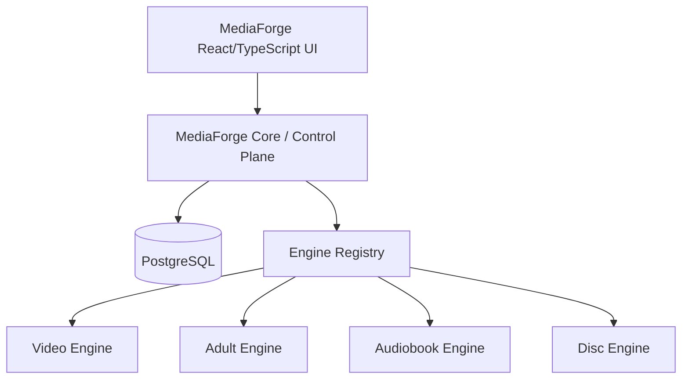

# Unified Application Architecture

Status: verbindliche Zielarchitektur  
Gilt ab: August 2026

## Ziel

MediaForge ist **eine App mit einer Oberfläche**. Der Benutzer navigiert niemals zwischen sichtbaren Jellyfin-, Audiobookshelf- oder Stash-Web-UIs, um normale Funktionen zu nutzen.

## Stufenmodell

### Frühphase
- Jellyfin und Audiobookshelf laufen als bestehende Dienste.
- MediaForge liest/synchronisiert über Connectoren.
- MediaForge baut den kanonischen Katalog und die gemeinsame UI auf.

### Reifephase
- MediaForge übernimmt normale Navigation, Suche, Browse, Details, Progress, Settings und Health vollständig.
- Fremde Web-UIs sind nur noch Debug-/Advanced-Werkzeuge.

### Fork-/Bundling-Phase
- kompatible Forks können als MediaForge Engines mitgeliefert werden;
- Update-, Health-, Auth- und Lifecycle-Management werden aus MediaForge gesteuert;
- die UI- und Core-Verträge bleiben gleich.

## Ein Interface, mehrere Sprachen

Eine einheitliche App verlangt keine einheitliche Programmiersprache:
- MediaForge Core: aktuell Laravel/PHP;
- UI: React + TypeScript;
- Video Engine: C#/.NET möglich;
- Adult Engine: Go/Stash-derived;
- Audiobook Engine: Node/Audiobookshelf-derived;
- Media Tools: native Tools/Python/Go je nach Aufgabe.

Die Sprache ist ein internes Implementierungsdetail.

## Verbotene Architektur

Nicht zulässig:
- iframes als „Integration“;
- sichtbare Weiterleitung auf Original-UIs für Kernflows;
- direkte Core-Foreign-Keys auf Engine-Datenbanken;
- Engine-IDs als kanonische MediaForge-IDs;
- Businesslogik, die nur in einem Connector lebt;
- UI-Komponenten, die Jellyfin/Stash/ABS-Semantik hart einkodieren.

## Akzeptanzkriterium

Ein normaler Benutzer soll nach Installation und Konfiguration MediaForge als **ein einziges Produkt** wahrnehmen, auch wenn intern mehrere Prozesse/Engines laufen.
