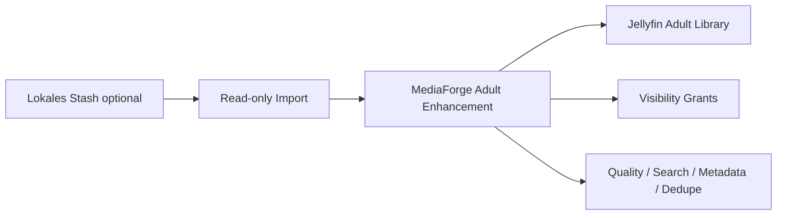

# Optionaler Stash-Import und Stash-Connector

Zurück zur [Masterdatei](../MediaForge_Master_Engineering.md). Abhängigkeiten: [connectors/connector-sdk.md](connector-sdk.md), [database/core-schema.md](../database/core-schema.md), [enhancements/adult-enhancement.md](../enhancements/adult-enhancement.md). Besonderheit: Stash ist **kein Pflichtsystem** und keine Kernvoraussetzung für Adult Enhancement.

**Vertiefung**: [API-Mapping-Referenz](stash/api-mapping.md) (GraphQL-Query-Dokumente, optionale Fingerprint-Brücke)

## Motivation

Der zentrale Adult-Bereich von MediaForge entsteht primär über Jellyfin-Bibliotheken plus MediaForge Adult Enhancement: getrennte Sichtbarkeit, Performer-, Studio-, Szenen-, Tag-, Collection-, Qualitäts-, Search- und Batch-Workflows. Stash darf zusätzlich genutzt werden, wenn eine lokale Stash-Installation bereits vorhanden ist oder vorhandene Daten migriert werden sollen.

Stash wird daher nur als optionale lokale Datenquelle, Importer, Migrationsquelle und Inspirationsquelle dokumentiert. MediaForge verlangt Stash nicht, installiert Stash nicht automatisch und macht keine Adult-Funktion von Stash abhängig.

## Problemstellung

Viele bestehende Adult-Sammlungen enthalten wertvolle lokale Stash-Daten: Szenen, Performer, Studios, Tags, Fingerprints und View-State. Gleichzeitig wäre es falsch, Stash zur Pflichtarchitektur zu machen. Die Integration muss deshalb drei Grenzen einhalten:

- Adult Enhancement bleibt ohne Stash voll funktionsfähig.
- Stash-Daten werden nur auf expliziten Wunsch importiert oder synchronisiert.
- Vertraulichkeit und lokale Sichtbarkeit gelten strenger als bei normalen Bibliotheken.

## Analyse der Gegenstelle

Stash bietet GraphQL, API-Key-Auth, Szenen, Performer, Studios, Tags, `updated_at`-Filter und Fingerprints wie oshash, phash und md5. Diese Daten sind nützlich für Migration, Dublettenerkennung und initiale Metadatenbefüllung. Stashs Scraper- und Plugin-Modell bleibt aber außerhalb der Kernarchitektur, weil MediaForge eigene Herkunfts-, Konflikt- und Metadaten-Governance braucht.

## Manifest

```php
capabilities: ingestCatalog=true, ingestPlayState=true,
              egressCatalog=false, egressPlayState=false,
              supportsWebhooks=false, supportsCursorSync=true,
              optional=true
providerKeys: ['stash_scene','stash_performer','stash_studio']
settings: base_url, api_key(secret), import_mode,
          target_adult_library_id, user_mapping(optional),
          sync_interval(optional), verify_tls
```

`import_mode` ist verbindlich: `one_time_import`, `scheduled_readonly_sync` oder `disabled`. Ein schreibender Stash-Egress ist nicht Teil der Kernstrategie und darf nur später als separate, opt-in Erweiterung mit eigener Risikoanalyse entstehen.

## Import- und Migrationsströme

**Katalogimport**: Szenen werden in die MediaForge Adult-Erweiterungsdaten und die zugehörige Jellyfin-Adult-Bibliothek eingeordnet. Performer, Studios, Tags und Collections werden als Adult-spezifische Metadaten importiert, mit Herkunft `connector:stash`. MediaForge behandelt diese Werte als Kandidaten, nicht als unumstößlichen Referenzstand.

**Fingerprint-Brücke**: Stash-Hashes können in `file_fingerprints` als `stash_oshash`, `stash_phash` oder `stash_md5` abgelegt werden, sofern MediaForge die Datei lokal identifizieren kann. Diese Fingerprints verbessern Dublettenerkennung und Migrationsqualität, ersetzen aber keine lokale Analyse.

**Watch-State-Import**: vorhandene View-/Resume-Daten können auf Wunsch einmalig oder regelmäßig als Quelle `connector:stash` importiert werden. Konflikte gehen durch dieselben Watch-State- und Review-Regeln wie Jellyfin- und Audiobookshelf-Daten.

## Adult Enhancement bleibt primär

Die primäre Adult-Verwaltung liegt in MediaForge plus Jellyfin:

- Adult-Inhalte bleiben in lokalen Jellyfin-Bibliotheken.
- MediaForge verwaltet getrennte Sichtbarkeit, Navigation, Performer, Studios, Szenen, Tags, Collections, Favoriten, Qualitätsanalyse, AI-Tagging, Dublettenerkennung und Batch-Bearbeitung.
- Stash kann historische Metadaten liefern, aber nicht die Adult-Architektur definieren.

## Vertraulichkeits-Architektur

Adult- und restriktive Bibliotheken nutzen explizite Grants. Inhalte erscheinen nur für berechtigte Benutzer in Suche, Dashboard, Empfehlungen, Rule-Treffern, Notifications und Audit-Detailansichten. Nicht berechtigte Benutzer sehen weder Titel noch Metadaten noch Vorschaubilder. Backups enthalten die Daten vollständig, Backup-Berichte zeigen restriktive Details nur berechtigten Administratoren.



## Laravel-Klassen

`StashManifest`, `StashGraphqlClient`, `StashImportPlanner`, `StashSceneTranslator`, `StashPerformerTranslator`, `StashStudioTranslator`, `ImportStashAdultMetadataJob`, `ImportStashFingerprintsJob`, `StashDiagnostics`. Alle Klassen müssen `optional=true` respektieren; fehlende oder deaktivierte Stash-Konfiguration darf keine Adult-Funktion blockieren.

## API und UI

Die UI zeigt Stash unter Adult-Importen und optionalen Connectoren, nicht als Pflichtschritt im Setup. Der Einrichtungsfluss verlangt Zielbibliothek, Importmodus, Sichtbarkeitsprüfung und eine Vorschau der zu importierenden Daten. Vor dem Import zeigt MediaForge Konflikte, Dublettenrisiken und die Herkunftskennzeichnung an.

## Edge Cases

- **Kein Stash vorhanden**: Adult Enhancement bleibt voll nutzbar.
- **Stash später entfernt**: importierte Daten bleiben mit Herkunft erhalten; optionale Sync-Jobs werden deaktiviert.
- **Konflikt mit manuellen MediaForge-Daten**: manuelle Werte gewinnen, Stash liefert Review-Kandidaten.
- **Gleiche Datei in Stash und Jellyfin**: Dubletten-Review respektiert Adult-Sichtbarkeit.
- **Stash-Scraper-Metadaten**: werden als `connector:stash` gekennzeichnet und nie als offizielle Providerdaten ausgegeben.

## Performance

Erstimporte großer Stash-Instanzen laufen als ResumableJobs mit Checkpoints. Delta-Sync ist optional und nutzt `updated_at`-Filter. Fingerprint-Import ist insert-only mit Unique-Schutz.

## Security

API-Key im Secret-Store, TLS-Prüfung optional konfigurierbar, GraphQL-Queries statisch, Payload-Retention verkürzt, restriktive Inhalte verschlüsselt in Outbox-/Importlogs, SSRF-Schutz für konfigurierte Basis-URLs. Die Integration ist lokal; es werden keine Stash-Daten an externe Dienste gesendet.

## Tests

Contract-Fixtures für GraphQL, Import-Vorschau, Konfliktauflösung, Sichtbarkeitsfilter, Grant-Lebenszyklus, fehlendes-Stash-Szenario, deaktivierter Sync, Fingerprint-Brücke und Changelog-Prüfung: Stash darf in keinem Setup-Dokument als Pflichtsystem erscheinen.

## ADR-Verweise

[ADR-0003](../adr/0003-provider-id-mapping.md), [ADR-0005](../adr/0005-immutable-originals.md), [ADR-0012](../adr/0012-plugin-trust-model.md), [enhancements/adult-enhancement.md](../enhancements/adult-enhancement.md).

## Offene Punkte

- Schreibender Stash-Egress bleibt bewusst außerhalb der Kernstrategie.
- Stash-Plugin-/Scraper-Ergebnisse brauchen vor tiefer Nutzung eine eigene Herkunfts- und Lizenzbewertung.
