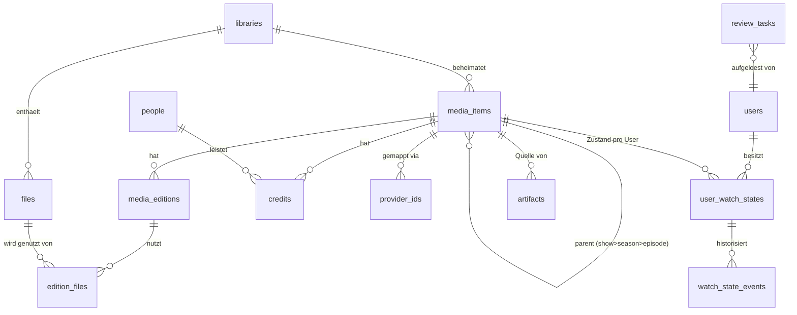

# Kern-Datenmodell und Schema-Konventionen

Das Datenmodell folgt der Enhancement-Architektur. MediaForge speichert lokale Referenzen, Jellyfin-IDs, Audiobookshelf-IDs, optionale externe IDs, Metadaten-Overrides, Health Scores, Analytics, Workflows, Rules, Plugin-Daten, Audit Logs, Benutzerpräferenzen, UI-Einstellungen, Adult-Erweiterungsdaten und Suchindexdaten. MediaForge besitzt nicht zwingend alle Medien und ersetzt nicht die Datenhoheit von Jellyfin oder Audiobookshelf für deren Kernbibliotheken.

Zurück zur [Masterdatei](../MediaForge_Master_Engineering.md). Dieses Kapitel definiert die Schema-Konventionen, die für jede Tabelle des Systems gelten, sowie das Kern-Datenmodell: Bibliotheken, Katalog, Dateien, Personen, Provider-IDs, Benutzer, Watch-States, Reviews, Artefakte und die Job-Infrastruktur. Modulspezifische Tabellen (Disc-Engine, Assembler, …) stehen in den Modulkapiteln, folgen aber ausnahmslos den hiesigen Konventionen.

**Vertiefungen**: [Datenbank-Gesamtreferenz](schema-reference.md) (Tabellen-Inventar, Kaskaden-Graph, Constraint-/JSONB-Register, `user_container_progress`-DDL, Partitions-Automatik) · [Query-Katalog](query-catalog.md) (kanonische Zugriffe, Budgets, Anti-Katalog, Plan-Suite)

## Schema-Konventionen

### Identität

Primärschlüssel sind ULIDs, gespeichert als `CHAR(26)`. ULIDs sind zeitlich sortierbar (Index-Lokalität wie Auto-Increment), kollisionfrei ohne zentrale Vergabe (Jobs und Importe können IDs clientseitig erzeugen) und leaken keine Mengeninformation wie fortlaufende Integer. UUIDv7 wäre gleichwertig; ULID gewinnt wegen der Laravel-Integration (`HasUlids`) und der kompakteren, URL-sicheren Darstellung. Die Entscheidung ist systemweit einheitlich — gemischte Schlüsseltypen sind ein Review-Defekt.

Externe Identifikatoren sind **niemals** Primärschlüssel und niemals Fremdschlüsselziel (Architekturregel 7, [ADR-0003](../adr/0003-provider-id-mapping.md)). Sie leben ausschließlich in `provider_ids` (unten).

### Benennung und Typen

Tabellen: snake_case Plural (`media_items`). Spalten: snake_case. Fremdschlüssel: `<singular>_id`. Zeitstempel: `TIMESTAMPTZ`, immer UTC, Standardpaar `created_at`/`updated_at` (von Eloquent gepflegt). Fachliche Zeitpunkte bekommen sprechende Namen (`analyzed_at`, `resolved_at`), nie überladene `updated_at`-Semantik.

Aufzählungswerte sind `TEXT` mit `CHECK`-Constraint, nicht native Postgres-Enums. Begründung: Native Enums machen Werterweiterungen zu DDL-Operationen mit Lock-Verhalten und sind in Migrationen notorisch sperrig; ein `CHECK` lässt sich in einer Migration atomar ersetzen. Die erlaubten Werte spiegeln sich in PHP als Backed Enums — die Datenbank prüft, PHP typisiert.

Fremdschlüssel deklarieren ihr `ON DELETE`-Verhalten immer explizit. Faustregeln: Kompositionsbeziehungen (Datei gehört zu Bibliothek) → `CASCADE`; Referenzen auf Stammdaten (Person in Credit) → `RESTRICT`; optionale Verweise (Review-Task auf gelöschtes Subjekt) → `SET NULL`. Ein FK ohne bewusst gewähltes Verhalten ist ein Review-Defekt.

### Soft Deletes

Soft Deletes (`deleted_at`) gibt es nur, wo Wiederherstellung ein fachlicher Anwendungsfall ist: `media_items`, `media_editions`, `users`. Dateien (`files`) werden nie soft-deleted, sondern tragen einen Lebenszyklus-Status (`present`, `missing`, `removed`) — eine Datei, die beim Scan fehlt, ist ein fachlicher Zustand, kein Löschfall. Join- und Protokolltabellen kennen keine Soft Deletes; der Audit-Trail ist ohnehin append-only.

### JSONB-Kriterien (Operationalisierung von Regel 8)

JSONB ist zulässig, wenn **alle** folgenden Fragen mit Nein beantwortet werden: Muss ein Fremdschlüssel auf einen Teil des Inhalts zeigen? Wird der Inhalt gejoint oder relational gefiltert (jenseits gelegentlicher `@>`-Prüfungen)? Werden Teile des Inhalts einzeln aktualisiert? Hat der Inhalt eine eigene Lebensdauer oder eigenen Audit-Bedarf? Typische legitime Fälle: `raw_response` (Provider-Rohantwort), `tool_output` (Werkzeug-Rohdaten), `evidence` (Begründungsdaten eines Vorschlags), `params` (freie Modell-/Werkzeugparameter). Jede JSONB-Spalte dokumentiert im Modulkapitel ihr Schema informell und den Grund, warum sie kein Relationenersatz ist.

### Migrationskonventionen

Jede Tabelle entsteht in genau einer Migration; nachträgliche Änderungen sind neue Migrationen, nie editierte alte. Indizes, die auf großen Tabellen nachgezogen werden, verwenden `CREATE INDEX CONCURRENTLY` (eigene Migration mit `withinTransaction = false`). Details und Werkzeuge in [database/migrations.md](migrations.md) (geplant).

## Überblick über das Kernmodell



Die tragende Idee: **Dateien und Katalog sind getrennte Welten, verbunden über Editionen.** Der Scanner entdeckt `files` (physische Realität). Matching und Enrichment erzeugen `media_items` als lokale Referenz- und Enhancement-Einträge mit `media_editions` (konkrete Fassungen). `edition_files` verbindet beide Welten n:m mit Rollen. Dadurch existieren unmatchte Dateien (frisch gescannt, Review offen) und dateilose Katalogeinträge (gewünscht, aber nicht vorhanden — Desired-State für Workflows) gleichberechtigt, ohne Krücken wie Dummy-Einträge.

## Bibliotheken

Eine Bibliothek ist ein überwachter Wurzelpfad mit Medientyp-Erwartung und Scan-Konfiguration.

```sql
CREATE TABLE libraries (
    id                 CHAR(26) PRIMARY KEY,
    name               TEXT        NOT NULL,
    root_path          TEXT        NOT NULL,
    media_kind         TEXT        NOT NULL
        CHECK (media_kind IN ('video','audiobook','music','photo','comic','ebook','mixed')),
    scan_enabled       BOOLEAN     NOT NULL DEFAULT true,
    scan_interval_min  INTEGER     NOT NULL DEFAULT 720,
    last_scan_started_at   TIMESTAMPTZ,
    last_scan_completed_at TIMESTAMPTZ,
    settings           JSONB       NOT NULL DEFAULT '{}',  -- Scan-Feintuning (Ausschlussmuster etc.)
    created_at         TIMESTAMPTZ NOT NULL DEFAULT now(),
    updated_at         TIMESTAMPTZ NOT NULL DEFAULT now(),
    UNIQUE (root_path)
);
```

`media_kind` ist eine **Erwartung**, kein Zwang: Der Classifier darf in einer Video-Bibliothek einen Hörbuch-Ordner erkennen; das erzeugt dann einen Review-Task („unerwarteter Medientyp") statt stiller Fehlklassifikation. Die Wurzel-Marker-Datei `.mediaforge-library` (siehe [architecture/overview.md](../architecture/overview.md)) wird beim Anlegen der Bibliothek geschrieben; ihr UUID-Inhalt wird in `settings` gespiegelt und beim Scan verifiziert — das erkennt auch vertauschte Mounts, nicht nur fehlende.

## Dateien

`files` ist das Inventar der physischen Realität. Eine Zeile pro Datei bzw. pro Disc-Wurzelordner (BDMV/VIDEO_TS-Ordner werden als ein Eintrag mit `is_container_dir = true` geführt, weil sie fachlich eine Einheit sind — die Disc-Engine modelliert ihr Innenleben selbst).

```sql
CREATE TABLE files (
    id                CHAR(26) PRIMARY KEY,
    library_id        CHAR(26)    NOT NULL REFERENCES libraries(id) ON DELETE CASCADE,
    path              TEXT        NOT NULL,              -- relativ zur Bibliothekswurzel
    is_container_dir  BOOLEAN     NOT NULL DEFAULT false,
    size_bytes        BIGINT      NOT NULL,
    mtime             TIMESTAMPTZ NOT NULL,
    inode_key         TEXT,                              -- device:inode bzw. volume:file_id, falls verfügbar
    quick_hash        TEXT,                              -- xxHash64 über definierte Stichprobenblöcke
    content_hash      TEXT,                              -- BLAKE3, asynchron befüllt
    status            TEXT        NOT NULL DEFAULT 'present'
        CHECK (status IN ('present','missing','removed')),
    missing_since     TIMESTAMPTZ,
    candidate_type    TEXT
        CHECK (candidate_type IN ('video','disc_image','audiobook_folder','audio',
                                  'image','comic','ebook','subtitle','sidecar','unknown')),
    candidate_confidence NUMERIC(4,3),
    analysis_status   TEXT        NOT NULL DEFAULT 'pending'
        CHECK (analysis_status IN ('pending','running','analyzed','failed','skipped')),
    analysis_error    TEXT,
    created_at        TIMESTAMPTZ NOT NULL DEFAULT now(),
    updated_at        TIMESTAMPTZ NOT NULL DEFAULT now(),
    UNIQUE (library_id, path)
);

CREATE INDEX files_content_hash_idx ON files (content_hash) WHERE content_hash IS NOT NULL;
CREATE INDEX files_status_idx       ON files (library_id, status);
CREATE INDEX files_candidate_idx    ON files (candidate_type, analysis_status);
```

Invarianten: `status = 'missing'` impliziert `missing_since IS NOT NULL` (per Trigger bzw. Action erzwungen). Der Übergang `missing → removed` erfolgt nie automatisch unterhalb einer konfigurierbaren Karenzfrist (Default 30 Tage) und nie bei ausgelöster Lösch-Dämpfung (siehe Architekturkapitel). `content_hash` wird bei `size_bytes`- oder `mtime`-Änderung invalidiert (auf NULL gesetzt), nie stillschweigend weiterverwendet.

Ein Datei-Move (gleicher `content_hash`, alter Eintrag `missing`, neuer Eintrag `present`) wird vom Fingerprinting-Modul zu einem Update des bestehenden Eintrags konsolidiert (Pfad-Rewrite statt Neuanlage), damit alle abhängigen Strukturen (Editionszuordnung, Disc-Analysen) erhalten bleiben. Diese Konsolidierung ist eine Action mit Audit-Eintrag.

## Katalog: media_items

Der Katalog ist eine Tabelle mit Typ-Feld und Selbst-Hierarchie. Die Alternative — eine Tabelle pro Typ — wurde verworfen: Watch-States, Provider-IDs, Credits, Tags, Suche und Audit operieren über alle Typen einheitlich; bei Tabellen-pro-Typ müsste jede dieser Querschnittsfunktionen polymorph über N Tabellen greifen. Typ-spezifische Attribute, die das Kernmodell sprengen würden, liegen in schlanken Satellitentabellen (z. B. `episode_details`), nicht in JSONB.

```sql
CREATE TABLE media_items (
    id             CHAR(26) PRIMARY KEY,
    library_id     CHAR(26)    REFERENCES libraries(id) ON DELETE SET NULL,
    media_type     TEXT        NOT NULL
        CHECK (media_type IN ('movie','show','season','episode',
                              'audiobook','album','track',
                              'photo_mirror','comic_series','comic_volume','ebook')),
    parent_id      CHAR(26)    REFERENCES media_items(id) ON DELETE CASCADE,
    sort_index     INTEGER,                     -- Ordnung unter Geschwistern (Episodennr., Tracknr., Bandnr.)
    title          TEXT        NOT NULL,
    sort_title     TEXT,
    original_title TEXT,
    year           INTEGER,
    release_date   DATE,
    summary        TEXT,
    runtime_ms     BIGINT,                      -- kanonische Laufzeit laut Metadaten (nicht Datei-Laufzeit)
    presence       TEXT        NOT NULL DEFAULT 'present'
        CHECK (presence IN ('present','wanted','absent')),
    metadata_locked_fields TEXT[] NOT NULL DEFAULT '{}',  -- vom Benutzer fixierte Felder, Enrichment fasst sie nie an
    created_at     TIMESTAMPTZ NOT NULL DEFAULT now(),
    updated_at     TIMESTAMPTZ NOT NULL DEFAULT now(),
    deleted_at     TIMESTAMPTZ
);

CREATE INDEX media_items_parent_idx  ON media_items (parent_id, sort_index);
CREATE INDEX media_items_type_idx    ON media_items (media_type, library_id);
CREATE INDEX media_items_title_trgm  ON media_items USING gin (title gin_trgm_ops);
```

Hierarchie-Invarianten (durchgesetzt in den Katalog-Actions plus einem `CHECK`-Trigger, der die Parent-Typ-Kompatibilität prüft): `episode.parent → season`, `season.parent → show`, `track.parent → album`, `comic_volume.parent → comic_series`; `movie`, `audiobook`, `album`, `show`, `comic_series`, `ebook` sind Wurzeltypen (`parent_id IS NULL`). `sort_index` ist Pflicht für `episode`, `season`, `track`, `comic_volume`. Doppelfolgen und Specials verletzen keine Invariante: Eine Episode ist eine Katalogzeile unabhängig davon, wie viele Dateien oder Disc-Segmente auf sie zeigen.

`presence` trägt das Desired-State-Muster der *arr-Familie in den Katalog: `wanted` beschreibt ein Medium, das der Benutzer besitzen will (Workflow-Ziel), `absent` ein bekanntes, aber weder vorhandenes noch gewünschtes (z. B. Episode im Provider-Katalog, Lücke in der Sammlung). Kein Modul darf `presence` aus Dateiexistenz ableiten und zurückschreiben — der Wert wird von den Katalog-Actions aus `edition_files`-Änderungen nachgeführt.

`metadata_locked_fields` löst einen klassischen Enrichment-Konflikt: Benutzerkorrekturen („der deutsche Titel ist falsch im Provider") dürfen von späteren Enrichment-Läufen nicht überschrieben werden. Jede manuelle Feldänderung trägt das Feld in die Lock-Liste ein; Enrichment-Actions filtern gelockte Felder aus. Das Array ist bewusst kein JSONB und keine Relation: Es ist eine flache Menge von Feldnamen mit gemeinsamer Lebensdauer — der legitime Anwendungsfall für ein Postgres-Array.

### Satellitentabellen

Typ-spezifische Pflichtstruktur, die relational gebraucht wird, liegt in 1:1-Satelliten. Fundament-Satelliten:

```sql
CREATE TABLE episode_details (
    media_item_id   CHAR(26) PRIMARY KEY REFERENCES media_items(id) ON DELETE CASCADE,
    season_number   INTEGER  NOT NULL,
    episode_number  INTEGER  NOT NULL,
    absolute_number INTEGER,
    air_date        DATE
);

CREATE TABLE audiobook_details (
    media_item_id   CHAR(26) PRIMARY KEY REFERENCES media_items(id) ON DELETE CASCADE,
    narrator_note   TEXT,               -- Freitext-Zusatz; strukturierte Sprecher via credits(role='narrator')
    abridged        BOOLEAN,
    series_name     TEXT,
    series_position NUMERIC(6,2)        -- 2, 2.5 (Novellen zwischen Bänden)
);
```

Weitere Satelliten definieren die Module bei Bedarf (die Disc-Engine etwa braucht keine: Discs sind keine `media_items`, sondern eigene Strukturen, die auf Episoden **zeigen** — siehe [modules/disc-engine.md](../modules/disc-engine.md)).

## Editionen und Dateizuordnung

```sql
CREATE TABLE media_editions (
    id             CHAR(26) PRIMARY KEY,
    media_item_id  CHAR(26)    NOT NULL REFERENCES media_items(id) ON DELETE CASCADE,
    name           TEXT        NOT NULL DEFAULT 'default',   -- "Director's Cut", "Remaster 2021", "Ungekürzt"
    edition_kind   TEXT        NOT NULL DEFAULT 'release'
        CHECK (edition_kind IN ('release','cut','remaster','language','quality','upscale')),
    is_primary     BOOLEAN     NOT NULL DEFAULT false,
    source_note    TEXT,
    created_at     TIMESTAMPTZ NOT NULL DEFAULT now(),
    updated_at     TIMESTAMPTZ NOT NULL DEFAULT now(),
    deleted_at     TIMESTAMPTZ
);

CREATE UNIQUE INDEX media_editions_one_primary
    ON media_editions (media_item_id) WHERE is_primary AND deleted_at IS NULL;

CREATE TABLE edition_files (
    id           CHAR(26) PRIMARY KEY,
    edition_id   CHAR(26) NOT NULL REFERENCES media_editions(id) ON DELETE CASCADE,
    file_id      CHAR(26) NOT NULL REFERENCES files(id) ON DELETE CASCADE,
    role         TEXT     NOT NULL DEFAULT 'main'
        CHECK (role IN ('main','part','subtitle','sidecar','artwork','sample')),
    part_index   INTEGER,                     -- Ordnung bei mehrteiligen Editionen (CD1/CD2, Teil 1/2)
    created_at   TIMESTAMPTZ NOT NULL DEFAULT now(),
    UNIQUE (edition_id, file_id)
);

CREATE INDEX edition_files_file_idx ON edition_files (file_id);
```

Der partielle Unique-Index `media_editions_one_primary` ist das erste Beispiel eines Fundament-Musters, das sich durch alle Module zieht: **„höchstens eine primäre Zeile pro Elternobjekt" wird von der Datenbank garantiert, nicht von Anwendungscode.** Die Disc-Engine verwendet dasselbe Muster für „genau ein bestätigtes Mapping pro Playlist".

Ein Disc-Image ist über `edition_files` mit `role = 'main'` einer Edition zugeordnet — aber wohlgemerkt der Edition **welcher** Entität? Bei Serien-Discs: der Edition des `show` oder der `season`, nie einzelner Episoden, denn die Datei enthält mehrere Episoden. Die Episodenbeziehung läuft ausschließlich über das Episode-Mapping der Disc-Engine. Diese Asymmetrie ist gewollt und in [ADR-0004](../adr/0004-episode-granular-watch-state.md) begründet: Dateizuordnung beschreibt Besitz („diese ISO gehört zu Staffel 3"), Episode-Mapping beschreibt Inhalt („Playlist 4 dieser ISO ist S03E07").

## Personen und Credits

```sql
CREATE TABLE people (
    id          CHAR(26) PRIMARY KEY,
    name        TEXT        NOT NULL,
    sort_name   TEXT,
    kind        TEXT        NOT NULL DEFAULT 'person'
        CHECK (kind IN ('person','group')),
    created_at  TIMESTAMPTZ NOT NULL DEFAULT now(),
    updated_at  TIMESTAMPTZ NOT NULL DEFAULT now()
);
CREATE INDEX people_name_trgm ON people USING gin (name gin_trgm_ops);

CREATE TABLE credits (
    id             CHAR(26) PRIMARY KEY,
    media_item_id  CHAR(26) NOT NULL REFERENCES media_items(id) ON DELETE CASCADE,
    person_id      CHAR(26) NOT NULL REFERENCES people(id) ON DELETE RESTRICT,
    role           TEXT     NOT NULL
        CHECK (role IN ('actor','director','writer','author','narrator',
                        'composer','artist','producer','translator','other')),
    character_name TEXT,
    sort_index     INTEGER,
    source         TEXT     NOT NULL DEFAULT 'provider'
        CHECK (source IN ('provider','manual','ai','import')),
    UNIQUE (media_item_id, person_id, role, character_name)
);
```

Personen-Deduplizierung (derselbe Sprecher mit drei Schreibweisen) ist Aufgabe des Datenqualitätsmoduls; das Kernschema hält Personen bewusst schlank und ohne Provider-Attribute — auch Personen werden über `provider_ids` gemappt.

## Tags

```sql
CREATE TABLE tags (
    id         CHAR(26) PRIMARY KEY,
    name       TEXT NOT NULL,
    namespace  TEXT NOT NULL DEFAULT 'user',    -- 'user' | 'genre' | 'system' | connector-eigene Namespaces
    UNIQUE (namespace, name)
);

CREATE TABLE taggables (
    tag_id        CHAR(26) NOT NULL REFERENCES tags(id) ON DELETE CASCADE,
    taggable_type TEXT     NOT NULL,            -- Eloquent-Morph-Alias: 'media_item', 'file', …
    taggable_id   CHAR(26) NOT NULL,
    source        TEXT     NOT NULL DEFAULT 'manual'
        CHECK (source IN ('manual','provider','rule','ai','import')),
    PRIMARY KEY (tag_id, taggable_type, taggable_id)
);
CREATE INDEX taggables_subject_idx ON taggables (taggable_type, taggable_id);
```

Namespaces trennen Herkunftswelten: Genres aus Providern (`genre:`), Systemmarker (`system:needs-review`), Benutzer-Tags und connector-spiegelte Tags kollidieren nicht. Regeln der Rule Engine dürfen nur in ihren eigenen Namespace schreiben.

## Provider-ID-Mapping

Die zentrale Umsetzung von Architekturregel 7. Jede Verknüpfung einer MediaForge-Entität mit einer externen Identität ist eine Zeile hier — mit Herkunft, Zeitpunkt und Verlässlichkeit.

```sql
CREATE TABLE provider_ids (
    id            CHAR(26) PRIMARY KEY,
    entity_type   TEXT     NOT NULL,             -- 'media_item' | 'person' | 'media_edition' | 'file'
    entity_id     CHAR(26) NOT NULL,             -- ULID der MediaForge-Entität
    provider      TEXT     NOT NULL,             -- 'tmdb_movie','tmdb_tv','tvdb','imdb','musicbrainz_release',
                                                 -- 'audible_asin','isbn13','jellyfin_item','abs_item','stash_scene',
                                                 -- 'sonarr_series','radarr_movie', …
    external_id   TEXT     NOT NULL,
    confidence    NUMERIC(4,3) NOT NULL DEFAULT 1.000,
    source        TEXT     NOT NULL
        CHECK (source IN ('matcher','manual','connector','import','ai')),
    verified_at   TIMESTAMPTZ,                   -- Zeitpunkt menschlicher Bestätigung, falls erfolgt
    last_seen_at  TIMESTAMPTZ,                   -- letzter Beleg der Gültigkeit (Sync, Lookup)
    created_at    TIMESTAMPTZ NOT NULL DEFAULT now(),
    updated_at    TIMESTAMPTZ NOT NULL DEFAULT now(),
    UNIQUE (provider, external_id, entity_type, entity_id)
);

-- Pro Entität und Provider höchstens EIN aktives Mapping:
CREATE UNIQUE INDEX provider_ids_one_per_provider
    ON provider_ids (entity_type, entity_id, provider);

CREATE INDEX provider_ids_lookup ON provider_ids (provider, external_id);
```

Zwei bewusste Eigenschaften: Erstens ist der Lookup-Index **nicht** unique über `(provider, external_id)` — zwei MediaForge-Entitäten dürfen zeitweise auf dieselbe externe ID zeigen (Dubletten-Verdachtsfall); die Dublettenerkennung konsumiert genau diese Kollisionen als Signal, statt dass die Datenbank den Zustand unrepräsentierbar macht. Zweitens gibt es keinen FK auf die Zielentität (polymorph); Konsistenz sichern die Actions plus ein nächtlicher Waisen-Check des Datenqualitätsmoduls. Diese Abweichung vom FK-Gebot ist dokumentiert und begründet: Der Alternativpreis — eine Mapping-Tabelle pro Entitätstyp — würde jede Provider-Operation (Lookup, Sync, Merge) über N Tabellen streuen.

Provider-Werte sind bewusst feingranular (`tmdb_movie` vs. `tmdb_tv`): TMDB-Movie-ID 550 und TMDB-TV-ID 550 sind verschiedene Objekte; ein gemeinsamer Namespace `tmdb` wäre eine Kollisionsfalle.

## Benutzer und Watch-State

```sql
CREATE TABLE users (
    id            CHAR(26) PRIMARY KEY,
    name          TEXT        NOT NULL,
    email         TEXT        NOT NULL,
    password_hash TEXT        NOT NULL,
    role          TEXT        NOT NULL DEFAULT 'member'
        CHECK (role IN ('admin','manager','member')),
    created_at    TIMESTAMPTZ NOT NULL DEFAULT now(),
    updated_at    TIMESTAMPTZ NOT NULL DEFAULT now(),
    deleted_at    TIMESTAMPTZ,
    UNIQUE (email)
);
```

Das Rollenmodell ist absichtlich klein (Details in [architecture/security.md](../architecture/security.md), geplant): `admin` verwaltet System und Benutzer, `manager` verwaltet Katalog und Reviews, `member` konsumiert und pflegt eigene Zustände. Feingranulare Policies bauen darauf auf; ein eigenes Berechtigungs-Framework ist Nicht-Ziel des Fundaments.

### Aktueller Zustand: user_watch_states

Vollständige Verhaltensspezifikation (Schwellen je Medientyp, Mehrfachquellen-Konsolidierung, Rewatch-/Abandonment-Semantik): [modules/watch-state.md](../modules/watch-state.md).

Watch-State existiert ausschließlich auf konsumierbaren Einheiten: `movie`, `episode`, `audiobook`, `track`, `comic_volume`, `ebook`. Nie auf Containern (`show`, `season`, `album`, `comic_series`) und nie auf Discs — Container-Fortschritt ist immer eine Ableitung zur Lesezeit bzw. ein gepflegter Cache (unten).

```sql
CREATE TABLE user_watch_states (
    id             CHAR(26) PRIMARY KEY,
    user_id        CHAR(26)    NOT NULL REFERENCES users(id) ON DELETE CASCADE,
    media_item_id  CHAR(26)    NOT NULL REFERENCES media_items(id) ON DELETE CASCADE,
    status         TEXT        NOT NULL
        CHECK (status IN ('in_progress','watched','abandoned')),
    position_ms    BIGINT,                          -- Resume-Position; NULL wenn status='watched'
    duration_ms    BIGINT,                          -- Bezugsdauer zum Zeitpunkt der Messung
    play_count     INTEGER     NOT NULL DEFAULT 0,
    first_played_at TIMESTAMPTZ,
    last_played_at  TIMESTAMPTZ,
    watched_at      TIMESTAMPTZ,                    -- Zeitpunkt der Gesehen-Markierung
    source          TEXT       NOT NULL             -- letzte Schreibquelle
        CHECK (source IN ('manual','player','connector:jellyfin','connector:abs',
                          'connector:stash','external_player','import')),
    created_at     TIMESTAMPTZ NOT NULL DEFAULT now(),
    updated_at     TIMESTAMPTZ NOT NULL DEFAULT now(),
    UNIQUE (user_id, media_item_id)
);

CREATE INDEX user_watch_states_user_idx ON user_watch_states (user_id, status, last_played_at DESC);
```

„Ungesehen" ist die Abwesenheit einer Zeile — bewusst: Bei 200.000 Episoden und 5 Benutzern wäre eine materialisierte Ungesehen-Matrix eine Million toter Zeilen. Der `CHECK` erzwingt, dass jede existierende Zeile einen echten Zustand trägt.

Die Schwellwert-Logik (ab wann gilt „gesehen"?) ist **keine** Schema-Frage, sondern in der Action `RecordPlaybackProgress` zentralisiert: Default „gesehen ab 90 % der Bezugsdauer, Resume löschen", konfigurierbar pro Medientyp (Hörbücher: 99 %, weil 90 % eines 40-Stunden-Hörbuchs vier ungehörte Stunden wären). Kein Connector und kein Player wendet eigene Schwellwerte an; sie liefern Positionen, MediaForge entscheidet (Architekturregel 3).

### Historie: watch_state_events

Der aktuelle Zustand genügt für UI und Sync; für Auditierbarkeit, Konfliktauflösung und Statistik braucht es die append-only-Historie:

```sql
CREATE TABLE watch_state_events (
    id             CHAR(26) PRIMARY KEY,
    user_id        CHAR(26)    NOT NULL REFERENCES users(id) ON DELETE CASCADE,
    media_item_id  CHAR(26)    NOT NULL REFERENCES media_items(id) ON DELETE CASCADE,
    event_type     TEXT        NOT NULL
        CHECK (event_type IN ('progress','watched','unwatched','abandoned','reset')),
    position_ms    BIGINT,
    source         TEXT        NOT NULL,            -- wie user_watch_states.source
    context        JSONB       NOT NULL DEFAULT '{}',  -- z. B. {"disc_image_id":"…","playlist_id":"…","segment_id":"…"}
    occurred_at    TIMESTAMPTZ NOT NULL,
    recorded_at    TIMESTAMPTZ NOT NULL DEFAULT now()
);

CREATE INDEX watch_state_events_subject_idx
    ON watch_state_events (user_id, media_item_id, occurred_at DESC);
```

`occurred_at` vs. `recorded_at` trennt Ereigniszeit von Erfassungszeit — essenziell für Connector-Konfliktauflösung: Wenn Jellyfin ein „watched" von gestern nachliefert und der Benutzer heute in MediaForge „unwatched" gesetzt hat, gewinnt nach der Default-Strategie („latest occurred_at wins") die MediaForge-Änderung, und die Entscheidung ist aus der Historie beweisbar. Das `context`-JSONB ist legitimes Evidence-JSONB (Regel-8-Kriterien erfüllt): Es wird nie gejoint, nur angezeigt und für Diagnosen gelesen; die fachlich tragende Disc-Verknüpfung läuft über die Disc-Engine-Tabellen selbst.

### Aggregierte Container-Zustände

Fortschritt auf Show-/Season-/Album-Ebene („3 von 6 gesehen") wird zur Lesezeit aggregiert; für große Bibliotheken hält ein gepflegter Cache (`user_container_progress`) die Zähler, nachgeführt von einem Listener auf `EpisodeWatched`/`watch_state`-Änderungen. Der Cache ist als solcher markiert und jederzeit aus `user_watch_states` rekonstruierbar (`artisan mediaforge:rebuild-progress`). Der aggregierte **Disc**-Status ist dagegen Sache der Disc-Engine und dort spezifiziert — er hängt am Episode-Mapping, nicht an der Katalog-Hierarchie.

## Review-Tasks

Reviews sind der systemweite Mechanismus für „Automatik ist unsicher, Mensch entscheidet" (Leitszenarien 1 und 2; Architekturregeln 5 und 11). Vollständige Lebenszyklus-, Priorisierungs- und Snooze-Spezifikation: [modules/review-system.md](../modules/review-system.md).

```sql
CREATE TABLE review_tasks (
    id            CHAR(26) PRIMARY KEY,
    task_type     TEXT        NOT NULL
        CHECK (task_type IN ('disc_episode_mapping','media_match','duplicate_suspect',
                             'chapter_proposal','unexpected_media_kind','mass_deletion',
                             'connector_conflict','metadata_conflict')),
    subject_type  TEXT        NOT NULL,           -- Morph-Alias der betroffenen Entität
    subject_id    CHAR(26)    NOT NULL,
    status        TEXT        NOT NULL DEFAULT 'open'
        CHECK (status IN ('open','in_review','resolved','dismissed','expired')),
    priority      TEXT        NOT NULL DEFAULT 'normal'
        CHECK (priority IN ('low','normal','high')),
    evidence      JSONB       NOT NULL DEFAULT '{}',   -- Vorschläge, Confidence-Werte, Vergleichsdaten
    resolution    JSONB,                               -- getroffene Entscheidung in strukturierter Form
    created_by    TEXT        NOT NULL,                -- Actor-Kennung (Job/Modul), z. B. 'job:AnalyzeDiscImageJob'
    resolved_by   CHAR(26)    REFERENCES users(id) ON DELETE SET NULL,
    resolved_at   TIMESTAMPTZ,
    created_at    TIMESTAMPTZ NOT NULL DEFAULT now(),
    updated_at    TIMESTAMPTZ NOT NULL DEFAULT now()
);

CREATE INDEX review_tasks_open_idx ON review_tasks (status, task_type, priority)
    WHERE status IN ('open','in_review');
CREATE INDEX review_tasks_subject_idx ON review_tasks (subject_type, subject_id);

-- Kein doppeltes offenes Review für dasselbe Subjekt und denselben Typ:
CREATE UNIQUE INDEX review_tasks_no_duplicate_open
    ON review_tasks (task_type, subject_type, subject_id)
    WHERE status IN ('open','in_review');
```

Die Auflösung eines Reviews ist immer eine Action des jeweiligen Fachmoduls (z. B. `ConfirmDiscEpisodeMapping`), die den Review-Task als Nebeneffekt schließt — nie umgekehrt ein generischer Review-Resolver, der Fachlogik ausführt. `evidence` und `resolution` sind legitimes JSONB: reine Anzeige-/Nachvollzugsdaten, deren fachliche Wirkung ausschließlich über die auflösende Action in echte Relationen fließt.

## Artefakte

Jede von MediaForge erzeugte Datei wird registriert — Grundlage für Regel 4 (Trennung Original/Artefakt), Rückverfolgbarkeit und Aufräumbarkeit.

```sql
CREATE TABLE artifacts (
    id             CHAR(26) PRIMARY KEY,
    artifact_type  TEXT        NOT NULL
        CHECK (artifact_type IN ('m4b','cue','flac_upscale','wav_upscale','export_abs',
                                 'waveform_json','analysis_report','thumbnail','other')),
    source_type    TEXT        NOT NULL,          -- Morph-Alias der fachlichen Quelle
    source_id      CHAR(26)    NOT NULL,
    generator      TEXT        NOT NULL,          -- Modulkennung, z. B. 'audiobook-assembler'
    generator_version TEXT     NOT NULL,
    input_signature   TEXT     NOT NULL,          -- Hash über Quell-Hashes + Parameter (Idempotenzanker)
    params         JSONB       NOT NULL DEFAULT '{}',
    path           TEXT        NOT NULL,          -- relativ zu /artifacts
    size_bytes     BIGINT      NOT NULL,
    checksum       TEXT        NOT NULL,          -- BLAKE3 des Artefakts
    status         TEXT        NOT NULL DEFAULT 'active'
        CHECK (status IN ('building','active','superseded','orphaned')),
    created_at     TIMESTAMPTZ NOT NULL DEFAULT now(),
    updated_at     TIMESTAMPTZ NOT NULL DEFAULT now(),
    UNIQUE (path)
);

CREATE INDEX artifacts_source_idx ON artifacts (source_type, source_id, artifact_type);
CREATE UNIQUE INDEX artifacts_idempotency
    ON artifacts (generator, input_signature) WHERE status IN ('building','active');
```

`input_signature` ist der Idempotenzanker aus dem Job-Vertrag ([architecture/overview.md](../architecture/overview.md)): Ein Erzeugungs-Job berechnet die Signatur aus Quell-Content-Hashes plus normalisierten Parametern; existiert ein aktives Artefakt mit dieser Signatur, terminiert er ohne Arbeit. `superseded` entsteht, wenn eine neue Signatur dasselbe fachliche Ziel bedient (z. B. M4B nach Kapitelkorrektur neu gebaut); `orphaned`, wenn die Quelle gelöscht wurde — Aufräumen erledigt ein Housekeeping-Job mit Karenzfrist, nie die löschende Transaktion selbst.

## Einstellungen

```sql
CREATE TABLE settings (
    key         TEXT PRIMARY KEY,               -- 'disc_engine.mapping_confidence_threshold'
    value       JSONB       NOT NULL,           -- typisierter Wert; Typprüfung in der Settings-Klasse
    updated_by  CHAR(26)    REFERENCES users(id) ON DELETE SET NULL,
    updated_at  TIMESTAMPTZ NOT NULL DEFAULT now()
);
```

Jede Änderung läuft über die Action `UpdateSetting` (Audit-Pflicht). PHP-seitig existiert pro Modul eine typisierte Settings-Klasse mit Defaults; die Tabelle hält nur Abweichungen vom Default — dadurch ändern Release-Updates Default-Werte, ohne bestehende Overrides zu berühren, und ein leerer Settings-Zustand ist immer lauffähig.

## Job-Infrastruktur

Ergänzend zu `job_checkpoints` (Definition in [architecture/overview.md](../architecture/overview.md), hier normativ wiederholt und erweitert):

```sql
CREATE TABLE job_checkpoints (
    id              CHAR(26) PRIMARY KEY,
    checkpoint_key  TEXT        NOT NULL,
    step_name       TEXT        NOT NULL,
    attempts        INTEGER     NOT NULL DEFAULT 1,
    completed_at    TIMESTAMPTZ,
    created_at      TIMESTAMPTZ NOT NULL DEFAULT now(),
    UNIQUE (checkpoint_key, step_name)
);

CREATE TABLE job_progress (
    id            CHAR(26) PRIMARY KEY,
    subject_type  TEXT        NOT NULL,
    subject_id    CHAR(26)    NOT NULL,
    job_class     TEXT        NOT NULL,
    phase         TEXT        NOT NULL,
    done          BIGINT      NOT NULL DEFAULT 0,
    total         BIGINT,
    message       TEXT,
    started_at    TIMESTAMPTZ NOT NULL DEFAULT now(),
    updated_at    TIMESTAMPTZ NOT NULL DEFAULT now(),
    finished_at   TIMESTAMPTZ,
    outcome       TEXT
        CHECK (outcome IN ('succeeded','failed','superseded')),
    UNIQUE (subject_type, subject_id, job_class)
);
```

`job_checkpoints.completed_at` ist hier nullable (anders als die vereinfachte Darstellung im Architekturkapitel): Eine Zeile mit `completed_at IS NULL` und `attempts >= 3` markiert den „giftigen Schritt", der den Job in den Fachfehler-Pfad zwingt (Subjekt als fehlerhaft markieren, Review erzeugen, erfolgreich terminieren).

## Laravel-Klassen des Fundaments

Die Kernmodelle liegen in `App\Core\Media`, `App\Core\WatchState`, `App\Core\Provider`, `App\Core\Review`:

| Klasse | Typ | Kernvertrag |
|---|---|---|
| `MediaItem`, `MediaEdition`, `MediaFile`, `Library`, `Person`, `Credit`, `Tag` | Model | `HasUlids`; Relationen wie oben; keine fachlichen Methoden mit Schreibwirkung |
| `ProviderId` | Model | plus `ProviderIdRepository::resolve(provider, externalId): ?Entity` |
| `UserWatchState`, `WatchStateEvent` | Model | schreibgeschützt außerhalb der Watch-State-Actions (Guarded-Konvention + Architektur-Test) |
| `RecordPlaybackProgress` | Action | Input-DTO `PlaybackProgress {userId, mediaItemId, positionMs, durationMs, source, occurredAt, context}`; wendet Schwellwert-Logik an; schreibt State + Event + Audit atomar; emittiert `PlaybackProgressRecorded` bzw. `EpisodeWatched` |
| `MarkWatched`, `MarkUnwatched` | Action | explizite manuelle Markierung; setzt `watched_at`, `play_count`-Handling; Audit |
| `CreateReviewTask`, `DismissReviewTask` | Action | Deduplizierung über den partiellen Unique-Index; Audit |
| `RegisterArtifact`, `SupersedeArtifact` | Action | Signatur-Prüfung; Audit |
| `UpdateSetting` | Action | Typprüfung gegen Settings-Klasse; Audit |
| `ScanLibraryJob`, `ClassifyCandidatesStep` | ResumableJob/Step | siehe [architecture/overview.md](../architecture/overview.md) |

`RecordPlaybackProgress` ist die meistgenutzte Action des Systems und verdient ihre Signatur ausgeschrieben:

```php
final class RecordPlaybackProgress extends AuditableAction
{
    /**
     * Einzige Schreibstelle für Playback-Fortschritt, alle Quellen.
     * - normalisiert Position gegen Bezugsdauer
     * - wendet die medientyp-spezifische Watched-Schwelle an
     * - schreibt user_watch_states (Upsert) + watch_state_events (Append) + Audit atomar
     * - emittiert EpisodeWatched nur bei ECHTEM Übergang zu 'watched' (nicht bei Wiederholung)
     * - lehnt Container-Typen (show/season/album/…) und Disc-Subjekte hart ab
     */
    public function execute(PlaybackProgress $input): WatchStateResult;
}
```

Die harte Ablehnung von Container- und Disc-Subjekten in der Action — nicht nur im Schema — ist Absicht: Sie macht Architekturregel 11 auch gegen fehlerhafte Aufrufer aus Connectoren durchsetzbar und liefert eine präzise Fehlermeldung statt eines Constraint-Fehlers.

## Performance-Betrachtung

Mengengerüst-Annahmen für Indexdesign (bewusst großzügig): 500.000 `files`, 300.000 `media_items`, 5–20 `users`, 2 Mio. `user_watch_states`, 20 Mio. `watch_state_events`, 1 Mio. `provider_ids`. Konsequenzen: `watch_state_events` ist die einzige absehbar große Tabelle — sie bekommt ab dem Fundament monatliche Partitionierung nach `occurred_at` (deklarativ, `PARTITION BY RANGE`), damit Retention (Event-Ausdünnung nach konfigurierbarer Frist, Default: Rohdaten 24 Monate) `DROP PARTITION` statt `DELETE` ist. Alle UI-kritischen Zugriffe (Bibliotheksansicht mit Watch-Status, „Weiterschauen"-Liste) müssen mit den definierten Indizes ohne Seq-Scan auskommen; die konkreten Query-Pläne werden im Admin-Kapitel als Health-Check überwacht (geplant).

Trigram-Indizes (`gin_trgm_ops`) auf `media_items.title` und `people.name` tragen die Suche des Fundaments; die semantische Suche (pgvector) definiert ihre `embeddings`-Tabelle im [Such-Modul](../modules/search.md) (geplant) und hängt sich über `media_item_id` an — das Kernschema reserviert dafür keine Spalten.

## Security-Betrachtung

Alle Tabellen sind nur über die Anwendung erreichbar (kein exponierter Postgres-Port). Zeilen-Sicherheit ist Anwendungssache (Policies): `user_watch_states` und `watch_state_events` sind strikt benutzergebunden; `review_tasks` erfordern `manager`-Rolle; `settings` und `libraries` `admin`. Pfad-Spalten (`files.path`, `artifacts.path`) sind relativ zu kontrollierten Wurzeln — absolute Pfade in diesen Spalten sind ein Validierungsfehler, was Path-Traversal über manipulierte Datenbankinhalte entschärft. Passwort-Hashing: Argon2id (Laravel-Default-Konfiguration wird auf Argon2id festgelegt).

## Tests

Fundament-Testfälle (Pest, Postgres-Testcontainer — kein SQLite-Ersatz, die Constraints sind Teil des Vertrags): Constraint-Tests für jeden `CHECK` und jeden partiellen Unique-Index (gezielte Verletzung muss scheitern); Hierarchie-Invarianten (`episode` unter `movie` muss scheitern); Watch-State-Actions gegen die Schwellwert-Matrix pro Medientyp; `RecordPlaybackProgress` lehnt Container-Subjekte ab; Idempotenz des Watch-State-Upserts (zweimal dasselbe Progress-Event ⇒ ein Event mehr, gleicher Endzustand, `play_count` unverändert); Lösch-Dämpfung und Marker-Datei-Verhalten der Scan-Pipeline; Artefakt-Signatur-Kollision (zweiter Build mit gleicher Signatur erzeugt keine zweite Zeile).

## ADR-Verweise

[ADR-0003](../adr/0003-provider-id-mapping.md) (Provider-IDs), [ADR-0004](../adr/0004-episode-granular-watch-state.md) (Watch-State-Granularität), [ADR-0005](../adr/0005-immutable-originals.md) (Artefakt-Trennung).

## Offene Punkte

* Mehrsprachige Metadaten (Titel/Summary in mehreren Sprachen) sind im Fundament bewusst einsprachig; eine `media_item_translations`-Tabelle ist skizziert, aber erst mit realem Bedarf spezifiziert — vermerkt für das Enrichment-Kapitel.
* `user_container_progress` (Cache) ist benannt, aber noch nicht als DDL spezifiziert; folgt mit dem UI-Kapitel der Bibliotheksansichten.
* Partitionierungs-Automatik für `watch_state_events` (Anlage künftiger Partitionen) braucht einen Scheduler-Job; Spezifikation im Betriebs-Kapitel.
* Foto-Spiegelung (`photo_mirror`) ist als Typ reserviert, aber das Immich-Kapitel muss klären, wie tief gespiegelt wird (nur Alben vs. einzelne Assets).
