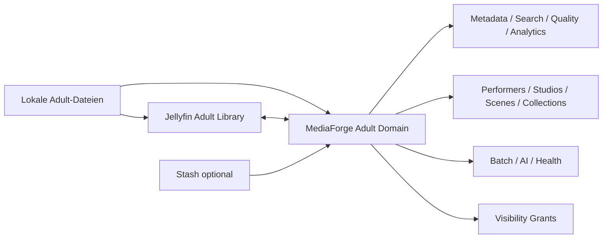

# Adult Enhancement

Zurück zur [Masterdatei](../MediaForge_Master_Engineering.md). Normatives Modulkapitel: [modules/adult-enhancement.md](../modules/adult-enhancement.md).

Adult Enhancement ist ein eigenes großes Enhancement-Modul. Es nutzt lokale Jellyfin-Bibliotheken, wenn Jellyfin die Dateien bereitstellt oder abspielt, ist aber fachlich kein Jellyfin-Unterpunkt. Stash ist optional und darf als Importer, Migrationsquelle oder Inspirationsquelle genutzt werden, ist aber kein Pflichtsystem.

## Ziele

MediaForge macht Adult-Bibliotheken zu einem getrennt sichtbaren, professionell verwalteten lokalen Bereich mit eigener Navigation, eigenen Metadaten, eigener Suche, eigenen Analytics, eigener Health-Prüfung und eigener Rechteprüfung.

## Funktionen

- getrennte Sichtbarkeit und Zugriffskonzepte
- eigenständige Adult-UI mit Szenen-, Performer-, Studio- und Collection-Ansichten
- Performer-, Studio-, Szenen- und Tag-Verwaltung
- Collections, Serien/Reihen, Favoriten und Watch-State
- Batch-Bearbeitung, Dublettenerkennung und Qualitätsanalyse
- lokale Metadatenquellen und manuelle Metadatenpflege
- AI-Tagging und Szenenanalyse mit lokaler/optionaler AI Engine
- Adult-sichere Unified Search und Dashboard-Widgets
- Health Checks für fehlende Dateien, Sichtbarkeitsfehler, Importdrift und Metadatenlücken
- Import aus bestehenden Ordnern und optionaler Import aus Stash
- keine Cloudpflicht, keine Pflicht zu Stash

## Datenfluss

## Security

Adult-Inhalte erscheinen nur für berechtigte Benutzer. Suche, Dashboards, Notifications, Audit-Details, Backup-Berichte und Rule-Treffer müssen dieselbe Sichtbarkeitsprüfung verwenden.
