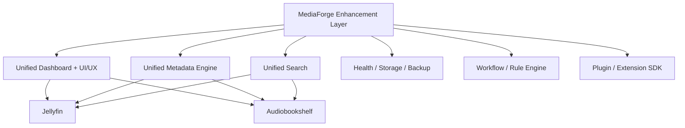

# Enhancement-Überblick

Zurück zur [Masterdatei](../MediaForge_Master_Engineering.md).

MediaForge ist ein lokaler Enhancement Layer für Jellyfin und Audiobookshelf. Die Suite ersetzt keine Player, keine Streaming-Kerne und keine Bibliotheksverwaltung der Ursprungssysteme. Sie erweitert vorhandene Installationen um gemeinsame Oberflächen, Metadaten, Suche, Analyse, Automatisierung, Backups, Health Checks, AI-Funktionen und lokale Verwaltung.

## Architekturprinzip

## Verantwortlichkeiten

Jellyfin bleibt zuständig für Video, Musik, Live TV, Adult-Bibliotheken, Playback, Transcoding und Client-Zugriff. Audiobookshelf bleibt zuständig für Hörbücher, Podcasts, Kapitelanzeige, Fortschritt und Wiedergabe. MediaForge speichert lokale Referenzen, IDs, Overrides, Scores, Workflows, Regeln, Audit-Daten, UI-Einstellungen und Suchindexdaten.

## Modulgruppen

- **Experience**: Unified Dashboard, moderne Navigation, UI-/UX-Enhancement, Design-System, Anpassbarkeit.
- **Metadata**: Unified Metadata Engine, Provider-Prioritäten, Konfliktlösung, Versionierung, Rollback.
- **Operations**: Health Center, Storage Analytics, Backup Center, Developer Center.
- **Automation**: Rule Engine, Workflow Engine, Jobs, Queues, Benachrichtigungen.
- **Intelligence**: lokale AI Engine, Embeddings, Kapitelvorschläge, Duplicate Detection, Qualitätsbewertung.
- **Extensions**: Plugin SDK, Connector SDK, optionale Upstream-Beiträge.

## Nicht-Ziele

MediaForge ist kein Jellyfin-Fork, kein Audiobookshelf-Fork, kein eigener Streaming-Server, kein Cloudservice und keine internetzentrierte Medienplattform. Optionale externe Quellen dürfen Kernfunktionen verbessern, aber nicht voraussetzen.
