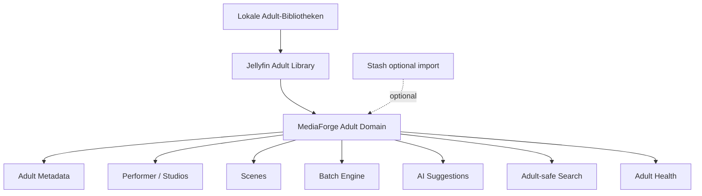

# Adult Enhancement Modul

Zurück zur [Masterdatei](../MediaForge_Master_Engineering.md). Überblick: [Enhancement-Strategie](../enhancements/adult-enhancement.md), [Adult UI Enhancement](../ui-ux/adult-ui-enhancement.md), [Stash-Connector optional](../connectors/stash.md), [Modul-Katalog](module-catalog.md).

Adult Enhancement ist ein eigenständiges großes MediaForge-Modul. Jellyfin kann lokale Adult-Bibliotheken bereitstellen und abspielen, aber die Adult-Domäne selbst wird in MediaForge modelliert: Szenen, Performer, Studios, Collections, Metadaten, Batch-Flows, AI-Vorschläge, Analytics, Health und Search. Stash ist optionaler Importer oder Migrationspfad, niemals Voraussetzung.

## Zweck

Das Modul macht private lokale Adult-Sammlungen professionell verwaltbar, sichtbarkeitsgeschützt und qualitativ nachvollziehbar. Es trennt Adult-Inhalte von normalen Medienbereichen, ohne parallele Ersatzplattform zu bauen.

## Verantwortlichkeiten

- **UI:** eigene Navigation, Szenenlisten, Performer-Seiten, Studio-Seiten, Collection-Seiten, Review-Ansichten und Batch-Editoren.
- **Metadaten:** feldgranulare Provenienz, lokale Overrides, Quellenprioritäten, Tags, Serien/Reihen, Szenenbeschreibungen und Herkunftskennzeichnung.
- **Performer:** lokale Identität, Aliasnamen, Deduplizierung, Rollen, Beziehungsstatus, Importkonflikte und Sichtbarkeit.
- **Studios:** Studio-/Label-Hierarchien, Szenen-Zuordnung, Provider-IDs, lokale Normalisierung und Historie.
- **Szenen:** Szenen als eigene Medienobjekte mit Dateien, Laufzeit, Datum, Tags, Performer-Credits, Studio, Collections und Watch-State.
- **Batch:** sichere Massenänderungen mit Vorschau, Filter-Snapshot, Audit, Dry Run und Rückfallebene.
- **AI:** lokale/optionale Vorschläge für Tags, Szenenbeschreibung, Performer-Matching, Dubletten und Qualitätsindikatoren; AI bleibt Vorschlag, nie bestätigter Stand.
- **Analytics:** Sammlungstrends, Qualitätsabdeckung, Dubletten, fehlende Credits, Studio-/Performer-Verteilung und Speicherprofile.
- **Health:** fehlende Dateien, defekte Mappings, Sichtbarkeitsverletzungen, Importdrift, veraltete AI-Ergebnisse und Connector-Probleme.
- **Search:** adult-sichere Indexierung über Szenen, Performer, Studios, Tags und Collections.
- **Collections:** manuelle und regelbasierte Collections mit Sichtbarkeit, Reihenfolge, Beschreibung, Cover und Herkunft.

## Architektur



Das Modul hängt an Core, Metadata Engine, Search, AI Engine, Health Center, Rule Engine und Jellyfin Enhancement. Fachentscheidungen liegen in Adult-Actions (`UpdateAdultScene`, `MergeAdultPerformer`, `ApplyAdultBatch`, `AcceptAdultAiSuggestion`), nicht im Connector. Sichtbarkeit wird früh im Query-Pfad erzwungen; Treffer oder Widget-Daten werden nicht erst im Frontend ausgeblendet.

## Datenmodell

Das Kernschema wird um adult-spezifische Tabellen erweitert:

```sql
CREATE TABLE adult_scenes (
    id                 CHAR(26) PRIMARY KEY,
    media_item_id       CHAR(26) NOT NULL REFERENCES media_items(id) ON DELETE CASCADE,
    title              TEXT NOT NULL,
    scene_date          DATE,
    studio_id           CHAR(26) REFERENCES adult_studios(id) ON DELETE SET NULL,
    visibility_level    TEXT NOT NULL CHECK (visibility_level IN ('restricted','private','shared')),
    metadata_status     TEXT NOT NULL CHECK (metadata_status IN ('empty','partial','complete','conflict')),
    created_at          TIMESTAMPTZ NOT NULL DEFAULT now(),
    updated_at          TIMESTAMPTZ NOT NULL DEFAULT now()
);

CREATE TABLE adult_performers (
    id                 CHAR(26) PRIMARY KEY,
    display_name        TEXT NOT NULL,
    sort_name           TEXT,
    aliases             JSONB NOT NULL DEFAULT '[]',
    metadata_source     TEXT NOT NULL DEFAULT 'manual',
    created_at          TIMESTAMPTZ NOT NULL DEFAULT now(),
    updated_at          TIMESTAMPTZ NOT NULL DEFAULT now()
);

CREATE TABLE adult_studios (
    id                 CHAR(26) PRIMARY KEY,
    name                TEXT NOT NULL,
    parent_studio_id    CHAR(26) REFERENCES adult_studios(id) ON DELETE SET NULL,
    metadata_source     TEXT NOT NULL DEFAULT 'manual',
    created_at          TIMESTAMPTZ NOT NULL DEFAULT now(),
    updated_at          TIMESTAMPTZ NOT NULL DEFAULT now()
);

CREATE TABLE adult_scene_performers (
    scene_id            CHAR(26) NOT NULL REFERENCES adult_scenes(id) ON DELETE CASCADE,
    performer_id        CHAR(26) NOT NULL REFERENCES adult_performers(id) ON DELETE RESTRICT,
    role                TEXT NOT NULL DEFAULT 'performer',
    source              TEXT NOT NULL,
    confidence          NUMERIC(4,3),
    PRIMARY KEY (scene_id, performer_id, role)
);

CREATE TABLE adult_collections (
    id                 CHAR(26) PRIMARY KEY,
    name                TEXT NOT NULL,
    collection_kind     TEXT NOT NULL CHECK (collection_kind IN ('manual','rule','imported')),
    visibility_level    TEXT NOT NULL CHECK (visibility_level IN ('restricted','private','shared')),
    created_at          TIMESTAMPTZ NOT NULL DEFAULT now(),
    updated_at          TIMESTAMPTZ NOT NULL DEFAULT now()
);

CREATE TABLE adult_visibility_grants (
    id                 CHAR(26) PRIMARY KEY,
    user_id             CHAR(26) NOT NULL REFERENCES users(id) ON DELETE CASCADE,
    scope_type          TEXT NOT NULL CHECK (scope_type IN ('adult_all','collection','studio','performer')),
    scope_id            CHAR(26),
    granted_by          CHAR(26) REFERENCES users(id) ON DELETE SET NULL,
    created_at          TIMESTAMPTZ NOT NULL DEFAULT now()
);
```

Provider-IDs, Audit Logs, Review Tasks, Search Documents und AI Jobs verwenden die bestehenden Core-Tabellen. Adult-spezifische Tabellen speichern nur fachliche Ergänzungen; sie ersetzen nicht `media_items`, `files` oder Jellyfin-IDs.

## APIs

| Endpoint | Zweck | Schutz |
|---|---|---|
| `GET /api/v1/adult/scenes` | Szenenliste mit Facetten | `adult:view` |
| `GET /api/v1/adult/scenes/{id}` | Szenendetail | `adult:view` + Grant |
| `PATCH /api/v1/adult/scenes/{id}` | Metadaten ändern | `adult:write` |
| `POST /api/v1/adult/batches` | Batch-Dry-Run starten | `adult:batch` |
| `POST /api/v1/adult/batches/{id}/apply` | geprüften Batch anwenden | `adult:batch` |
| `GET /api/v1/adult/performers` | Performer suchen/verwalten | `adult:view` |
| `POST /api/v1/adult/performers/{id}/merge` | Performer zusammenführen | `adult:write` |
| `GET /api/v1/adult/studios` | Studios verwalten | `adult:view` |
| `GET /api/v1/adult/collections` | Collections | `adult:view` |
| `POST /api/v1/adult/ai/suggestions/{id}/accept` | AI-Vorschlag annehmen | `adult:write` |

Inertia-Seiten verwenden dieselben Policies. API-Responses dürfen nicht durch fehlende Berechtigung verraten, dass ein bestimmter Adult-Inhalt existiert; unberechtigte Zugriffe liefern dieselbe Außenwirkung wie unbekannte IDs.

## Erweiterbarkeit

Adult-Erweiterungen registrieren Importer, Metadatenquellen, Tagger, Health Checks, Batch-Aktionen, Collection Builder, Search Facets und UI-Widgets. Jede Erweiterung deklariert Datenschutzklasse, Sichtbarkeitsbedarf, Audit-Verhalten und Test-Fixtures. Importer müssen trocken laufen können und vor dem Schreiben Konflikte als Reviews erzeugen.

## Zukünftige Roadmap

- Performer-Deduplizierung über Alias-, Fingerprint- und Importsignale.
- Studio-Hierarchien mit Merge-/Split-Workflow.
- lokale Scraper-Profile mit Quellprioritäten und Rate Limits.
- adult-spezifische Qualitätsmetriken für Metadatenabdeckung, Scene Health und Dubletten.
- Collection-Assistent für manuelle, regelbasierte und importierte Collections.
- sensitive Backup- und Restore-Policies mit zusätzlicher Bestätigung.
- UI-Verbesserungen für schnelle Batch-Korrekturen ohne Sichtbarkeitslecks.

## Akzeptanzkriterien

- Adult ist als eigenes Modul sichtbar und nicht als Unterkapitel von Jellyfin formuliert.
- Jede Adult-Liste, Suche, Notification, Dashboard-Kachel und jeder Export respektiert `adult_visibility_grants`.
- AI-Ergebnisse sind als Vorschläge gekennzeichnet und brauchen Annahme oder Review.
- Batch-Aktionen haben Dry Run, Audit und Wiederherstellungspfad.
- Stash-Import ist optional; ohne Stash bleibt das Modul vollständig nutzbar.
