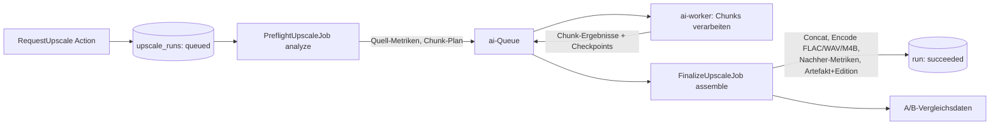

# AI Audio Upscaler

Zurück zur [Masterdatei](../MediaForge_Master_Engineering.md). Abhängigkeiten: [architecture/overview.md](../architecture/overview.md) (ai-worker, Queue `ai`), [database/core-schema.md](../database/core-schema.md) (Editionen, Artefakte), [modules/audit.md](audit.md), [modules/audiobook-assembler.md](audiobook-assembler.md) (Track-Sequenz als Eingabe bei Hörbüchern).

**Vertiefungen**: [Worker-Protokoll `ai-job/v1`](audio-upscaler/worker-protocol.md) · [Profile und Metriken](audio-upscaler/profiles-metrics.md) Verwandt: [modules/audio-analysis.md](audio-analysis.md) (geplant; liefert die Qualitätsmetriken), [modules/ai-engine.md](ai-engine.md) (geplant; Modell-Registry und Worker-Protokoll — die hier verwendeten Verträge sind in diesem Kapitel normativ vorweggenommen und wandern bei Ausarbeitung der AI Engine dorthin).

## Motivation

Leitszenario 4 der Masterdatei: Große Bestände existieren nur in verlustbehafteter Qualität — 64-kbit/s-Hörbuch-MP3s aus den 2000ern, 128-kbit/s-Musik-Rips, Kassetten-Digitalisierungen mit Rauschen und Dropouts. Moderne Audio-Restaurationsmodelle (Bandbreiten-Erweiterung, De-Noising, De-Clipping, Artefakt-Reduktion) können daraus hörbar bessere Fassungen erzeugen. MediaForge macht diese Verbesserung als **optionalen, ehrlichen, vollständig dokumentierten** Verarbeitungsschritt verfügbar: Das Ergebnis ist eine gekennzeichnete rekonstruierte Fassung als neues Artefakt — nie ein Ersatz des Originals, nie eine Behauptung von Originaltreue.

## Problemstellung

**Die Ehrlichkeitsgrenze.** Verlorene Information ist verloren: Ein 64-kbit/s-MP3 enthält oberhalb ~10 kHz schlicht nichts mehr; ein Modell, das dort Obertöne erzeugt, **erfindet** plausible Inhalte, es stellt keine wieder her. Das System muss diese Natur des Verfahrens in Datenmodell, UI und Artefakt-Metadaten unmissverständlich transportieren — „verbesserte, rekonstruierte Version", nie „Original in verlustfrei". Ein als FLAC gespeichertes Upscale-Ergebnis ist verlustfrei *gegenüber dem Modelloutput*, nicht gegenüber einer nie besessenen Studioquelle. Wer das vermischt, produziert Katalogbetrug an sich selbst.

**Reproduzierbarkeit und Rechenschaft.** Modelle ändern sich, Parameter ändern Ergebnisse drastisch, und ein 40-Stunden-Hörbuch-Upscale kostet GPU-Stunden. Jeder Lauf muss vollständig beschrieben sein (Modell, Version, Gewichte-Hash, Parameter, Quell-Signatur), damit Ergebnisse erklärbar, vergleichbar und — bei identischen Eingaben — reproduzierbar bzw. per Idempotenz-Anker gar nicht erst doppelt berechnet werden.

**Qualität ist messbar zu machen.** „Klingt besser" genügt nicht als Systemzustand. Der Lauf braucht Vorher/Nachher-Metriken (Spektral-Bandbreite, Rausch-Schätzung, Clipping-Rate, Lautheit, ggf. modellinterne Konfidenzen) und einen A/B-Vergleichspfad für das menschliche Urteil — beides persistiert, beides Teil der Processing History.

**Betriebsrealität.** GPU-Jobs über Stunden auf Consumer-Hardware: Abbrüche, OOM, Thermik. Die Verarbeitung muss chunk-weise mit Checkpoints laufen (Fundament-Vertrag), die `ai`-Queue darf den Rest des Systems nie blockieren, und ein Betrieb ganz ohne GPU (CPU-Fallback oder Feature deaktiviert) muss sauber funktionieren — der Upscaler ist strikt optional.

## Analyse bestehender Lösungen

Im Selfhosting-Umfeld existiert kein Vorbild: **Jellyfin/ABS/Kodi** verändern Audio nur transient (Transcoding fürs Streaming, verworfen nach Nutzung) — strukturell interessant ist daran nur die klare Trennung von Quelle und abgeleitetem Strom. **Immich** ist das Architektur-Vorbild für ML-Worker-Anbindung (dedizierter Container, Queue-Protokoll, Modell-Download beim Start), aber seine ML-Ergebnisse (Embeddings, Gesichter) sind Metadaten, keine Medien-Artefakte. **Photo-Upscaler-Ökosystem** (Upscayl u. a.) zeigt die UI-Erwartung (Vorher/Nachher-Vergleich, Modellwahl) und den verbreiteten Fehler: Ergebnisse ohne Herkunftsmetadaten, die sich nach Monaten nicht mehr von Originalen unterscheiden lassen. Auf der Modellseite existieren einsatzreife Familien für Sprach-Restauration (Bandbreiten-Erweiterung/„bandwidth extension", Speech Enhancement) und Musik-Restauration (De-Noise, De-Clip, Codec-Artefakt-Reduktion); die konkrete Modellwahl ist bewusst **konfigurierbar** und nicht Teil dieser Spezifikation — die Architektur behandelt Modelle als versionierte, austauschbare Black Boxes hinter dem Worker-Protokoll.

## Architekturentscheidung

Der Upscaler ist eine dünne Fach-Orchestrierung über drei Fundament-Bausteinen: **Runs** (die vollständig beschriebene Verarbeitungseinheit, eigene Tabelle), **Artefakte** (Ergebnis-Dateien über das Fundament-Artefaktmodell mit Idempotenz-Signatur) und **Editionen** (das Ergebnis wird als eigene `media_edition` mit `edition_kind='upscale'` katalogisiert, damit Player-Integrationen und Exporte es als wählbare Fassung sehen). Die eigentliche Signalverarbeitung liegt vollständig im ai-worker (Python), erreichbar über das Job-Protokoll der `ai`-Queue; PHP orchestriert, misst nach und verbucht.

Ablauf eines Laufs:



Der **Preflight** ist fachlich tragend, nicht nur technisch: Er misst die Quelle (effektive Bandbreite, Rauschteppich, Clipping, Lautheit — via Audioanalyse-Modul) und prüft die **Sinnhaftigkeit** des angeforderten Profils. Ein „Bandbreiten-Erweiterung"-Profil auf einer bereits vollbandigen FLAC-Quelle wird mit fachlicher Begründung abgelehnt (`rejected_pointless`) statt GPU-Stunden zu verbrennen; eine 32-kbit/s-Quelle unterhalb der Modell-Trainingsdomäne erzeugt eine Warnung im Run („Ergebnis außerhalb der validierten Domäne"), die bis ins Artefakt durchgereicht wird.

Die **Ehrlichkeits-Verankerung** zieht sich durch alle Ebenen: Die Ziel-Edition heißt im UI „Rekonstruiert (Modellname)", `edition_kind='upscale'` kann nie `is_primary` werden, solange eine Nicht-Upscale-Edition existiert (Action-Validierung); Artefakt-Tags enthalten `MediaForge_RECONSTRUCTED=1`, Modell und Version; und der Katalog zeigt das Upscale-Badge überall, wo die Edition auftaucht. Regel 5 (KI erfindet keine offiziellen Daten) gilt hier in der Medienform: Die Rekonstruktion ist als solche unauslöschlich gekennzeichnet.

## Alternativen

**In-Place-Ersatz der Quelle** (Original durch verbesserte Fassung ersetzen): kategorisch ausgeschlossen ([ADR-0005](../adr/0005-immutable-originals.md)). **Upscaling beim Abspielen** (transient, wie Transcoding): verworfen — GPU-Echtzeit-Kosten pro Wiedergabe statt einmalig, keine Metriken, kein A/B; zudem streamt MediaForge nicht selbst (Nicht-Ziel). **Externe Tools per Hand + Import**: der Status quo, den das Modul ablöst; verliert Herkunft, Idempotenz, Metriken. **Modell-Festlegung in der Spezifikation** (ein definiertes Modell statt Registry): verworfen — die Modelllandschaft dreht sich schneller als dieses Handbuch; die Registry mit versionierten Profilen ist die stabile Abstraktion. **Ergebnis nur als Artefakt ohne Editions-Katalogisierung**: verworfen — dann wäre die verbesserte Fassung für Player/Exporte unsichtbar und das Feature liefe ins Leere.

## Datenmodell

Ein **Run** beschreibt genau einen Verarbeitungslauf: Quelle (Edition + deren Datei-Signatur zum Startzeitpunkt), Profil (Modell, Version, Parameter), Zustand, Metriken vorher/nachher, Ergebnis (Artefakt + Ziel-Edition), Fehler- und Zeitinformation. Runs sind append-only-artig: Ein erneuter Versuch nach Fehlschlag ist ein neuer Run mit `retry_of`-Verweis — die **Processing History** einer Edition ist die Kette ihrer Runs, ohne Überschreiben. Ein **Profil** (`upscale_profiles`) ist eine benannte, versionierte Konfiguration (Modell-Referenz + Parameter-Preset + Zielformat), damit Betreiber reproduzierbare Standards definieren („Hörbuch-Standard: speech-bwe v2.1, mono, FLAC") statt pro Lauf Parameter zu raten.

## SQL-Schema

```sql
CREATE TABLE upscale_profiles (
    id             CHAR(26) PRIMARY KEY,
    name           TEXT        NOT NULL,
    task           TEXT        NOT NULL
        CHECK (task IN ('speech_enhance','bandwidth_extend','denoise','declip',
                        'codec_artifact_reduce','composite')),
    model_name     TEXT        NOT NULL,          -- Registry-Kennung, z. B. 'speech-bwe'
    model_version  TEXT        NOT NULL,          -- '2.1.0'
    model_weights_hash TEXT,                      -- Hash der Gewichte-Datei (Reproduzierbarkeit)
    params         JSONB       NOT NULL DEFAULT '{}',   -- Modellparameter-Preset
    target_format  TEXT        NOT NULL DEFAULT 'flac'
        CHECK (target_format IN ('flac','wav','m4b')),
    is_enabled     BOOLEAN     NOT NULL DEFAULT true,
    created_at     TIMESTAMPTZ NOT NULL DEFAULT now(),
    updated_at     TIMESTAMPTZ NOT NULL DEFAULT now(),
    UNIQUE (name)
);

CREATE TABLE upscale_runs (
    id              CHAR(26) PRIMARY KEY,
    source_edition_id CHAR(26)  NOT NULL REFERENCES media_editions(id) ON DELETE CASCADE,
    profile_id      CHAR(26)    NOT NULL REFERENCES upscale_profiles(id) ON DELETE RESTRICT,
    -- Profil-Zustand zum Laufzeitpunkt eingefroren (Profile sind editierbar, Runs nicht):
    profile_snapshot JSONB      NOT NULL,
    source_signature TEXT       NOT NULL,         -- Hash über Quell-Datei-Hashes + Sequenz
    status          TEXT        NOT NULL DEFAULT 'queued'
        CHECK (status IN ('queued','preflight','rejected_pointless','processing',
                          'finalizing','succeeded','failed','cancelled')),
    domain_warning  TEXT,                         -- z. B. 'below_trained_bitrate_domain'
    metrics_before  JSONB,                        -- Preflight-Messung (Audioanalyse-Schema)
    metrics_after   JSONB,                        -- Nachmessung des Ergebnisses
    result_artifact_id CHAR(26) REFERENCES artifacts(id) ON DELETE SET NULL,
    result_edition_id  CHAR(26) REFERENCES media_editions(id) ON DELETE SET NULL,
    retry_of        CHAR(26)    REFERENCES upscale_runs(id) ON DELETE SET NULL,
    requested_by    CHAR(26)    REFERENCES users(id) ON DELETE SET NULL,
    error_detail    TEXT,
    worker_info     JSONB       NOT NULL DEFAULT '{}',  -- GPU/CPU, Treiber, Laufzeit je Chunk
    queued_at       TIMESTAMPTZ NOT NULL DEFAULT now(),
    started_at      TIMESTAMPTZ,
    finished_at     TIMESTAMPTZ,
    created_at      TIMESTAMPTZ NOT NULL DEFAULT now(),
    updated_at      TIMESTAMPTZ NOT NULL DEFAULT now()
);

CREATE INDEX upscale_runs_edition_idx ON upscale_runs (source_edition_id, status, queued_at DESC);

-- Kein zweiter aktiver Lauf derselben Quelle mit demselben eingefrorenen Profil:
CREATE UNIQUE INDEX upscale_runs_no_duplicate_active
    ON upscale_runs (source_edition_id, source_signature, profile_id)
    WHERE status IN ('queued','preflight','processing','finalizing');
```

Die Metrik-JSONBs folgen dem versionierten Schema des Audioanalyse-Moduls (`audio-metrics/v1`: `bandwidth_hz`, `noise_floor_db`, `clipping_ratio`, `lufs_integrated`, `true_peak_db`, spektrale Kennwerte pro Zeitfenster als Verweis auf ein `analysis_report`-Artefakt statt inline — die Zeitreihen sind zu groß für Zeilen-JSONB). Regel-8-konform: Metriken werden angezeigt und verglichen, nie relational gejoint.

## Worker-Protokoll (ai-Queue)

Der ai-worker konsumiert Jobs der `ai`-Queue direkt (Redis-Protokoll, Payload-Vertrag `ai-job/v1`) und ist bewusst dumm gehalten: Er kennt weder Editionen noch Kataloge — nur Eingabedateien, Modellreferenz, Parameter, Ausgabepfad:

```json
{
  "schema": "ai-job/v1",
  "job_id": "01J…",
  "task": "bandwidth_extend",
  "model": {"name": "speech-bwe", "version": "2.1.0", "weights_hash": "blake3:…"},
  "params": {"target_sr": 44100, "chunk_overlap_ms": 500},
  "inputs": [{"path": "/media/audiobooks/…/Track01.mp3", "chunk": {"index": 3, "of": 40,
              "start_ms": 1800000, "end_ms": 2400000}}],
  "output": {"path": "/artifacts/audio-upscaler/01J…/chunk-003.wav.partial", "format": "wav_f32"},
  "checkpoint_key": "upscale:01J…"
}
```

Chunking geschieht in PHP (Preflight erstellt den Chunk-Plan: 10-Minuten-Fenster mit 500 ms Überlappung; Übergänge werden im Finalize per Crossfade in der Überlappungszone verschmolzen — die Naht liegt nie hörbar auf einem harten Schnitt). Jeder Chunk ist ein eigener Queue-Job mit eigenem Checkpoint (`job_checkpoints`); OOM/Absturz kostet einen Chunk, nie den Lauf. Der Worker meldet Ergebnis + Laufzeitdaten (`worker_info`-Fragment) zurück; drei Fehlversuche desselben Chunks eskalieren zum Fachfehler des Runs (Fundament-Konvention der giftigen Schritte). GPU-Verfügbarkeit deklariert der Worker beim Start; ohne ai-worker bleibt die `ai`-Queue leer liegen und das UI zeigt das Feature als „nicht verfügbar (kein AI-Worker verbunden)" statt Jobs ins Nichts zu stauen (Health-Check des Admin-Moduls).

## Finalize und Ergebnisverbuchung

Der `FinalizeUpscaleJob` (Queue `assemble`) fügt die Chunks zusammen (Crossfade, Sample-genaue Gesamtlänge = Quelllänge — Längendrift > 50 ms ist ein Validierungsfehler), enkodiert ins Zielformat (FLAC Level 8 / WAV PCM16 oder f32 / M4B über den [Assembler-Builder](audiobook-assembler.md) mit übernommener Kapitelstruktur der Quelle), misst nach (identisches Metrik-Schema wie Preflight), erzeugt Vergleichsdaten für das A/B-UI (synchronisierte Wellenform-/Spektrogramm-Bilder als `analysis_report`-Artefakte plus drei automatisch gewählte 20-s-Vergleichsausschnitte: leiseste Passage, lauteste Passage, höchster spektraler Differenzpunkt), registriert das Fundament-Artefakt (`flac_upscale`/`wav_upscale`, `input_signature` = `source_signature` + Profil-Snapshot-Hash) und legt die Ziel-Edition an (`edition_kind='upscale'`, `source_note` = „speech-bwe 2.1.0, Run 01J…", verknüpft über `edition_files` mit dem Artefakt — Artefakt-Dateien können als `files`-Einträge einer Artefakt-Bibliothek geführt werden, damit die Editions-Mechanik einheitlich bleibt). Tags im Zielcontainer: Katalog-Metadaten plus `MediaForge_RECONSTRUCTED=1`, `MediaForge_MODEL`, `MediaForge_RUN`. Alles in einer auditieren Abschluss-Action (`RecordUpscaleResult`).

## Laravel-Klassen

Namespace `App\Modules\AudioUpscaler`:

| Klasse | Typ | Vertrag |
|---|---|---|
| `UpscaleProfile`, `UpscaleRun` | Model | Runs guarded außerhalb der Actions; Profile admin-editierbar |
| `RequestUpscale` | Action | Input `{editionId, profileId, userId}`; prüft Duplikat-Index, Feature-Verfügbarkeit; friert Profil-Snapshot ein; dispatcht Preflight; Audit |
| `CancelUpscaleRun` | Action | bricht ausstehende Chunks ab (Queue-Purge über checkpoint_key); Status `cancelled`; Audit |
| `RecordUpscaleResult` | Action | Finalize-Verbuchung (Artefakt, Edition, Metriken) atomar; Audit |
| `PromoteUpscaleEdition` | Action | erlaubt `is_primary` nur, wenn keine Nicht-Upscale-Edition existiert oder der Benutzer die explizite Überschreib-Bestätigung mitliefert (zweistufig, auditiert) |
| `PreflightUpscaleJob` | ResumableJob (`analyze`) | Quell-Metriken, Sinnhaftigkeitsprüfung, Chunk-Plan |
| `DispatchUpscaleChunksJob` | Job (`default`) | Chunk-Jobs auf `ai`-Queue legen (Batch) |
| `FinalizeUpscaleJob` | ResumableJob (`assemble`) | Schritte `concat`, `encode`, `measure`, `compare`, `register` |
| `UpscaleRunSucceeded`, `UpscaleRunFailed` | Event | Fundament-Konvention |
| `AudioMetricsInterface` | Interface | `measure(paths): AudioMetrics` — Implementierung liefert das Audioanalyse-Modul |

## API-Endpunkte

| Route | Zweck | Rolle |
|---|---|---|
| `GET /api/v1/upscale/profiles` | verfügbare Profile + Worker-Verfügbarkeit | member |
| `POST /api/v1/editions/{ulid}/upscale` | Lauf anfordern `{profile_id}` (Run-Referenz zurück) | manager |
| `GET /api/v1/upscale/runs/{ulid}` | Run-Detail: Status, Fortschritt (Chunks), Metriken, Warnungen | member |
| `POST /api/v1/upscale/runs/{ulid}/cancel` | Lauf abbrechen | manager |
| `GET /api/v1/upscale/runs/{ulid}/comparison` | A/B-Daten: Ausschnitt-URLs (signiert), Spektrogramme, Metrik-Diff | member |
| `GET /api/v1/editions/{ulid}/processing-history` | Run-Kette der Edition (Processing History) | member |

## Vue-/Inertia-Komponenten und UI-Flows

**`Upscaler/RunDetail`** — Statusseite eines Laufs: Chunk-Fortschrittsleiste (aus `job_progress`), Warnbanner bei `domain_warning`, Metrik-Tabelle vorher/nachher mit Delta-Hervorhebung, Fehlerdetails. **`Upscaler/Comparison`** — der A/B-Vergleich: synchronisierte Spektrogramm-Ansicht (Original oben, Rekonstruktion unten, gemeinsamer Zeitcursor), drei kuratierte Vergleichsausschnitte mit umschaltbarem A/B-Player (blind-Modus: Zuordnung erst nach dem Anhören aufgedeckt — das ehrlichste UI gegen Placebo-Urteile), Übernahme-Buttons („Edition behalten" / „Run verwerfen": verwerfen löscht Artefakt + Edition über die Housekeeping-Karenz, der Run selbst bleibt als History). **Edition-Badge** — überall, wo Editionen erscheinen (Katalog-Detail, Export-Dialoge), trägt die Upscale-Edition dauerhaft das „Rekonstruiert"-Badge mit Modell-Tooltip; das Badge ist Bestandteil der Edition-Props des Fundaments, nicht pro Seite nachgebaut (Architekturregel 2).

Kern-Flow: Hörbuch-Edition (64-kbit/s-MP3) → „Verbessern"-Aktion → Profilwahl („Hörbuch-Standard", Worker verfügbar, Kostenschätzung: ~3.5 h GPU) → Run beobachtbar auf der Detailseite → nach Abschluss Vergleichsansicht → Benutzer behält die Edition → ABS-Export ([Assembler](audiobook-assembler.md)) bietet fortan beide Fassungen an; das Original bleibt byte-identisch.

## Edge Cases

* **Quelle ändert sich während des Laufs** (Re-Rip): `source_signature`-Prüfung im Finalize schlägt fehl ⇒ Run `failed` mit klarer Ursache; kein Ergebnis aus gemischten Quellen.
* **Mehrteilige Quellen** (Hörbuch aus 97 Tracks): Eingabe ist die Track-Sequenz der Assembly (Werk-Zeitachse); das Ergebnis ist ein Werk-Artefakt (eine FLAC/M4B), nicht 97 Einzeldateien — Kapitelstruktur kommt aus dem aktiven Chapter Set.
* **Stereo-Entscheidung bei Sprachquellen**: Preflight erkennt Pseudo-Stereo (Kanalkorrelation > 0.98) und schlägt Mono-Verarbeitung mit halber Rechenzeit vor; echte Stereo-Hörspiele bleiben Stereo (Parameter, nie stille Automatik — die Wahl steht im Profil-Snapshot).
* **Bereits hochwertige Quelle**: `rejected_pointless` mit Metrik-Begründung („effektive Bandbreite 21.8 kHz — nichts zu erweitern"); der Run kostet nur den Preflight.
* **Modell-Update** (Profil zeigt auf neue Version): alte Runs bleiben mit Snapshot beweisfähig; ein Re-Run derselben Quelle mit neuer Version ist ein neuer Run — das A/B-UI kann auch zwei Runs gegeneinander vergleichen (nicht nur gegen das Original).
* **Worker verschwindet mitten im Lauf**: Chunks bleiben in der Queue, Checkpoints halten den Stand; Wiederanlauf setzt fort. Timeout-Überwachung (Run ohne Chunk-Fortschritt > konfigurierbare Frist) markiert `failed` mit `worker_lost`.
* **Plattenplatz**: Finalize prüft vor dem Encode den freien Artefakt-Speicher gegen eine Schätzung (Quelldauer × Zielformat-Rate × 1.2); zu knapp ⇒ Fachfehler vor teurer Arbeit, nicht ENOSPC mittendrin.

## Performance

Die `ai`-Queue ist strikt seriell pro Worker (GPU-Speicher); Parallelität entsteht nur über mehrere Worker. Chunk-Größe (Default 10 min) balanciert Checkpoint-Granularität gegen Overhead (Modell-Warmup pro Chunk; der Worker hält das Modell zwischen Chunks desselben Runs im Speicher — das Protokoll übergibt `checkpoint_key` als Affinitäts-Hinweis). Zwischenergebnisse (WAV f32) sind groß (~700 MB/h): Sie liegen unter `/artifacts/audio-upscaler/{run}/tmp` und werden im Finalize-Erfolgs- wie -Fehlerpfad aufgeräumt (Housekeeping-Job fängt Waisen). Spektrogramm-Erzeugung läuft auf `analyze`, nie auf `ai` (keine GPU-Bindung für Bilder).

## Security

Der ai-worker verarbeitet Medieninhalte mit ML-Stacks voller nativer Abhängigkeiten: Container ohne Netz-Egress (Modelle werden beim Image-Build bzw. aus lokalem Modell-Volume geladen, nicht zur Laufzeit aus dem Internet), read-only-Medien-Mounts, Schreibrecht nur auf `/artifacts/audio-upscaler`. Modell-Gewichte werden über `model_weights_hash` verifiziert — ein ausgetauschtes Gewichte-File fällt im Worker-Start auf. Profil-Verwaltung ist `admin`; Lauf-Anforderung `manager` (GPU-Zeit ist eine teure Ressource — kein member-Selbstbedienungsladen, konfigurierbar). Vergleichsausschnitt-URLs sind signiert und kurzlebig wie beim Assembler.

## Tests

Protokoll-Contract-Tests gegen einen Fake-Worker (Chunk-Ergebnisse aus Fixtures; Absturz-/OOM-Simulation ⇒ Checkpoint-Wiederaufnahme). Finalize-Tests mit synthetischem Audio: Crossfade-Nahtlosigkeit (Phasen-Kontinuität über die Naht), Längeninvariante (±50 ms), Metrik-Plausibilität (Bandbreiten-Erweiterung muss `bandwidth_hz` messbar erhöhen — auf Synthetik deterministisch prüfbar). Ehrlichkeits-Invarianten als eigene Testgruppe: Upscale-Edition kann ohne Zweitbestätigung nie primär werden; Artefakt-Tags enthalten die Rekonstruktions-Marker; `rejected_pointless` auf vollbandiger Quelle. Idempotenz: identische Quelle + identisches Profil ⇒ zweiter Request liefert den bestehenden Run/das bestehende Artefakt (Duplikat-Index + Artefakt-Signatur).

## ADR-Verweise

[ADR-0005](../adr/0005-immutable-originals.md) (Artefakt-Prinzip — hier in Reinform), [ADR-0006](../adr/0006-action-level-audit.md) (Runs vollständig auditiert). Die Ehrlichkeits-Verankerung operationalisiert Architekturregel 5 für generierte Medien; eine eigene ADR ist nicht nötig, da keine Alternative ernsthaft bestand.

## Offene Punkte

* **Modell-Registry und Beschaffung** (welche Modelle werden ausgeliefert/empfohlen, Lizenzlage der Gewichte, lokales Modell-Volume-Format): gehört in [modules/ai-engine.md](ai-engine.md) und ist dort zu spezifizieren, bevor der Upscaler implementiert wird.
* **Wahrnehmungsmetriken** (PESQ/VISQOL-artige Scores zusätzlich zu Signalmetriken): wünschenswert für das Metrik-Delta, Lizenz-/Implementierungsfragen offen.
* **Batch-Läufe** („alle Hörbücher unter 96 kbit/s mit Profil X"): fachlich ein Rule-Engine-Anwendungsfall; der Upscaler bleibt Einzellauf-orientiert, die Massensteuerung kommt von außen.
* **Video-Upscaling**: bewusst außerhalb des Modulumfangs (eigene Problemklasse); Namensraum `AudioUpscaler` hält die Grenze explizit.
