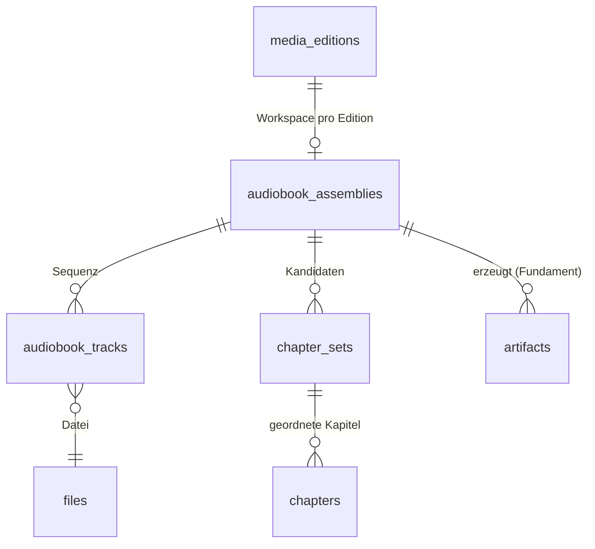

# Hörbuch-Kapitel-Assembler

Zurück zur [Masterdatei](../MediaForge_Master_Engineering.md). Abhängigkeiten: [architecture/overview.md](../architecture/overview.md) (Jobs, media-tools), [database/core-schema.md](../database/core-schema.md) (Katalog, files/editions, artifacts), [modules/audit.md](audit.md). Verwandt: [connectors/audiobookshelf.md](../connectors/audiobookshelf.md) (geplant; Export-Ziel), [modules/audio-analysis.md](audio-analysis.md) (geplant; Stille-/Sprecheranalyse als Heuristik-Zulieferer), [modules/audio-upscaler.md](audio-upscaler.md) (geplant; konsumiert die Track-Sequenz dieses Moduls).

**Vertiefungen**: [Sequenzierungsregel-Katalog](audiobook-assembler/sequencing-rules.md) · [Kapitelquellen-Formatreferenz](audiobook-assembler/chapter-source-formats.md) · [Alignment-Algorithmus](audiobook-assembler/alignment-algorithm.md) · [Artefakt-Builder](audiobook-assembler/artifact-builders.md) · [API/UI/Tests](audiobook-assembler/api-ui-tests.md)

## Motivation

Leitszenario 2 der Masterdatei: Hörbücher liegen real als ungeordnetes Quellenpaket vor — 97 MP3s über drei CD-Ordner, leere Tags, generische Tracknamen, manchmal eine CUE-Datei aus einem Rip, manchmal ein M4B mit eingebetteten Kapiteln, meistens nichts von alledem. Audiobookshelf und alle Player spielen das ab, aber niemand **assembliert**: Niemand baut aus den Fragmenten die kanonische Struktur des Werks — geordnete Tracksequenz, verlässliche Kapitel mit Titeln, saubere Container. Der Assembler ist das Kurationsmodul, das aus Fragmenten ein strukturiertes Hörbuch macht: mit einer harten Quellen-Hierarchie (offizielle Kapitel schlagen alles), mit KI nur als gekennzeichnetem Vorschlagsgeber (Architekturregel 5) und mit Artefakt-Erzeugung (CUE, M4B, ABS-Export) statt Manipulation der Originale (Architekturregel 4).

## Problemstellung

Vier Teilprobleme:

**Track-Sequenzierung.** Bevor über Kapitel geredet werden kann, muss die Abspielreihenfolge der Dateien feststehen. Die Realität: `CD1/Track01.mp3 … CD3/Track32.mp3` (Tracknummern starten pro CD neu), `01 - Kapitel 1.mp3` (Dateiname trägt das Sequenzsignal), `B003 Der Name des Windes 003.mp3` (Publisher-Schema), Tags mit `track=3/97` oder `track=3` + `disc=2/3` oder gar nichts, Windows-Sortierung vs. natürliche Sortierung (`Track2` vs. `Track10`). Falsche Sequenz macht jede Kapitelarbeit wertlos — und stille Fehler (zwei vertauschte Tracks in Stunde 14) sind praktisch unauffindbar. Die Sequenzierung braucht deshalb Konsistenzprüfungen und einen Unsicherheits-Pfad ins Review.

**Kapitelquellen-Konflikt.** Für dasselbe Hörbuch können koexistieren: eine offizielle Kapitelliste des Anbieters (31 Kapitel mit Titeln), eingebettete M4B-Kapitel (30 Kapitel, andere Grenzen), eine CUE-Datei (97 Einträge = Tracks, keine echten Kapitel), ID3-Kapitel-Frames (CHAP), eine NFO/JSON-Datei eines anderen Tools und die triviale Struktur „1 Track = 1 Kapitel". Diese Quellen widersprechen sich in Anzahl, Grenzen und Titeln. Das System braucht eine deklarierte Hierarchie, Nachvollziehbarkeit, warum welche Quelle gewann, und die Fähigkeit, mehrere Kandidaten nebeneinander zu halten.

**Zeitachsen-Übersetzung.** Kapitelquellen sprechen Werkzeit („Kapitel 7 beginnt bei 6:12:44"), Dateien sprechen Trackzeit („Track 43, Offset 2:11"). Die Übersetzung erfordert eine exakte kumulative Zeitachse über die Tracksequenz — inklusive der Frage, ob Tracklaufzeiten aus Headern (schnell, bei VBR-MP3 ohne Xing-Header falsch) oder per Dekodierung (exakt, teuer) bestimmt werden. Eine um Sekunden driftende Zeitachse verschiebt jede Kapitelmarke hörbar.

**Artefakt-Erzeugung.** CUE-Dateien (für Player und Archivierung), M4B mit eingebetteten Kapiteln (ein-Datei-Distribution), FFmpeg-Metadaten (`FFMETADATA1`) und ABS-kompatible Exporte müssen deterministisch, idempotent und rückverfolgbar entstehen — bei 40-Stunden-Werken auch performant (M4B-Erzeugung ohne Re-Encoding wo möglich).

## Analyse bestehender Lösungen

**Audiobookshelf** ist das Export-Ziel, nicht das Vorbild der Assemblierung: Es liest eingebettete Kapitel und erlaubt manuelle Kapitel-Edits, hat aber keine Quellen-Hierarchie, keine offiziellen Quellen-Lookups und keine Artefakt-Erzeugung; seine Ordner-Konventionen (`Autor/Serie/Buch/`) und sein Kapitel-JSON definieren das Exportformat. **m4b-tool** (CLI, PHP) ist der Stand der Technik der M4B-Erzeugung aus Track-Ordnern: Merge mit `--use-filenames-as-chapters`, Stille-Erkennung als Kapitelheuristik, ffmpeg/fdkaac-Orchestrierung. Lehren: Die FFmpeg-Kommandomuster sind erprobt und werden übernommen; die Kapitellogik (Dateiname-oder-Stille) ist genau die Beliebigkeit, die MediaForge durch die Quellen-Hierarchie ersetzt. **Audnexus** (Aggregator über Audible-Metadaten, von der ABS-Community genutzt) beweist, dass offizielle Kapitellisten programmatisch verfügbar sind (ASIN → Kapitel mit Titeln und Millisekunden) — der wichtigste Baustein für die oberste Hierarchiestufe. **MusicBrainz** deckt Hörbücher lückenhaft ab (Release mit Track-Struktur, selten Kapitelsemantik) und dient nur als sekundäre Identifikationsquelle. **Kodi/Player-CUE-Praxis** definiert die CUE-Dialekte, die der Generator schreiben muss (eine CUE pro Datei vs. Multi-FILE-CUE; REM-Erweiterungen).

## Architekturentscheidung

Der Assembler arbeitet als **Workspace-Modell**: Pro Hörbuch-Edition existiert eine `audiobook_assembly` — der Arbeitsbereich, in dem Sequenz, Zeitachse und Kapitelkandidaten aufgebaut, geprüft und erst nach Bestätigung (oder bei hoher Confidence automatisch) in Artefakte umgesetzt werden. Die Pipeline:

1. **Sequencer** — ordnet die Dateien der Edition zu einer Tracksequenz (Evidenz-Kaskade: Tags → Dateinamen-Muster → CD-Ordner-Struktur → natürliche Sortierung), berechnet die kumulative Zeitachse (exakte Laufzeiten via media-tools/ffprobe mit Dekodier-Fallback bei VBR-Verdacht) und prüft Konsistenz (Lücken, Duplikate, Ausreißer). Unsicherheit ⇒ Review.
2. **Chapter-Source-Collector** — sammelt alle verfügbaren Kapitelquellen als getrennte, vollständige **Chapter Sets**: offizieller Provider-Lookup (via Provider-ID, z. B. Audible-ASIN), vorhandene CUE-Dateien, eingebettete Kapitel (M4B/MP4-Chapters, ID3-CHAP, Vorbis/Opus-Chapters), Sidecar-JSON/NFO, Track-als-Kapitel-Trivialstruktur und — nur auf Anforderung — KI-Vorschläge (Stilleanalyse, Titelerkennung). Jedes Set trägt Herkunft, Offizialitäts-Flag und Rohdaten.
3. **Selector/Aligner** — wählt das aktive Set nach der normativen Hierarchie, aligniert es auf die Zeitachse (inkl. Drift-Korrektur und Grenz-Snapping an Trackgrenzen/Stillefenster, wo die Quelle gerundete Zeiten liefert) und validiert (Monotonie, Abdeckung, Plausibilität).
4. **Artifact-Builder** — erzeugt aus aktivem Set + Sequenz die Artefakte: CUE, `FFMETADATA1`, M4B, ABS-Export — als Fundament-Artefakte mit `input_signature`-Idempotenz.

Die **Quellen-Hierarchie** ist die zentrale fachliche Festlegung ([ADR-0008](../adr/0008-chapter-source-hierarchy.md)), absteigend: **(1) bestätigte manuelle Struktur** (der Mensch hat immer das letzte Wort) · **(2) offizielle Provider-Kapitel** (verifizierter Provider-Match vorausgesetzt) · **(3) eingebettete Kapitel aus Publisher-Containern** (M4B vom Anbieter) · **(4) mitgelieferte CUE/NFO/JSON** · **(5) Track-als-Kapitel** (wenn Trackgrenzen erkennbar Kapitelgrenzen sind) · **(6) KI-Vorschlag — niemals automatisch aktiv**: Ein KI-Set wird ausschließlich per expliziter menschlicher Bestätigung aktiv und behält auch danach dauerhaft `origin='ai'` und `is_official=false`; das UI kennzeichnet es überall (Architekturregel 5). Stufen 2–5 dürfen automatisch aktiv werden, wenn Validierung und Confidence es tragen; Konflikte benachbarter Stufen (z. B. offizielle Liste passt nicht zur Laufzeit) erzeugen Reviews statt stiller Entscheidungen.

## Alternativen

**Kapitel direkt am Katalog-Item speichern** (eine Kapitelliste pro Hörbuch, ohne Sets): verworfen — der Mehrquellen-Konflikt ist der Normalfall, nicht die Ausnahme; ohne Set-Modell sind Herkunft, Vergleich und Rollback nicht darstellbar. **Assemblierung beim Import erzwingen** (nur „fertige" Hörbücher betreten den Katalog): verworfen — Hörer wollen sofort hören; Assemblierung ist nachgelagerte Veredelung, kein Gatekeeper. **m4b-tool einbetten** (als Subprozess die ganze Pipeline erledigen lassen): verworfen — keine Quellen-Hierarchie, keine Review-Integration, PHP-CLI-Kopplung; übernommen werden seine FFmpeg-Muster, nicht das Werkzeug. **Kapitel nur virtuell führen** (nie M4B/CUE erzeugen): verworfen als Alleinlösung — Interoperabilität (andere Player, Archivierung) verlangt materialisierte Artefakte; virtuell-first bleibt aber der Default, Artefakte entstehen auf Anforderung oder per Regel.

## Datenmodell



Eine **Assembly** gehört zu genau einer Hörbuch-Edition ([database/core-schema.md](../database/core-schema.md)) und durchläuft einen Lebenszyklus: `draft` (Sequencer gelaufen, prüfbar) → `sequenced` (Sequenz bestätigt oder confident) → `chaptered` (aktives Chapter Set vorhanden) → `built` (Artefakte aktuell); Rückfälle bei Quelländerungen (neue Datei im Ordner ⇒ zurück auf `draft` mit Review). **Tracks** referenzieren die Dateien mit Sequenzposition, exakter Laufzeit und kumulativem Offset — die Zeitachse ist materialisiert, nicht on-the-fly berechnet, weil jede Kapitel- und Artefakt-Operation sie braucht und weil ihre Berechnungsmethode (`duration_method`) dokumentierter Teil des dokumentierten Referenzstands ist. **Chapter Sets** sind vollständige, unabhängige Kapitelstrukturen mit Herkunft; genau eines je Assembly ist aktiv (partieller Unique-Index). **Chapters** leben in Werkzeit (Millisekunden ab Werkbeginn); die Übersetzung in (Track, Offset) ist eine deterministische Funktion über die Zeitachse.

## SQL-Schema

```sql
CREATE TABLE audiobook_assemblies (
    id               CHAR(26) PRIMARY KEY,
    edition_id       CHAR(26)    NOT NULL REFERENCES media_editions(id) ON DELETE CASCADE,
    status           TEXT        NOT NULL DEFAULT 'draft'
        CHECK (status IN ('draft','sequenced','chaptered','built','stale')),
    sequence_source  TEXT
        CHECK (sequence_source IN ('tags','filename','folder_structure','natural_sort','manual')),
    sequence_confidence NUMERIC(4,3),
    sequence_confirmed_by CHAR(26) REFERENCES users(id) ON DELETE SET NULL,
    sequence_confirmed_at TIMESTAMPTZ,
    total_duration_ms   BIGINT,
    track_count         INTEGER,
    sequencer_evidence  JSONB     NOT NULL DEFAULT '{}',
    created_at       TIMESTAMPTZ NOT NULL DEFAULT now(),
    updated_at       TIMESTAMPTZ NOT NULL DEFAULT now(),
    UNIQUE (edition_id)
);

CREATE TABLE audiobook_tracks (
    id               CHAR(26) PRIMARY KEY,
    assembly_id      CHAR(26)    NOT NULL REFERENCES audiobook_assemblies(id) ON DELETE CASCADE,
    file_id          CHAR(26)    NOT NULL REFERENCES files(id) ON DELETE CASCADE,
    seq              INTEGER     NOT NULL,              -- 1-basierte Gesamtposition
    disc_no          INTEGER,                           -- aus CD-Ordner/Tags, informativ
    track_no         INTEGER,                           -- ursprüngliche Nummer innerhalb der CD
    duration_ms      BIGINT      NOT NULL,
    duration_method  TEXT        NOT NULL
        CHECK (duration_method IN ('header','decoded')),
    start_offset_ms  BIGINT      NOT NULL,              -- kumulativ: Werkzeit des Trackbeginns
    tag_snapshot     JSONB       NOT NULL DEFAULT '{}', -- gelesene Tags zum Sequenzierzeitpunkt
    UNIQUE (assembly_id, seq),
    UNIQUE (assembly_id, file_id)
);

CREATE TABLE chapter_sets (
    id               CHAR(26) PRIMARY KEY,
    assembly_id      CHAR(26)    NOT NULL REFERENCES audiobook_assemblies(id) ON DELETE CASCADE,
    origin           TEXT        NOT NULL
        CHECK (origin IN ('manual','official_provider','embedded','cue','sidecar',
                          'track_as_chapter','ai')),
    origin_detail    TEXT,                              -- z. B. 'audnexus:asin=B004…', 'cue:CD1.cue'
    is_official      BOOLEAN     NOT NULL,              -- true NUR bei official_provider mit verifiziertem Match
    is_active        BOOLEAN     NOT NULL DEFAULT false,
    alignment_status TEXT        NOT NULL DEFAULT 'raw'
        CHECK (alignment_status IN ('raw','aligned','failed_validation')),
    alignment_report JSONB       NOT NULL DEFAULT '{}', -- Drift, Snapping-Entscheidungen, Validierungsfehler
    confidence       NUMERIC(4,3),
    raw_source       JSONB       NOT NULL DEFAULT '{}', -- Original-Rohdaten der Quelle (Werkzeug-JSONB)
    activated_by     CHAR(26)    REFERENCES users(id) ON DELETE SET NULL,
    activated_at     TIMESTAMPTZ,
    created_at       TIMESTAMPTZ NOT NULL DEFAULT now(),
    updated_at       TIMESTAMPTZ NOT NULL DEFAULT now(),
    -- KI-Sets können nie als offiziell gespeichert werden:
    CHECK (NOT (origin = 'ai' AND is_official))
);

-- Genau ein aktives Set pro Assembly:
CREATE UNIQUE INDEX chapter_sets_one_active
    ON chapter_sets (assembly_id) WHERE is_active;

CREATE TABLE chapters (
    id               CHAR(26) PRIMARY KEY,
    chapter_set_id   CHAR(26)    NOT NULL REFERENCES chapter_sets(id) ON DELETE CASCADE,
    seq              INTEGER     NOT NULL,              -- 1-basiert
    title            TEXT        NOT NULL,
    start_ms         BIGINT      NOT NULL CHECK (start_ms >= 0),
    end_ms           BIGINT      NOT NULL,
    title_source     TEXT        NOT NULL DEFAULT 'source'
        CHECK (title_source IN ('source','generated','manual')),  -- "Kapitel 7" vs. echter Titel
    CHECK (end_ms > start_ms),
    UNIQUE (chapter_set_id, seq),
    EXCLUDE USING gist (
        chapter_set_id WITH =,
        int8range(start_ms, end_ms) WITH &&
    )
);
```

Ergänzende Invarianten (Action-seitig durchgesetzt): Die Kapitel eines `aligned`-Sets decken `[0, total_duration_ms]` lückenlos ab (Lücken < 500 ms werden beim Alignment dem Vorgänger zugeschlagen; größere Lücken sind Validierungsfehler); `is_active=true` erfordert `alignment_status='aligned'`; Aktivierung eines `origin='ai'`-Sets erfordert einen bestätigenden Benutzer (`activated_by NOT NULL` — für andere Origins darf die Aktivierung automatisch mit System-Actor erfolgen); Sequenzänderungen (Tracks) invalidieren alle Sets auf `raw` und die Assembly auf `stale` — nichts bleibt aktiv, was auf einer toten Zeitachse beruht.

## Sequencer

Der `SequenceAudiobookJob` (ResumableJob, Queue `analyze`) baut die Tracksequenz in vier Schritten:

**Evidenz sammeln** (`collect-evidence`): Für jede Audio-Datei der Edition liest der media-tools-Dienst Tags (track/disc-Nummern inkl. `x/y`-Formen, Titel), und der Sequencer extrahiert Dateinamen-Muster (führende Nummern, `CDn`-/`Disc n`-Ordner, Publisher-Schemata via regulärer Muster-Bibliothek) sowie die natürliche Sortierung als Fallback-Signal.

**Kandidaten-Sequenzen bilden** (`build-candidates`): Jede Evidenzquelle, die eine vollständige Ordnung liefert, erzeugt eine Kandidaten-Sequenz. CD-Ordner-Struktur kombiniert zweistufig (Ordner-Ordnung × Track-Ordnung innerhalb). Quellen, die nur Teilordnungen liefern (Tags nur bei 80 der 97 Dateien), scheiden als Alleinquelle aus, dienen aber der Validierung.

**Konsens prüfen** (`score`): Stimmen die Top-Kandidaten überein, ist die Confidence hoch (≥ 0.95: automatisch `sequenced`). Widersprüche (Tags sagen A, Dateinamen sagen B) senken die Confidence quellengewichtet (Tags > Dateiname > Sortierung — es sei denn, die Tag-Nummern sind erkennbar CD-lokal und die Dateinamen global). Harte Inkonsistenzen — doppelte Positionen, Lücken in Nummernfolgen, Laufzeit-Ausreißer (ein 4-Sekunden-Track zwischen 8-Minuten-Tracks deutet auf ein Jingle/Fragment) — erzeugen einen Review-Task `audiobook_sequence` mit Evidenz-Gegenüberstellung.

**Zeitachse materialisieren** (`timeline`): Laufzeiten kommen per ffprobe-Header; bei MP3 ohne Xing/Info-Header oder wenn Header-Summe und Dateigrößen-Schätzung > 1 % divergieren, wird dekodiert gemessen (`ffmpeg -f null`) und `duration_method='decoded'` vermerkt. Die kumulativen Offsets entstehen in einem Durchlauf; die Assembly erhält `total_duration_ms` und `track_count`.

Manuelle Sequenz-Korrektur (Drag-and-Drop im UI) setzt `sequence_source='manual'` und ist für spätere automatische Läufe unantastbar.

## Chapter-Source-Collector

Der `CollectChapterSourcesJob` erzeugt pro verfügbarer Quelle ein `chapter_set` (Origin, Rohdaten, `alignment_status='raw'`) — bewusst alle, nicht nur die beste: Das Review-UI lebt vom Vergleich.

* **official_provider**: Lookup über die Provider-IDs der Edition (primär Audible-ASIN via Audnexus-kompatiblem Endpunkt, konfigurierbar). Ergebnis nur dann `is_official=true`, wenn das Provider-Mapping verifiziert ist (`provider_ids.verified_at` gesetzt) — eine offizielle Kapitelliste zum falschen Buch ist schlimmer als keine. Die Provider-Gesamtlaufzeit wird gegen `total_duration_ms` geprüft: Abweichung > 2 % ⇒ Set wird angelegt, aber mit Warnung im `alignment_report` und ohne Auto-Aktivierungs-Kandidatur (typischer Fall: gekürzte vs. ungekürzte Fassung).
* **embedded**: MP4/M4B-Chapter-Atome, ID3v2-CHAP/CTOC, Vorbis-/Opus-Chapter-Comments — gelesen vom media-tools-Dienst. Bei Editionen aus vielen Dateien mit eingebetteten Kapiteln pro Datei (selten, aber real) werden die Datei-Kapitel über die Zeitachse konkateniert.
* **cue**: Sidecar-CUEs (eine pro CD oder eine global). CUE-`INDEX 01`-Marken werden über die Zeitachse in Werkzeit übersetzt; `TITLE`-Felder werden übernommen, generische Titel („Track 03") als `title_source='generated'` markiert.
* **sidecar**: JSON/NFO bekannter Werkzeuge (ABS-Kapitel-JSON, m4b-tool-Chapters.txt, generisches `chapters.json`); Parser-Registry, erweiterbar via Plugin SDK.
* **track_as_chapter**: die Trivialstruktur aus der Sequenz. Sie ist wertvoller als ihr Ruf: Bei Publisher-Rips entsprechen Trackgrenzen oft exakt Kapitelgrenzen; ihre Titel kommen aus Tags/Dateinamen, generische werden als `generated` markiert.
* **ai** (nur auf explizite Anforderung, nie im Automatik-Lauf): Die AI Engine ([modules/ai-engine.md](ai-engine.md), geplant) liefert Kapitelgrenzen-Vorschläge aus Stilleanalyse + Sprechpausen-Mustern + optionaler Ansage-Erkennung („Kapitel siebzehn" als gesprochener Text). Das Set entsteht mit `origin='ai'`, `is_official=false` (DB-CHECK erzwingt das), Confidence aus dem Modell, Modell und Version in `origin_detail` — und wird niemals automatisch aktiv.

## Selector und Aligner

Der `AlignChapterSetJob` übersetzt ein rohes Set auf die Zeitachse: **Skalierungsprüfung** (Gesamtlaufzeit Quelle vs. Zeitachse; bei konstantem Faktor nahe 1 — z. B. 0.96 durch andere Encodierung — wird linear skaliert und im Report dokumentiert; bei nichtlinearer Abweichung schlägt das Alignment fehl), **Grenz-Snapping** (Quellen mit Sekunden-Auflösung werden auf das nächstgelegene Stillefenster ±2 s gesnappt, sofern die Audioanalyse Stilledaten liefert; sonst auf volle Quellenzeit belassen — nie stumm auf Trackgrenzen gezogen, außer die Distanz ist < 500 ms), **Lücken-/Überlappungsbereinigung** (Lücken < 500 ms dem Vorgänger zuschlagen; Überlappungen sind Quellfehler ⇒ `failed_validation`), **Abdeckungsprüfung** (erste Marke auf 0 ziehen, wenn < 5 s; letztes Kapitel bis Werkende strecken, wenn Rest < 30 s; sonst Validierungsfehler).

Die **Aktivierung** (`SelectActiveChapterSet`-Action) wendet die Hierarchie an: Unter allen `aligned`-Sets gewinnt die höchste Stufe; innerhalb einer Stufe die höchste Confidence. Automatische Aktivierung nur für Stufen 2–5 und nur ohne offene Konflikte (z. B. offizielle Liste mit Laufzeit-Warnung konkurriert mit sauber alignierten eingebetteten Kapiteln ⇒ Review `chapter_proposal` statt Auto-Wahl). Jeder Aktivierungswechsel ist auditiert und deaktiviert das vorherige Set (partieller Unique-Index garantiert Eindeutigkeit).

## Artifact-Builder

Alle Builder sind ResumableJobs (Queue `assemble`), erzeugen Fundament-Artefakte mit `input_signature` = Hash über (Track-Content-Hashes, aktive Kapitelstruktur, Builder-Parameter) und schreiben `.partial` + atomarem Rename ([ADR-0005](../adr/0005-immutable-originals.md)).

**CUE-Generator**: erzeugt wahlweise (a) eine globale Multi-FILE-CUE über die gesamte Sequenz oder (b) eine CUE pro Quelldatei — Dialekt-Setting, Default (a). Kapitelmarken in Werkzeit werden über die Zeitachse in FILE-lokale `INDEX 01 mm:ss:ff`-Marken (75 Frames/s, kaufmännisch gerundet) übersetzt; Kapitel, deren Grenze nicht mit einer Dateigrenze zusammenfällt, erscheinen als TRACK innerhalb der laufenden FILE. `REM MediaForge_SET <ulid>` und `REM MediaForge_ORIGIN <origin>` machen das Artefakt rückverfolgbar; ein KI-basiertes Set trägt zusätzlich `REM MediaForge_UNOFFICIAL AI-PROPOSED`.

**FFMETADATA-Generator**: `;FFMETADATA1` mit `[CHAPTER]`-Blöcken (`TIMEBASE=1/1000`, START/END in ms, `title=`) — sowohl eigenständiges Artefakt als auch Zulieferung für den M4B-Builder.

**M4B-Builder**: zweistufig. (1) **Concat**: verlustfreies Zusammenfügen via FFmpeg-concat-Demuxer, wenn alle Tracks bereits AAC in kompatibler Konfiguration sind (`-c copy` in den MP4-Container); sonst Transcode zu AAC (Encoder/Bitrate/VBR-Modus als Builder-Parameter, Default `aac_at`/`libfdk_aac` falls verfügbar, sonst native `aac`, 64 kbit/s mono Sprache / 128 kbit/s stereo, per Audioanalyse gewählt). (2) **Mux**: Kapitel aus FFMETADATA, Tags aus dem Katalog (Titel, Autor, Sprecher, Serie, Jahr, Cover) — der Katalog ist die Tag-Quelle, nie die alten Datei-Tags. Bei 40-Stunden-Werken läuft der Transcode in Track-Chunks mit Checkpoint pro Chunk (Wiederaufnahme nach Abbruch ohne Neubeginn). Das Ergebnis wird per ffprobe verifiziert (Laufzeit ±1 s, Kapitelzahl) bevor das Artefakt `active` wird.

**ABS-Export**: materialisiert eine Audiobookshelf-kompatible Struktur unter `/artifacts/abs-export/…`: Ordnerschema `Autor/Serie/Nr - Titel/`, wahlweise M4B (falls gebaut) oder Hardlinks/Kopien der Originaldateien (Hardlink nur, wenn Artefakt-Volume und Bibliothek dasselbe Filesystem sind — sonst Kopie; nie Symlinks in Container-Setups) plus `metadata.json` mit Kapiteln des aktiven Sets im ABS-Format. Der [ABS-Connector](../connectors/audiobookshelf.md) (geplant) kann den Export-Pfad als ABS-Bibliothek registrieren und Scans anstoßen.

## Laravel-Klassen

Namespace `App\Modules\AudiobookAssembler`:

| Klasse | Typ | Vertrag |
|---|---|---|
| `AudiobookAssembly`, `AudiobookTrack`, `ChapterSet`, `Chapter` | Model | wie Schema; Sets/Chapters guarded außerhalb der Actions |
| `TrackSequencer` | Service (pure) | `sequence(list<FileEvidence>): SequencingResult` — Kandidaten, Konsens, Confidence |
| `TimelineCalculator` | Service (pure) | `timeline(list<TrackDuration>): Timeline` — Offsets, Werkzeit↔(Track,Offset)-Übersetzung |
| `ChapterSourceParserRegistry` | Service | registriert `ChapterSourceParserInterface` (cue, sidecar, embedded, …); Plugin-erweiterbar |
| `ChapterAligner` | Service (pure) | `align(RawChapters, Timeline, ?SilenceMap): AlignmentResult` |
| `CueWriter`, `FfmetadataWriter` | Service (pure) | deterministische Text-Erzeugung aus (Timeline, ChapterSet) |
| `SequenceAudiobookJob`, `CollectChapterSourcesJob`, `AlignChapterSetJob` | ResumableJob | Schritte wie oben |
| `BuildM4bJob`, `BuildCueJob`, `BuildAbsExportJob` | ResumableJob (`assemble`) | Signatur-Idempotenz; Chunk-Checkpoints (M4B) |
| `ConfirmTrackSequence`, `ReorderTracks` | Action | manuelle Sequenz; invalidiert Sets; Audit |
| `SelectActiveChapterSet` | Action | Hierarchie + Konfliktprüfung; KI-Sets nur mit Benutzer; Audit |
| `EditChapters` | Action | manuelle Kapitel-Edits ⇒ neues Set `origin='manual'` (nie In-Place-Edit fremder Sets); Audit |
| `RequestAiChapterProposal` | Action | dispatcht AI-Engine-Job; Ergebnis-Set immer `ai`/inoffiziell; Audit |
| `AudiobookSequenced`, `ChapterSetActivated`, `AudiobookArtifactBuilt` | Event | Fundament-Konvention |

`EditChapters` verdient Betonung: Manuelle Bearbeitung erzeugt immer ein **neues** Set mit `origin='manual'` (kopiert vom Ausgangs-Set, Herkunftskette in `origin_detail`), statt ein Provider-/KI-Set zu verändern — Quell-Sets bleiben unverfälschte Zeugen ihrer Quelle, und „zurück zur offiziellen Struktur" ist immer möglich.

## API-Endpunkte

| Route | Zweck | Rolle |
|---|---|---|
| `GET /api/v1/audiobooks/{ulid}/assembly` | Assembly-Zustand: Sequenz, Zeitachse, Sets, aktives Set | member |
| `POST /api/v1/audiobooks/{ulid}/assembly/sequence` | Sequenzierung (neu) anstoßen | manager |
| `PUT /api/v1/audiobooks/{ulid}/assembly/sequence` | manuelle Reihenfolge setzen | manager |
| `POST /api/v1/audiobooks/{ulid}/assembly/collect-sources` | Quellensammlung anstoßen | manager |
| `POST /api/v1/chapter-sets/{ulid}/activate` | Set aktivieren (Hierarchie-/KI-Regeln serverseitig) | manager |
| `PUT /api/v1/chapter-sets/{ulid}/chapters` | Kapitel-Edit (erzeugt manual-Set) | manager |
| `POST /api/v1/audiobooks/{ulid}/assembly/ai-proposal` | KI-Vorschlag anfordern | manager |
| `POST /api/v1/audiobooks/{ulid}/assembly/build?targets=m4b,cue,abs` | Artefakt-Builds anstoßen (Job-Referenzen) | manager |

## React-/Inertia-Komponenten und UI-Flows

**`Audiobooks/Assembly`** — die Werkbank, drei Zonen: (1) **Sequenz-Editor**: Trackliste mit Evidenz-Spalten (Tag-Nr., Dateiname, CD-Ordner), Konfliktmarkierung, Drag-and-Drop, Konsens-Anzeige; (2) **Kapitel-Vergleich**: Sets als parallele Spuren auf einer gemeinsamen Zeitachsen-Visualisierung (Kapitelgrenzen als Marken, Titel als Labels; KI-Sets mit dauerhaft sichtbarem „KI-Vorschlag — nicht offiziell"-Band), Aktivierungs-Buttons mit serverseitiger Regelprüfung, Detail-Diff zweier Sets (Grenzen-Abweichungen in Sekunden, Titelvergleich); (3) **Artefakt-Panel**: gebaute Artefakte mit Status/Signatur/Alter, Build-Buttons, Staleness-Warnung wenn aktives Set jünger als Artefakt. Der Kapitel-Editor bietet Audio-Vorschau an Grenzen (±5 s Ausschnitt, serverseitig via signierter Range-URL aus der Quelldatei gestreamt — lesend, versteht sich).

Kern-Flow „97 MP3s ohne alles": Scan erkennt Hörbuch-Ordner → Assembly `draft`, Sequenz per CD-Ordner+Dateinamen (Confidence 0.97, auto-`sequenced`) → Collector findet keine Quellen außer `track_as_chapter` → Katalog-Match liefert ASIN, Benutzer verifiziert das Provider-Mapping → Collector-Nachlauf holt offizielle 31 Kapitel → Alignment mit Snapping → Auto-Aktivierung (Stufe 2, konfliktfrei) → Regel der Rule Engine (geplant) triggert CUE+ABS-Export-Build → Hörbuch erscheint korrekt gekapitelt in ABS. Menschliche Interaktion: genau eine Verifikation.

## Edge Cases

* **Mehrere CUEs mit widersprüchlichen Marken** (CD-Rips verschiedener Herkunft): jede CUE wird eigenes Set; der Vergleich zeigt die Differenz; keine automatische Fusion.
* **Kaputte VBR-Header** (Header-Laufzeit 71 min, real 68 min): Divergenz-Trigger erzwingt Dekodier-Messung; ohne die Prüfung würde jede spätere Kapitelmarke um Minuten driften — deshalb ist die Prüfung nicht optional.
* **Gekürzte vs. ungekürzte Fassung**: offizielle Liste passt nicht zur Laufzeit (Skalierungsprüfung schlägt an, nichtlinear) ⇒ Set bleibt `failed_validation`, Review erklärt den Verdacht „Fassungs-Mismatch"; die Edition kann auf `abridged` korrigiert werden ([database/core-schema.md](../database/core-schema.md), `audiobook_details`).
* **Ein M4B + lose MP3s im selben Ordner** (Publisher-M4B plus Bonus-PDF-Begleit-MP3): der Sequencer erkennt den Laufzeit-Ausreißer; Review entscheidet, ob die Zusatzdatei Teil des Werks ist oder als `bonus`-Rolle aus der Sequenz fällt.
* **Unicode-/Locale-Sortierfallen** (`Kapitel 2` vs. `Kapitel 10`, `ä`-Einsortierung): natürliche Sortierung via ICU-Collation mit numerischer Ordnung, locale-fest (de) — dokumentiert, damit Sequenzen reproduzierbar sind.
* **Track 0 / Pre-Gap-Inhalte** (Verlagsjingle vor Kapitel 1): bleibt in der Sequenz (Werkzeit zählt ihn), das Alignment zieht Kapitel 1 nicht auf 0, wenn die offizielle Quelle bei 0 beginnt und der Jingle < 5 s ist (Toleranzregel); längere Intros bleiben sichtbare Differenz im Report.
* **Datei ändert sich nach Assemblierung** (Re-Rip einzelner Tracks): Fundament-Hash-Invalidierung ⇒ Assembly `stale`, Sets `raw`, Artefakte behalten Status aber das UI zeigt Staleness; nichts wird automatisch neu gebaut (Builds kosten Stunden — bewusste Entscheidung, per Rule Engine automatisierbar).

## Performance

Mengengerüst: 2.000 Hörbücher × ⌀ 40 Tracks ⇒ 80k Tracks, Sets/Chapters vernachlässigbar. Teuer sind: Dekodier-Messungen (nur bei Divergenz-Verdacht; ⌀ < 5 % der Dateien; ~0.5× Echtzeit ⇒ Queue `analyze` drosselt), M4B-Transcodes (Stunden; Chunk-Checkpoints, `assemble`-Parallelität 2, nice-Level im Container), Stilleanalyse für Snapping (nur bei aktivierungsrelevanten Sets, Ergebnisse als `waveform_json`-Artefakt gecacht und vom UI für die Zeitachsen-Visualisierung mitgenutzt). Collector-Lookups (Audnexus) laufen über den Connector-Rate-Limiter des Fundaments.

## Security

Provider-Lookups senden minimale Identifikatoren (ASIN/ISBN), nie Dateiinhalte oder Pfade. Sidecar-Parser (CUE/JSON/NFO) verarbeiten fremde Dateien aus den Medienordnern: Sie laufen mit Größen-Limits (1 MB), striktem Encoding-Handling und ohne Pfadauflösung aus dem Dateiinhalt (eine CUE mit `FILE /etc/passwd` referenziert ins Leere — FILE-Einträge werden nur gegen die Dateien der Edition gematcht, nie als Pfade geöffnet). Audio-Vorschau-URLs sind signiert, kurzlebig, benutzergebunden und range-beschränkt. Die Build-Jobs schreiben ausschließlich unter `/artifacts` (read-only-Mounts der Bibliotheken erzwingen den Rest, [ADR-0005](../adr/0005-immutable-originals.md)).

## Tests

Fixture-Bibliothek synthetischer Hörbuch-Ordner (generiert im Test-Setup: Sinus-Audio mit definierten Laufzeiten und Tags): die kanonischen Fälle (CD-Ordner, globale Nummern, Tag-los, gemischt, VBR-kaputt, M4B-mit-Kapiteln, CUE-vorhanden, Fassungs-Mismatch). Golden-File-Tests für `CueWriter`/`FfmetadataWriter` (deterministische Ausgabe, byte-stabil). Property-Test der Zeitachse (Übersetzung Werkzeit↔(Track,Offset) ist bijektiv auf Trackgrenzen-freien Punkten). Alignment-Tests gegen die Toleranzregeln (Tabelle der Grenzfälle: 499 ms-Lücke schluckt, 501 ms fällt durch, …). Hierarchie-Tests der Aktivierung inkl. der unverhandelbaren: **ein KI-Set kann durch keinen automatischen Pfad aktiv werden** (Action ohne Benutzer ⇒ Exception; DB-CHECK gegen `is_official`). M4B-Build-Integrationstest (kleines Fixture, echter FFmpeg im media-tools-Testcontainer): Kapitelzahl, Laufzeit, Tag-Übernahme, Wiederaufnahme nach künstlichem Abbruch mitten im Chunk.

## ADR-Verweise

[ADR-0008](../adr/0008-chapter-source-hierarchy.md) (Kapitelquellen-Hierarchie), [ADR-0005](../adr/0005-immutable-originals.md) (Artefakte statt In-Place), [ADR-0006](../adr/0006-action-level-audit.md) (auditierte Aktivierungen). Setzt um: Architekturregeln 4, 5, 9, 10.

## Offene Punkte

* **Kapitelquellen-Abdeckung**: Audnexus deckt Audible-Kataloge ab; für deutsche Verlags-Hörbücher außerhalb Audibles fehlt eine belastbare offizielle Quelle — Kandidaten (Verlags-APIs, ONIX-Feeds) sind zu evaluieren.
* **Gesprochene Kapitelansagen als Alignment-Anker** (ASR auf den ersten 10 s jedes Stillefensters): vielversprechend zur Verifikation offizieller Listen; gehört in die AI Engine, Schnittstelle offen.
* **Mehrteilige Werke** (Box mit 3 Büchern in einem Ordner): derzeit manuelle Editions-Trennung vorausgesetzt; automatische Werk-Splittung ist unspezifiziert.
* **Wiedergabe-Kapitelnavigation in MediaForge selbst**: MediaForge ist kein Player (Nicht-Ziel), aber die Assembly-Vorschau könnte mehr Player-Funktionen vertragen; bewusst minimal gehalten, Erweiterung nach UI-Feedback.
