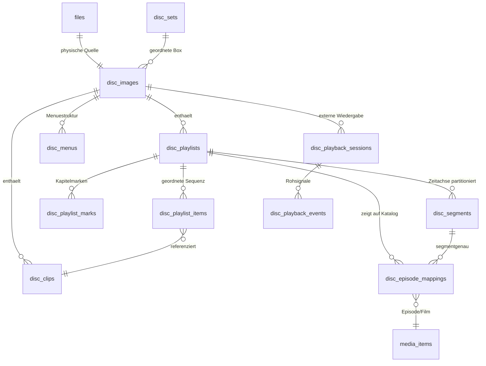
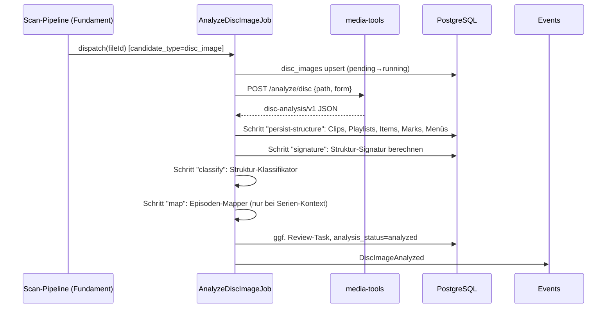

# Blu-ray/DVD/UHD-Engine

Zurück zur [Masterdatei](../MediaForge_Master_Engineering.md). Abhängigkeiten: [architecture/overview.md](../architecture/overview.md) (Job-/Event-Verträge, media-tools-Dienst), [database/core-schema.md](../database/core-schema.md) (Katalog, Watch-State, Reviews), [modules/audit.md](audit.md). Verwandt: [connectors/external-player.md](../connectors/external-player.md) (geplant; das Playback-Protokoll ist in diesem Kapitel normativ definiert, das Connector-Kapitel spezifiziert die Player-Anbindungen).

**Vertiefungen** (normative Detailspezifikationen dieses Moduls): [Formatreferenz Blu-ray/UHD](disc-engine/formats-bluray.md) · [Formatreferenz DVD](disc-engine/formats-dvd.md) · [Klassifikationsregel-Katalog](disc-engine/classification-rules.md) · [Mapping-Algorithmus](disc-engine/mapping-algorithm.md) · [Playback-Übersetzung](disc-engine/playback-translation.md) · [API-Referenz](disc-engine/api-reference.md) · [UI-Referenz](disc-engine/ui-reference.md) · [Test-Katalog](disc-engine/test-catalog.md)

## Motivation

Die Disc-Engine ist das fachliche Alleinstellungsmerkmal von MediaForge und bedient Leitszenario 1 der Masterdatei. Wer gekaufte Blu-rays, UHD-Blu-rays und DVDs als Images archiviert, besitzt seine Medien in der originalgetreuesten Form — mit Menüs, Bonusmaterial, allen Tonspuren, Seamless-Branching-Fassungen. Der Preis dafür ist in allen existierenden Systemen der Verlust der Episodengranularität: Die Disc ist eine Black Box. MediaForge öffnet diese Black Box, ohne sie anzutasten: Es modelliert das Innenleben der Disc (Playlists, Clips, Segmente), verknüpft es mit dem kanonischen Katalog (Episoden-Mapping) und führt den Wiedergabezustand dort, wo er fachlich hingehört — auf der Episode ([ADR-0004](../adr/0004-episode-granular-watch-state.md), Architekturregel 11).

Der Anspruch in einem Satz: **Eine Serienbox als ISO-Sammlung soll sich in MediaForge exakt so anfühlen wie dieselbe Staffel als Einzeldateien — Folge für Folge, mit Fortschritt, Weiterschauen und korrektem Staffelstatus — und zusätzlich das Disc-Menü-Erlebnis bieten, wenn der Benutzer es will.**

## Problemstellung

Fünf Teilprobleme, jedes für sich nicht trivial, in Summe der Grund, warum das bisher niemand gebaut hat:

**Strukturerkennung.** Ein Disc-Image verrät seinen Inhalt nicht freiwillig. Eine Blu-ray enthält typischerweise 20–200 Playlists, von denen die meisten irrelevant sind (Trailer, Warnhinweise, Menü-Loops, Duplikate); manche Discs enthalten absichtliche Verwirrung (siehe Edge Cases: Struktur-Obfuskation). Die relevanten Playlists — Episoden, Hauptfilm, Bonusmaterial — müssen aus Struktur, Laufzeiten, Kapitelmarken und Referenzmustern erschlossen werden.

**Episoden-Zuordnung unter Unsicherheit.** Selbst wenn sechs Episoden-Playlists erkannt sind: Welche Playlist ist welche Episode? Die Playlist-Nummerierung folgt keiner Norm; die Reihenfolge auf der Disc entspricht meist, aber nicht immer der Ausstrahlungsreihenfolge; Doppelfolgen, Extended Cuts und regionale Schnittfassungen verschieben Laufzeiten. Ein System, das hier rät und falsch rät, produziert falsche „gesehen"-Markierungen — schlimmer als keine. Die Engine braucht deshalb ein Confidence-Modell mit hartem Schwellwert und Review-Pflicht darunter (Architekturregel 11).

**Playback-Übersetzung.** Disc-Playback findet außerhalb von MediaForge statt (externer Player mit Menü-Unterstützung). Der Player berichtet, was er abspielt — bestenfalls Playlist, Position, Zeitstempel; schlechtestenfalls nur „ISO geöffnet/geschlossen". Diese Rohsignale müssen in Episodenfortschritt übersetzt werden: „Playlist 00004, Position 12:31–55:48" heißt „S03E07 zu 95 % gesehen" — aber nur, wenn das Mapping bestätigt ist und die Position im Episodensegment liegt (nicht im Intro-Vorspann des Play-All).

**Zustandsdisziplin.** Die Versuchung jeder Implementierung ist der Shortcut „Disc lief lange genug ⇒ Disc gesehen". Genau dieser Shortcut ist verboten. Wenn das Mapping unsicher ist, wird Playback vorgehalten, nicht verworfen und nicht geraten; wenn nur Folge 2 lief, ist nur Folge 2 gesehen; die Disc aggregiert höchstens zu „teilweise gesehen". Die Engine muss diese Disziplin strukturell erzwingen, nicht nur versprechen.

**Mengen- und Formatvielfalt.** BD-ISO, UHD-BD-ISO, DVD-ISO, BDMV-Ordner, VIDEO_TS-Ordner; Single-Layer bis 100-GB-Triple-Layer; Serienboxen mit 8 Discs pro Staffel (Disc Sets); Images auf NAS-Mounts, deren Analyse nicht das Netz sättigen darf.

## Analyse bestehender Lösungen

**Kodi** ist der Machbarkeitsbeweis für das Playback: libbluray und libdvdread ermöglichen Menü-Navigation aus ISO/BDMV/VIDEO_TS ohne physisches Laufwerk (BD-J-Menüs mit Einschränkungen). Genau darauf beschränkt sich die Referenzrolle. Kodis Datenmodell führt Discs als eine Video-Quelle; der Watch-State hängt an der Quelle. Kodis „Episode-auf-Disc"-Fähigkeiten (STACK, Datei-Bookmarks) sind Anzeige-Hacks ohne Modell dahinter. Übernommen wird: nichts am Datenmodell; der Player-Ansatz wird als External-Player-Konzept integriert.

**Jellyfin/Plex/Emby** behandeln ISO bestenfalls als abspielbare Einzeldatei (Plex hat ISO-Support ganz entfernt); BDMV-Ordner werden als „größte M2TS-Datei" heuristisch verflacht — Menüs, Playlists und Mehrfachepisoden gehen verloren. Lehre: Die Verflachung auf „eine Datei = ein Item" ist der Konstruktionsfehler, nicht ein fehlendes Feature obendrauf.

**MakeMKV** (kein Referenzprojekt der Masterliste, aber fachlich unumgänglich als Stand der Technik der Strukturanalyse) demonstriert, dass Playlist-Klassifikation automatisierbar ist: Es erkennt Haupttitel, filtert Duplikat-Playlists und Obfuskations-Müll. Lehre: Laufzeit-, Kapitel- und Clip-Referenz-Heuristiken tragen weit; aber MakeMKV löst nur „was ist relevant?", nicht „welche Episode ist es?" — und es extrahiert (transformiert), während MediaForge nur liest.

**Sonarr** löst das umgekehrte Problem — Episodenzuordnung von Dateien über Dateinamen-Parsing plus Provider-Abgleich. Sein Laufzeit-Matching gegen TVDB-Episodendauern und sein Umgang mit Doppelfolgen (eine Datei → mehrere Episoden) liefern das Vorbild für die Mapping-Heuristiken der Disc-Engine, angewandt auf Playlists statt Dateien.

**DVD-Profiler/Disc-Datenbanken** (LDDB u. ä.) zeigen, dass communitygepflegte Disc-Metadaten (Track-Listen pro Disc-Release) existieren, aber lückenhaft und lizenzrechtlich heterogen sind. Konsequenz: Die Engine ist auf lokale Analyse + Provider-Episodendaten ausgelegt; externe Disc-Datenbanken sind ein optionaler, später spezifizierter Mapping-Provider (offener Punkt).

## Architekturentscheidung

Die Disc-Engine ist eine **eigene Domäne neben dem Katalog, nicht im Katalog**: Discs, Playlists, Clips und Segmente sind keine `media_items`, sondern eigene Strukturen, die per Mapping auf Katalog-Episoden **zeigen** ([ADR-0007](../adr/0007-disc-domain-separate.md)). Begründung: Der Katalog modelliert fachliche Werke; die Disc modelliert eine physische Veröffentlichungsform. Eine Vermischung (Playlists als media_items) würde Watch-State-, Such- und Sync-Logik mit Nicht-Werken fluten und die Kernregel „Watch-State nur auf konsumierbaren Werken" unterlaufen.

Die Engine zerfällt in vier Subsysteme mit klaren Verträgen:

1. **Disc Scanner** — erkennt Disc-Kandidaten (via Classifier des Fundaments), orchestriert die Strukturanalyse durch den media-tools-Dienst und persistiert das Strukturmodell. Reine Ingestion, keine fachlichen Entscheidungen.
2. **Struktur-Klassifikator** — bewertet Playlists (Episode-Kandidat / Hauptfilm / Bonus / Müll) anhand lokaler Evidenz (Laufzeiten, Kapitel, Clip-Referenzen, Duplikatmuster). Ergebnis: typisierte Kandidaten mit Begründungsdaten.
3. **Episoden-Mapper** — gleicht Episode-Kandidaten gegen den Provider-Episodenkatalog ab (Laufzeit-Alignment, Reihenfolge, Disc-Set-Kontext), erzeugt Mapping-Vorschläge mit Confidence und ab Schwellwert-Unterschreitung Review-Tasks. Bestätigung ist immer eine auditierte Action.
4. **Playback-Übersetzer** — konsumiert Player-Sessions (normiertes Protokoll), mappt Positionen über Playlists und Segmente auf Episodenfortschritt und speist ausschließlich die zentrale Action `RecordPlaybackProgress`. Ungemapptes Playback wird als Session vorgehalten und nach späterer Mapping-Bestätigung nachverrechnet.

Quer dazu liegt das **Disc-Set-Modell** (Staffelbox als geordnete Disc-Gruppe), das dem Mapper entscheidenden Kontext liefert: „Disc 2 von 4 der Staffel-3-Box" schränkt den Episoden-Suchraum drastisch ein.

Der media-tools-Dienst liefert die Rohstruktur als versioniertes JSON (`disc-analysis/v1`); PHP parst niemals selbst MPLS/CLPI/IFO-Binärformate (Stack-Entscheidung der Masterdatei). Das JSON wird als `raw_analysis` aufbewahrt (legitimes JSONB: Werkzeug-Rohoutput), sodass Klassifikator und Mapper bei Algorithmus-Verbesserungen **ohne Neuanalyse** der Images neu laufen können — bei 100 GB pro UHD-Image ein entscheidender Betriebsvorteil.

## Alternativen

**Playlists als media_items modellieren**: verworfen, siehe Architekturentscheidung und ADR-0007. **Episoden-Extraktion statt Mapping** (Remux der Episoden als MKV, Disc nur Archiv): verletzt keine Regel (Artefakte wären zulässig), wurde aber als Kernansatz verworfen, weil er das Menü-Erlebnis aufgibt, Speicher verdoppelt und die Extraktion bei Seamless Branching fehleranfällig ist; als optionaler Export-Workflow bleibt er denkbar (offener Punkt). **Mapping ausschließlich manuell** (kein Heuristik-Mapper): maximal korrekt, aber bei einer 60-Disc-Sammlung unzumutbar; die Heuristik mit Review-Schwelle ist der dokumentierte Mittelweg. **Mapping ausschließlich automatisch** (kein Review): verletzt Architekturregel 11 und wurde nie ernsthaft erwogen. **Disc-Datenbank-First** (Mapping primär aus externen Disc-DBs): an Datenlage und Lizenzfragen gescheitert; als optionaler Provider vorgesehen.

## Disc-Format-Grundlagen

Dieser Abschnitt fixiert das Fachwissen, auf dem Scanner und Klassifikator aufbauen. Er beschreibt die Formate soweit — und nur soweit —, wie die Engine sie modellieren muss.

### Blu-ray und UHD Blu-ray (BDMV)

Eine Blu-ray ist ein UDF-Dateisystem mit der Wurzelstruktur `BDMV/`:

| Pfad | Inhalt | Relevanz für die Engine |
|---|---|---|
| `BDMV/index.bdmv` | Einstiegspunkt, Titelliste | Disc-Identität, First-Play-Verhalten |
| `BDMV/MovieObject.bdmv` | HDMV-Navigationsprogramme | nur Existenzprüfung (Menüfähigkeit) |
| `BDMV/PLAYLIST/*.mpls` | Playlists: geordnete PlayItems mit Clip-Referenz, In-/Out-Time, Kapitelmarken (PlayListMarks) | **Kernstruktur** — eine MPLS ist der Playlist-Datensatz der Engine |
| `BDMV/CLIPINF/*.clpi` | Clip-Info: Streams, Laufzeit, EP-Map des zugehörigen M2TS | Clip-Laufzeiten, Stream-Eigenschaften |
| `BDMV/STREAM/*.m2ts` | die eigentlichen AV-Container | Größen/Existenz; Inhalte werden nie dekodiert, nur optional per ffprobe stichprobenartig verifiziert |
| `BDMV/JAR/` | BD-J (Java-Menüs) | Existenz ⇒ Menü-Playback nur mit BD-J-fähigem Player |
| `BDMV/BACKUP/` | Redundanzkopien | wird ignoriert |

Für die Engine tragende Konzepte: Eine **MPLS-Playlist** referenziert 1..n **PlayItems**; jedes PlayItem zeigt auf einen Clip (CLPI/M2TS) mit In-Time und Out-Time — dieselben Clips können von mehreren Playlists mit unterschiedlichen Schnittfenstern referenziert werden. **PlayListMarks** (Typ „EntryMark") sind die Kapitelmarken. **Seamless Branching** (mehrere Schnittfassungen aus gemeinsamen Clips plus fassungsspezifischen Einschüben) zeigt sich als Playlists mit überlappenden Clip-Mengen und unterschiedlichen PlayItem-Sequenzen. **UHD-BDMV** ist strukturell identisch (BDMV v3); Unterschiede (HEVC, HDR10/Dolby-Vision-Metadaten, 66/100-GB-Layouts) betreffen Stream-Eigenschaften, nicht die Navigationsstruktur — die Engine behandelt UHD als BDMV mit erweiterten Stream-Attributen und `disc_kind = 'uhd_bluray'`.

### DVD (VIDEO_TS)

Eine DVD ist ein UDF/ISO-9660-Dateisystem mit `VIDEO_TS/`:

| Pfad | Inhalt | Relevanz |
|---|---|---|
| `VIDEO_TS/VIDEO_TS.IFO` (VMGI) | Disc-weite Navigation, Titelverzeichnis | Disc-Identität, Titelzahl |
| `VIDEO_TS/VTS_nn_0.IFO` (VTSI) | Navigation eines Video Title Set: Program Chains (PGC) mit Programmen/Zellen, Zeittabellen | **Kernstruktur** — PGCs sind das DVD-Pendant der Playlist |
| `VIDEO_TS/VTS_nn_k.VOB` | AV-Daten des Title Set | Existenz/Größen |
| `VIDEO_TS/VIDEO_TS.VOB`, Menü-VOBs | Menüs | Existenzprüfung (Menüfähigkeit) |

Die Engine bildet DVD-Konzepte auf ihr generisches Modell ab: **Title/PGC → Playlist** (eine Playlist pro Titel-PGC; Menü-PGCs werden als Menüstrukturen erfasst, nicht als Playlists), **Zelle (Cell) → PlayItem/Segmentgrundlage**, **Program-Grenzen → Kapitelmarken**, **VOB-Bereich einer Zelle → Clip**. Multi-Angle-Zellen und interleaved VOB-Blöcke werden als Clip-Attribute erfasst. DVD-Laufzeiten aus den PGC-Zeittabellen sind verlässlich genug für Mapping-Heuristiken (BCD-codierte Zeitangaben mit Frame-Genauigkeit).

### Erscheinungsformen

Jedes der beiden Strukturmodelle kann in drei physischen Formen vorliegen, die der Scanner gleich behandelt (`source_form`): **ISO-Image** (UDF-Dateisystem in einer Datei; der media-tools-Dienst mountet nicht, sondern liest über libbluray/libdvdread-UDF-Zugriff direkt aus dem Image), **BDMV-Ordner** bzw. **VIDEO_TS-Ordner** (bereits entpackte Struktur; als `is_container_dir`-Eintrag im Datei-Inventar des Fundaments). Erkennungsregeln des Classifier-Detektors: Dateiendung `.iso` ⇒ UDF-Sondierung auf `BDMV/index.bdmv` bzw. `VIDEO_TS/VIDEO_TS.IFO`; Ordner mit `BDMV/index.bdmv` ⇒ BDMV-Ordner; Ordner mit `VIDEO_TS/VIDEO_TS.IFO` ⇒ VIDEO_TS-Ordner. Ein `.iso` ohne beide Marker ist kein Disc-Kandidat (Daten-ISO) und fällt an den generischen Classifier zurück.

### Disc-Identität

Discs brauchen eine stabile Identität über Pfad-Moves und Re-Rips hinweg. Die Engine berechnet eine **Struktur-Signatur**: BLAKE3 über die kanonisierte Navigationsstruktur (sortierte Liste aller Playlists mit Laufzeiten, PlayItem-Sequenzen und Kapitelmarken — nicht über die AV-Daten). Zwei byte-verschiedene Rips derselben Disc (unterschiedliche Ripper, gleiche Struktur) erhalten dieselbe Signatur; das trägt Dubletten-Erkennung und ermöglicht, bestätigte Mappings auf ein neues Image derselben Disc zu übernehmen (Mapping-Vererbung, siehe Episoden-Mapping). Zusätzlich werden vorhandene Disc-IDs erfasst (Blu-ray: Organisations-/Disc-ID aus `index.bdmv`/AACS-Verzeichnis, sofern lesbar; DVD: Provider-ID/Serial aus dem VMGI), aber nie als Primäridentität verwendet (Architekturregel 7 gilt sinngemäß auch hier).

## Datenmodell

### Entitäten und Beziehungen



Das Modell trennt drei Referenzebenen sauber: **Struktur** (was ist physisch auf der Disc: Playlists, Clips, Marken — Ergebnis der Analyse, unveränderlich solange die Datei unverändert ist), **Interpretation** (Klassifikation der Playlists, Segmente, Episoden-Mappings — veränderlich, versioniert, review-pflichtig) und **Nutzung** (Playback-Sessions und -Events — append-only-Rohsignale, aus denen Watch-State abgeleitet wird). Analyse-Läufe dürfen die Strukturebene neu schreiben, aber nie die Interpretationsebene verwerfen: Bestätigte Mappings überleben eine Neuanalyse, solange die Struktur-Signatur stabil ist.

**Segmente** sind das Bindeglied zwischen Playlist-Zeit und Episodenzeit: Sie partitionieren die Zeitachse einer Playlist in fachlich bedeutsame Abschnitte (`episode_body`, `recap`, `intro`, `credits`, `bonus`, `unassigned`). Für eine gewöhnliche Episoden-Playlist gibt es im Minimalfall genau ein Segment (`episode_body` über die volle Länge, implizit beim Mapping erzeugt); für Play-All-Playlists partitionieren die Segmente die Gesamtzeit in Episodenabschnitte (typisch entlang der Kapitelmarken); für Doppelfolgen-Playlists trennen sie die beiden Episoden. Ein Episoden-Mapping zeigt entweder auf eine ganze Playlist (`segment_id IS NULL`, der 90-%-Fall) oder segmentgenau. Die Nicht-Überlappung der Segmente je Playlist garantiert ein Exclusion Constraint — die Übersetzung „Playlist-Position → Episode" ist damit immer eindeutig.

**Disc Sets** gruppieren Discs zu einer geordneten physischen Veröffentlichung („Staffel 3, Disc 2 von 4"). Das Set kann optional auf ein Katalog-Container-Item zeigen (`season` oder `show`), was dem Mapper den Suchraum vorgibt. Sets entstehen automatisch aus Pfad-Heuristiken (Geschwisterordner `Disc 1`, `Disc 2`, …) als Vorschlag und werden manuell bestätigt oder korrigiert.

### Invarianten

1. Ein `disc_image` gehört zu genau einer `files`-Zeile (1:1); Löschung der Datei kaskadiert auf die Struktur-, nicht aber auf die Nutzungsebene (Sessions bleiben für Statistik/Audit, mit `SET NULL`).
2. Segmente einer Playlist überlappen nie (Exclusion Constraint) und liegen innerhalb `[0, duration_ms]` (CHECK + Action-Validierung).
3. Pro Playlist existiert höchstens ein bestätigtes Ganz-Playlist-Mapping **oder** eine Menge bestätigter Segment-Mappings — nie beides gemischt (partieller Unique-Index plus Action-Validierung).
4. Ein bestätigtes Mapping zeigt immer auf ein konsumierbares Katalog-Item (`movie`, `episode`); Container sind als Mapping-Ziel ungültig (Action-Validierung, analog zur Watch-State-Regel).
5. `disc_playback_events` sind append-only; die Übersetzung in Watch-State ist wiederholbar (Reprocessing nach Mapping-Änderung erzeugt identische Ergebnisse, Idempotenz über Event-IDs).
6. Kein Pfad der Engine schreibt jemals `user_watch_states` direkt — ausschließlich über `RecordPlaybackProgress` (Fundament).

## SQL-Schema

```sql
CREATE TABLE disc_sets (
    id             CHAR(26) PRIMARY KEY,
    name           TEXT        NOT NULL,                  -- "Staffel 3 (Blu-ray Box)"
    container_item_id CHAR(26) REFERENCES media_items(id) ON DELETE SET NULL,  -- season/show
    source         TEXT        NOT NULL DEFAULT 'heuristic'
        CHECK (source IN ('heuristic','manual','import')),
    confirmed_at   TIMESTAMPTZ,
    created_at     TIMESTAMPTZ NOT NULL DEFAULT now(),
    updated_at     TIMESTAMPTZ NOT NULL DEFAULT now()
);

CREATE TABLE disc_images (
    id                  CHAR(26) PRIMARY KEY,
    file_id             CHAR(26)    NOT NULL REFERENCES files(id) ON DELETE CASCADE,
    disc_kind           TEXT        NOT NULL
        CHECK (disc_kind IN ('bluray','uhd_bluray','dvd')),
    source_form         TEXT        NOT NULL
        CHECK (source_form IN ('iso','bdmv_folder','video_ts_folder')),
    label               TEXT,                              -- Volume-Label bzw. abgeleiteter Name
    structure_signature TEXT,                              -- BLAKE3 der kanonisierten Navigationsstruktur
    native_disc_id      TEXT,                              -- Disc-eigene ID, rein informativ
    disc_set_id         CHAR(26)    REFERENCES disc_sets(id) ON DELETE SET NULL,
    set_position        INTEGER,                           -- "Disc 2 von 4"
    has_hdmv_menu       BOOLEAN,
    has_bdj_menu        BOOLEAN,
    has_dvd_menu        BOOLEAN,
    analysis_status     TEXT        NOT NULL DEFAULT 'pending'
        CHECK (analysis_status IN ('pending','running','analyzed','failed')),
    analysis_error      TEXT,
    analyzer_version    TEXT,                              -- Version des media-tools-Analyzers
    raw_analysis        JSONB,                             -- disc-analysis/v1-Rohoutput (Werkzeug-JSONB)
    analyzed_at         TIMESTAMPTZ,
    created_at          TIMESTAMPTZ NOT NULL DEFAULT now(),
    updated_at          TIMESTAMPTZ NOT NULL DEFAULT now(),
    UNIQUE (file_id)
);

CREATE INDEX disc_images_signature_idx ON disc_images (structure_signature)
    WHERE structure_signature IS NOT NULL;
CREATE INDEX disc_images_set_idx ON disc_images (disc_set_id, set_position);

CREATE TABLE disc_clips (
    id             CHAR(26) PRIMARY KEY,
    disc_image_id  CHAR(26)    NOT NULL REFERENCES disc_images(id) ON DELETE CASCADE,
    clip_ref       TEXT        NOT NULL,      -- BD: CLPI-Nummer ("00012"); DVD: "VTS02/CELL03"
    duration_ms    BIGINT      NOT NULL,
    size_bytes     BIGINT,
    video_codec    TEXT,                      -- 'h264','hevc','vc1','mpeg2', …
    video_width    INTEGER,
    video_height   INTEGER,
    hdr_format     TEXT
        CHECK (hdr_format IN ('none','hdr10','hdr10plus','dolby_vision','hlg')),
    audio_streams  JSONB       NOT NULL DEFAULT '[]',   -- [{lang,codec,channels}] — Anzeige/Diagnose
    angle_count    INTEGER     NOT NULL DEFAULT 1,
    UNIQUE (disc_image_id, clip_ref)
);

CREATE TABLE disc_playlists (
    id                CHAR(26) PRIMARY KEY,
    disc_image_id     CHAR(26)    NOT NULL REFERENCES disc_images(id) ON DELETE CASCADE,
    playlist_ref      TEXT        NOT NULL,   -- BD: MPLS-Nummer ("00003"); DVD: "VTS02/PGC01"
    duration_ms       BIGINT      NOT NULL,
    chapter_count     INTEGER     NOT NULL DEFAULT 0,
    classification    TEXT        NOT NULL DEFAULT 'unclassified'
        CHECK (classification IN ('unclassified','episode_candidate','main_feature',
                                  'play_all','bonus','menu_loop','duplicate','junk')),
    classification_confidence NUMERIC(4,3),
    classification_evidence   JSONB NOT NULL DEFAULT '{}',  -- Begründungsdaten (Regel-8-konform)
    classified_by     TEXT
        CHECK (classified_by IN ('heuristic','manual','ai')),
    UNIQUE (disc_image_id, playlist_ref)
);

CREATE INDEX disc_playlists_class_idx ON disc_playlists (disc_image_id, classification);

CREATE TABLE disc_playlist_items (
    id             CHAR(26) PRIMARY KEY,
    playlist_id    CHAR(26) NOT NULL REFERENCES disc_playlists(id) ON DELETE CASCADE,
    seq            INTEGER  NOT NULL,          -- Position in der Playlist
    clip_id        CHAR(26) NOT NULL REFERENCES disc_clips(id) ON DELETE CASCADE,
    in_time_ms     BIGINT   NOT NULL,
    out_time_ms    BIGINT   NOT NULL CHECK (out_time_ms > in_time_ms),
    is_seamless    BOOLEAN  NOT NULL DEFAULT false,
    angle_count    INTEGER  NOT NULL DEFAULT 1,
    UNIQUE (playlist_id, seq)
);

CREATE TABLE disc_playlist_marks (
    id             CHAR(26) PRIMARY KEY,
    playlist_id    CHAR(26) NOT NULL REFERENCES disc_playlists(id) ON DELETE CASCADE,
    seq            INTEGER  NOT NULL,          -- Kapitelnummer (1-basiert)
    position_ms    BIGINT   NOT NULL,
    UNIQUE (playlist_id, seq)
);

CREATE TABLE disc_segments (
    id             CHAR(26) PRIMARY KEY,
    playlist_id    CHAR(26) NOT NULL REFERENCES disc_playlists(id) ON DELETE CASCADE,
    start_ms       BIGINT   NOT NULL CHECK (start_ms >= 0),
    end_ms         BIGINT   NOT NULL,
    segment_kind   TEXT     NOT NULL DEFAULT 'episode_body'
        CHECK (segment_kind IN ('episode_body','recap','intro','credits','bonus','unassigned')),
    source         TEXT     NOT NULL DEFAULT 'heuristic'
        CHECK (source IN ('heuristic','chapter_marks','manual','ai')),
    CHECK (end_ms > start_ms),
    -- Nicht-Überlappung pro Playlist, von der Datenbank garantiert:
    EXCLUDE USING gist (
        playlist_id WITH =,
        int8range(start_ms, end_ms) WITH &&
    )
);

CREATE TABLE disc_episode_mappings (
    id             CHAR(26) PRIMARY KEY,
    playlist_id    CHAR(26)    NOT NULL REFERENCES disc_playlists(id) ON DELETE CASCADE,
    segment_id     CHAR(26)    REFERENCES disc_segments(id) ON DELETE CASCADE,  -- NULL = ganze Playlist
    media_item_id  CHAR(26)    NOT NULL REFERENCES media_items(id) ON DELETE CASCADE,
    status         TEXT        NOT NULL DEFAULT 'suggested'
        CHECK (status IN ('suggested','confirmed','rejected','superseded')),
    confidence     NUMERIC(4,3) NOT NULL,
    mapping_source TEXT        NOT NULL
        CHECK (mapping_source IN ('heuristic','manual','inherited','provider','ai')),
    evidence       JSONB       NOT NULL DEFAULT '{}',   -- Laufzeitvergleiche, Rangfolgen, Alternativen
    confirmed_by   CHAR(26)    REFERENCES users(id) ON DELETE SET NULL,
    confirmed_at   TIMESTAMPTZ,
    created_at     TIMESTAMPTZ NOT NULL DEFAULT now(),
    updated_at     TIMESTAMPTZ NOT NULL DEFAULT now()
);

-- Höchstens EIN bestätigtes Ganz-Playlist-Mapping pro Playlist:
CREATE UNIQUE INDEX disc_mappings_one_confirmed_full
    ON disc_episode_mappings (playlist_id)
    WHERE status = 'confirmed' AND segment_id IS NULL;

-- Höchstens EIN bestätigtes Mapping pro Segment:
CREATE UNIQUE INDEX disc_mappings_one_confirmed_per_segment
    ON disc_episode_mappings (segment_id)
    WHERE status = 'confirmed' AND segment_id IS NOT NULL;

CREATE INDEX disc_mappings_item_idx     ON disc_episode_mappings (media_item_id, status);
CREATE INDEX disc_mappings_playlist_idx ON disc_episode_mappings (playlist_id, status);

CREATE TABLE disc_menus (
    id             CHAR(26) PRIMARY KEY,
    disc_image_id  CHAR(26) NOT NULL REFERENCES disc_images(id) ON DELETE CASCADE,
    menu_kind      TEXT     NOT NULL
        CHECK (menu_kind IN ('hdmv','bdj','dvd_vmg','dvd_vts')),
    menu_ref       TEXT,                       -- z. B. VTS-Nummer bei dvd_vts
    requires_bdj   BOOLEAN  NOT NULL DEFAULT false,
    notes          TEXT
);

CREATE TABLE disc_playback_sessions (
    id             CHAR(26) PRIMARY KEY,
    disc_image_id  CHAR(26)    REFERENCES disc_images(id) ON DELETE SET NULL,
    user_id        CHAR(26)    NOT NULL REFERENCES users(id) ON DELETE CASCADE,
    player_kind    TEXT        NOT NULL
        CHECK (player_kind IN ('kodi','mpv','vlc','powerdvd','other')),
    player_instance TEXT,                      -- Connector-Kennung der Player-Instanz
    status         TEXT        NOT NULL DEFAULT 'active'
        CHECK (status IN ('active','ended','stale','discarded')),
    position_reporting TEXT    NOT NULL
        CHECK (position_reporting IN ('playlist_position','title_only','open_close_only')),
    started_at     TIMESTAMPTZ NOT NULL,
    ended_at       TIMESTAMPTZ,
    created_at     TIMESTAMPTZ NOT NULL DEFAULT now(),
    updated_at     TIMESTAMPTZ NOT NULL DEFAULT now()
);

CREATE INDEX disc_sessions_user_idx ON disc_playback_sessions (user_id, status, started_at DESC);

CREATE TABLE disc_playback_events (
    id             CHAR(26) PRIMARY KEY,
    session_id     CHAR(26)    NOT NULL REFERENCES disc_playback_sessions(id) ON DELETE CASCADE,
    event_type     TEXT        NOT NULL
        CHECK (event_type IN ('open','play','position','pause','stop','playlist_change','close')),
    playlist_ref   TEXT,                        -- vom Player gemeldete Playlist/Titel-Kennung
    position_ms    BIGINT,                      -- Position innerhalb der Playlist
    occurred_at    TIMESTAMPTZ NOT NULL,
    recorded_at    TIMESTAMPTZ NOT NULL DEFAULT now(),
    processed_at   TIMESTAMPTZ,                 -- NULL = noch nicht in Watch-State übersetzt
    processing_note TEXT                        -- z. B. 'unmapped_playlist', 'below_threshold'
);

CREATE INDEX disc_events_session_idx   ON disc_playback_events (session_id, occurred_at);
CREATE INDEX disc_events_unprocessed   ON disc_playback_events (processed_at)
    WHERE processed_at IS NULL;
```

### Abgeleiteter Disc-Status

Der aggregierte Disc-Status ist **keine Tabelle**, sondern eine definierte Ableitung — es gibt bewusst keinen Speicherort, in den man ein „Disc gesehen" schreiben könnte (Architekturregel 11, strukturelle Durchsetzung):

```sql
CREATE VIEW user_disc_status AS
SELECT
    di.id                                   AS disc_image_id,
    u.id                                    AS user_id,
    count(DISTINCT m.media_item_id)         AS mapped_episodes,
    count(DISTINCT m.media_item_id) FILTER (
        WHERE ws.status = 'watched')        AS watched_episodes,
    count(DISTINCT m.media_item_id) FILTER (
        WHERE ws.status = 'in_progress')    AS in_progress_episodes,
    CASE
        WHEN count(DISTINCT m.media_item_id) = 0 THEN 'unmapped'
        WHEN count(DISTINCT m.media_item_id) FILTER (WHERE ws.status = 'watched')
             = count(DISTINCT m.media_item_id) THEN 'watched'
        WHEN count(DISTINCT m.media_item_id) FILTER (
             WHERE ws.status IN ('watched','in_progress')) > 0 THEN 'partial'
        ELSE 'unwatched'
    END AS derived_status
FROM disc_images di
CROSS JOIN users u
LEFT JOIN disc_playlists dp ON dp.disc_image_id = di.id
LEFT JOIN disc_episode_mappings m
       ON m.playlist_id = dp.id AND m.status = 'confirmed'
LEFT JOIN user_watch_states ws
       ON ws.media_item_id = m.media_item_id AND ws.user_id = u.id
GROUP BY di.id, u.id;
```

Die View ist die normative Definition; für die Bibliotheks-Grid-Ansicht wird sie über den `user_container_progress`-Cache des Fundaments materialisiert (Listener auf `EpisodeWatched` und Mapping-Änderungen), rekonstruierbar per `mediaforge:rebuild-progress`. Wichtige Eigenschaft der Definition: **Nur bestätigte Mappings zählen.** Eine Disc mit sechs Episoden-Kandidaten, davon zwei bestätigt und einer gesehen, zeigt „teilweise gesehen (1/2 bestätigt gemappt)" — das UI weist die Mapping-Lücke explizit aus, statt Vollständigkeit vorzutäuschen.

## Disc Scanner

Der Scanner ist die Job-Pipeline von der erkannten Datei bis zum persistierten Strukturmodell. Er klinkt sich über den Disc-Detektor in die Fundament-Scan-Pipeline ein ([architecture/overview.md](../architecture/overview.md)) und läuft als `AnalyzeDiscImageJob` (ResumableJob, Queue `analyze`).



Die Schritte im ResumableJob-Vertrag: `fetch-analysis` (media-tools-Aufruf; Rohergebnis nach `raw_analysis`), `persist-structure` (Upsert über natürliche Schlüssel `(disc_image_id, playlist_ref)` etc. — idempotent per Konstruktion), `signature` (kanonisierte Struktur hashen; bei Signatur-Treffer auf ein anderes Image: Dubletten-Hinweis an das Fingerprinting-Modul, Mapping-Vererbung anbieten), `classify` und `map` (unten). Fehlerverhalten nach Fundament-Konvention: Ein unparsebares Image ist ein Fachfehler (`analysis_status='failed'`, Review-Task `disc_analysis_failed`), kein Job-Retry-Fall.

### Der disc-analysis/v1-Vertrag

Der media-tools-Dienst kapselt libbluray/libdvdread und liefert ein versioniertes JSON. Die für den Vertrag normativen Felder (vollständiges Schema in der Dienst-Dokumentation, Fixtures im Repo):

```json
{
  "schema": "disc-analysis/v1",
  "analyzer_version": "1.4.2",
  "disc_kind": "bluray",
  "label": "STAGE_3_DISC_2",
  "native_disc_id": "…",
  "menus": {"hdmv": true, "bdj": false, "dvd": null},
  "clips": [
    {"ref": "00012", "duration_ms": 2581040, "video": {"codec": "h264", "width": 1920,
     "height": 1080, "hdr": "none"}, "audio": [{"lang": "deu", "codec": "dts_hd", "channels": 6}],
     "angles": 1, "size_bytes": 5813400000}
  ],
  "playlists": [
    {"ref": "00003", "duration_ms": 2592000, "chapters_ms": [0, 122000, 601000, 1489000, 2405000],
     "items": [{"seq": 1, "clip_ref": "00012", "in_ms": 0, "out_ms": 2581040,
                "seamless": false, "angles": 1}]}
  ]
}
```

Der Analyzer dekodiert keine AV-Ströme; Laufzeiten stammen aus MPLS/CLPI bzw. den IFO-Zeittabellen. Eine optionale ffprobe-Stichprobe (erste Sekunden des größten Clips) verifiziert Codec-Angaben — konfigurierbar, weil sie auf NAS-Mounts spürbar I/O kostet.

## Struktur-Klassifikator

Der Klassifikator bewertet jede Playlist mit einer deterministischen, erklärbaren Heuristik-Kaskade — bewusst regelbasiert, nicht ML: Die Entscheidungen müssen im Review-UI begründbar sein (`classification_evidence`), und die Regeln sind aus wenigen hundert realen Discs ableitbar. Jede Regel schreibt ihren Beitrag in die Evidence.

Die Kaskade (Auszug der normativen Regeln, Reihenfolge signifikant):

1. **Duplikat-Falten:** Playlists mit identischer PlayItem-Sequenz (gleiche Clips, gleiche In/Out-Zeiten) werden zu einer Repräsentantin gefaltet; Duplikate → `duplicate`. (Struktur-Obfuskation erzeugt hunderte solcher Playlists; siehe Edge Cases.)
2. **Menü-Loops und Müll:** Laufzeit < 3 min ohne Kapitelmarken, oder Clip-Referenzen auf Menü-VOBs → `menu_loop` bzw. `junk`. Warnhinweise/Logos (< 2 min, am First-Play hängend) → `junk`.
3. **Play-All-Erkennung:** Laufzeit ≈ Summe einer Teilmenge anderer Playlists (Toleranz 2 %), deren Clip-Sequenzen sie konkateniert → `play_all`; die Teilmenge wird als Evidence verlinkt (sie stützt später die Segmentierung des Play-All entlang der Episodengrenzen).
4. **Episoden-Kandidaten:** Gruppe ≥ 3 Playlists mit ähnlicher Laufzeit (Variationskoeffizient < 15 %) im Serienfenster (18–65 min) → alle `episode_candidate`. Die Gruppenbildung läuft über das gesamte Image, bei bestätigtem Disc-Set über alle Discs des Sets (konsistente Laufzeitmuster über Discs stützen die Gruppe).
5. **Hauptfilm:** längste verbleibende Playlist > 70 min, nicht `play_all` → `main_feature`. Mehrere lange Playlists mit stark überlappenden Clip-Mengen → Schnittfassungen; alle `main_feature` mit Fassungs-Hinweis in der Evidence (Edition-Zuordnung folgt im Mapping).
6. **Bonus:** Rest mit Laufzeit ≥ 3 min → `bonus`.

Unterschreitet die Gesamtkonfidenz der Klassifikation einen Schwellwert (Setting `disc_engine.classification_confidence_threshold`, Default 0.80) — typisch bei Discs, die in kein Muster fallen —, bleibt die Klassifikation bestehen, aber der nachgelagerte Mapper wird übersprungen und ein Review-Task `disc_episode_mapping` mit Stufe „Klassifikation prüfen" erzeugt. Manuelle Umklassifikation ist immer möglich (`classified_by='manual'`) und für Heuristik-Läufe unantastbar.

## Episoden-Mapping

### Kontextermittlung

Der Mapper braucht einen Episoden-Suchraum. Er wird bestimmt aus (absteigende Priorität): bestätigtem Disc-Set mit Container-Item („Staffel 3" ⇒ deren Episoden), Edition-Zuordnung des Images im Katalog (ISO hängt als `edition_file` an einer Season/Show), Pfad-Analyse (`…/Serie XY/Season 03/Disc 2.iso` durch den vorhandenen Katalog-Matcher), Volume-Label. Ohne belastbaren Kontext mappt der Mapper nicht, sondern erzeugt einen Review-Task „Disc zuordnen" — Raten über die gesamte Bibliothek ist verboten (die Trefferwahrscheinlichkeit wäre miserabel und falsche Mappings sind teuer, Architekturregel 11).

### Heuristik und Scoring

Gegeben: N Episode-Kandidaten-Playlists (geordnet nach `playlist_ref`), M Katalog-Episoden des Suchraums (geordnet nach `sort_index`) mit Provider-Laufzeiten. Der Mapper bewertet Zuordnungen als **Sequenz-Alignment**, nicht als unabhängige Einzelzuordnungen — die Discs-Reihenfolge ist das stärkste Signal, aber nicht unverletzlich:

* **Laufzeit-Score** pro Paar (Playlist, Episode): `1 − min(1, |dur_pl − dur_ep| / (tol · dur_ep))` mit `tol` = 0.12 (Serien senden mit Werbung; Provider-Laufzeiten schwanken; DVD-PAL-Speedup von 4 % wird bei `disc_kind='dvd'` vorab korrigiert).
* **Reihenfolge-Score:** monotone Zuordnungen (Playlist-Reihenfolge = Episodenreihenfolge) erhalten einen Bonus; Inversionen werden bestraft, aber nicht ausgeschlossen.
* **Set-Kontext-Score:** Bei „Disc 2 von 4" mit 24 Staffel-Episoden und 6 Kandidaten je Disc wird das erwartete Episodenfenster (E07–E12) bevorzugt; Abweichung kostet quadratisch.
* **Kapitel-Score:** Episoden derselben Serie haben typischerweise identische Kapitelanatomie (4–8 Marken); ein Kandidat mit abweichender Anatomie verliert Gruppenzugehörigkeit.

Das beste Gesamt-Alignment (dynamische Programmierung über die Sequenz, Laufzeit O(N·M)) ergibt pro Playlist ein Mapping mit Confidence = normalisiertem Pfad-Score; die zweitbeste Alternative wandert in die Evidence (das Review-UI zeigt „beste vs. zweitbeste" als Entscheidungshilfe).

### Schwellwerte und Review

Drei Zonen (Settings, Defaults): **≥ 0.90** — Mapping als `suggested` mit Auto-Bestätigungs-Kandidatur: Es wird nur dann automatisch `confirmed` (mit `mapping_source='heuristic'`, auditiert als System-Actor), wenn *alle* Playlists der Episodengruppe ≥ 0.90 liegen und das Alignment konfliktfrei monoton ist — Einzelsicherheit genügt nicht, die Gruppe muss stimmen. **0.60–0.90** — `suggested` + Review-Task; nichts wird automatisch bestätigt. **< 0.60** — kein Vorschlag; Review-Task „manuell mappen" mit den Rohdaten. Die Auto-Bestätigung lässt sich global abschalten (`disc_engine.auto_confirm_mappings=false`) für Betreiber, die jede Disc prüfen wollen.

Bestätigung, Ablehnung und Korrektur sind Actions (`ConfirmDiscEpisodeMapping`, `RejectDiscEpisodeMapping`, `RemapDiscPlaylist`) mit Audit und Review-Task-Auflösung als Nebeneffekt. Eine Korrektur setzt das alte Mapping auf `superseded` (nie Löschung — die Historie erklärt, warum Playback ggf. früher anders angerechnet wurde).

### Mapping-Vererbung

Bei Signatur-Treffer (identische Struktur-Signatur, z. B. Re-Rip oder Zweitkopie) bietet die Engine an, bestätigte Mappings zu übernehmen: neue Mappings mit `mapping_source='inherited'`, Confidence des Originals, Status `suggested` (Default) oder direkt `confirmed` (Setting `disc_engine.inherit_confirmed_mappings`, Default true — die Struktur ist beweisbar identisch, das Risiko ist null solange die Signatur die Navigationsstruktur vollständig abdeckt).

### Doppelfolgen und Segment-Mappings

Weicht genau ein Kandidat um ~2× von der Gruppenlaufzeit ab und bleibt im Suchraum ein benachbartes Episodenpaar übrig, schlägt der Mapper ein **Segment-Mapping** vor: zwei Segmente (Grenze an der nächstliegenden Kapitelmarke zur Provider-Laufzeit der ersten Episode), je ein Mapping pro Segment. Analog partitioniert er bestätigte `play_all`-Playlists entlang der Kapitelmarken in Episodensegmente — dadurch wird auch Playback über die Play-All-Route korrekt pro Episode angerechnet. Segment-Vorschläge sind nie Auto-Bestätigungs-Kandidaten; sie erfordern immer Review (die Grenzziehung ist inhärent unsicherer als Ganz-Playlist-Zuordnung).

## Watch-State-Übersetzung

### Vom Rohsignal zum Episodenfortschritt

Der `TranslatePlaybackEventsJob` (Queue `default`, getriggert pro Session-Update, zusätzlich periodischer Sweep über unverarbeitete Events) verarbeitet `disc_playback_events` streng idempotent (`processed_at`-Markierung; Reprocessing setzt sie zurück):

1. **Playlist auflösen:** `playlist_ref` des Events → `disc_playlists`. Unbekannte Referenz ⇒ `processing_note='unknown_playlist'`, Ende (kein Watch-State, kein Raten).
2. **Mapping auflösen:** Bestätigtes Ganz-Playlist-Mapping ⇒ Ziel-Episode direkt; bestätigte Segment-Mappings ⇒ Segment über `position_ms` per Range-Lookup bestimmen, Ziel-Episode des Segments; nur `suggested`/keine Mappings ⇒ `processing_note='unmapped_playlist'`, Event bleibt unverarbeitet **vorgehalten**.
3. **Position übersetzen:** Episodenposition = `position_ms − segment.start_ms` (Ganz-Playlist: identisch). Bezugsdauer = Segmentlänge bzw. Playlist-Dauer. Positionen in `recap`/`intro`/`credits`-Segmenten, die einem Episoden-Mapping zugeordnet sind, zählen zur Episode; Positionen in `bonus`/`unassigned` erzeugen keinen Episodenfortschritt.
4. **Fortschritt anrechnen:** Aus der Event-Folge einer Session werden **kontiguierliche Wiedergabespannen** rekonstruiert (play→position*→pause/stop; Seeks trennen Spannen). Die kumulierte abgedeckte Spanne der Episode geht als `PlaybackProgress` an `RecordPlaybackProgress` — mit `source='external_player'` und Disc-Kontext (`disc_image_id`, `playlist_ref`, `segment_id`) im Event-Kontext. Die Watched-Schwelle wendet ausschließlich das Fundament an; die Engine liefert Positionen, keine Urteile.

Damit ist die Kernanforderung strukturell erfüllt: Ein Player, der 43 Minuten in Playlist 00004 spielt, erzeugt Fortschritt für genau die dort bestätigte Episode. Lief das Disc-Menü eine Stunde im Loop (Menü-Playlists sind nie gemappt), entsteht: nichts.

### Nachverrechnung

Wird ein Mapping nachträglich bestätigt, dispatcht `ConfirmDiscEpisodeMapping` ein Reprocessing der vorgehaltenen Events dieser Playlist (Zeithorizont: Setting `disc_engine.retro_credit_days`, Default 90 Tage). Der Benutzer, der gestern über das Menü drei Folgen schaute und heute das Review bestätigt, bekommt seinen Fortschritt nachgetragen — mit `occurred_at` der Original-Events, sodass die Konfliktauflösung des Fundaments korrekt arbeitet. Umgekehrt löst eine Mapping-Korrektur (altes Mapping `superseded`) **keine** automatische Rücknahme bereits angerechneten Fortschritts aus; stattdessen entsteht ein Review-Task `metadata_conflict` mit den betroffenen Watch-States — automatisches Zurücknehmen von „gesehen" ist riskanter als eine menschliche Sichtung (der Benutzer hat die Folge ja gesehen, nur vielleicht eine andere als verbucht).

### Degradierte Reporting-Modi

Das Session-Feld `position_reporting` deklariert, was der Player liefern kann; die Engine verhält sich strikt nach Modus: `playlist_position` (voller Pfad wie oben) · `title_only` (nur „Playlist X läuft", keine Position: Fortschritt wird als Spanne von play bis stop mit Wanduhrzeit geschätzt, aber **nur** angerechnet, wenn die geschätzte Abdeckung ≥ 95 % der Playlist-Dauer beträgt und das Mapping bestätigt ist; sonst vorhalten + `processing_note='below_threshold'`) · `open_close_only` (nur „ISO offen/zu": es wird **nie** Fortschritt angerechnet; die Session erscheint im UI als „Disc wurde abgespielt — Fortschritt manuell bestätigen?" mit Ein-Klick-Buttons pro gemappter Episode). Der Modus ist pro Player-Integration im [External-Player-Kapitel](../connectors/external-player.md) festgelegt; Kodi mit MediaForge-Add-on erreicht `playlist_position`, ein nackter MPV-Aufruf nur `open_close_only`.

## Laravel-Klassen

Namespace `App\Modules\DiscEngine`. Überblick der tragenden Klassen mit Verträgen:

| Klasse | Typ | Vertrag |
|---|---|---|
| `DiscImage`, `DiscSet`, `DiscPlaylist`, `DiscClip`, `DiscPlaylistItem`, `DiscPlaylistMark`, `DiscSegment`, `DiscEpisodeMapping`, `DiscMenu`, `DiscPlaybackSession`, `DiscPlaybackEvent` | Model | Relationen wie im ER-Diagramm; Mappings/Segmente guarded außerhalb der Actions |
| `DiscAnalyzerInterface` | Interface (Service) | `analyze(string $path, SourceForm $form): DiscAnalysisResult` — Implementierung `MediaToolsDiscAnalyzer` (HTTP-Client), Test-Fake gegen Fixtures |
| `PlaylistClassifier` | Service | `classify(DiscStructure $s, ?DiscSetContext $ctx): ClassificationResult` — pure Funktion über dem Strukturmodell, deterministisch |
| `EpisodeMapper` | Service | `align(list<PlaylistCandidate> $c, list<EpisodeCandidate> $e, MappingContext $ctx): MappingProposal` — pure, DP-Alignment |
| `PlaybackSpanReducer` | Service | `reduce(list<DiscPlaybackEvent> $events): list<PlaybackSpan>` — pure Rekonstruktion kontiguierlicher Spannen |
| `SegmentResolver` | Service | `resolve(DiscPlaylist $pl, int $positionMs): ?ResolvedTarget` — Range-Lookup Segment→Episode |
| `AnalyzeDiscImageJob` | ResumableJob (`analyze`) | Schritte `fetch-analysis`, `persist-structure`, `signature`, `classify`, `map` |
| `TranslatePlaybackEventsJob` | Job (`default`) | idempotente Event-Übersetzung, siehe oben |
| `ReprocessPlaylistPlaybackJob` | Job (`default`) | Nachverrechnung nach Mapping-Bestätigung |
| `ConfirmDiscEpisodeMapping` | Action | Input `{mappingId, userId}`; validiert Invarianten 3–4; setzt confirmed; löst Review; dispatcht Reprocessing; Audit |
| `RejectDiscEpisodeMapping`, `RemapDiscPlaylist` | Action | Ablehnung bzw. Korrektur mit `superseded`-Kette; Audit |
| `DefineDiscSegments` | Action | ersetzt Segmentierung einer Playlist atomar (Exclusion-Constraint-geprüft); Audit |
| `AssignDiscToSet`, `ConfirmDiscSet` | Action | Set-Verwaltung; Audit |
| `AcknowledgeManualPlayback` | Action | manuelle Fortschritts-Bestätigung im `open_close_only`-Modus; delegiert an `RecordPlaybackProgress` |
| `DiscImageAnalyzed`, `DiscMappingConfirmed`, `DiscPlaybackSessionEnded` | Event | Payload nach Fundament-Konvention (ULIDs + Werte) |

Die drei Kern-Services (`PlaylistClassifier`, `EpisodeMapper`, `PlaybackSpanReducer`) sind bewusst **pure** (keine I/O, keine Persistenz): Sie nehmen DTOs, liefern DTOs und sind damit vollständig fixture-testbar — die gesamte fachliche Intelligenz der Engine liegt in reinen, deterministischen Funktionen; Jobs und Actions erledigen nur Orchestrierung und Persistenz.

## API-Endpunkte

Inertia-Routen (eigenes UI) sind hier ausgelassen; REST (`/api/v1`, Token-Auth, Verträge nach [api/conventions.md](../api/conventions.md), geplant):

| Route | Zweck | Rolle |
|---|---|---|
| `GET /api/v1/discs?library_id=&set_id=&status=` | Disc-Liste mit abgeleitetem Status | member |
| `GET /api/v1/discs/{ulid}` | Disc-Detail: Struktur, Klassifikation, Mappings, Status | member |
| `GET /api/v1/discs/{ulid}/playlists` | Playlists mit Segmenten und Mappings | member |
| `POST /api/v1/discs/{ulid}/reanalyze` | Neuanalyse anstoßen (Job-Referenz zurück) | manager |
| `POST /api/v1/disc-mappings/{ulid}/confirm` | Mapping bestätigen | manager |
| `POST /api/v1/disc-mappings/{ulid}/reject` | Mapping ablehnen | manager |
| `POST /api/v1/disc-playlists/{ulid}/segments` | Segmentierung setzen (ersetzt atomar) | manager |
| `POST /api/v1/playback/disc-sessions` | Session eröffnen (Player-Protokoll) | player-token |
| `POST /api/v1/playback/disc-sessions/{ulid}/events` | Event-Batch melden | player-token |
| `POST /api/v1/playback/disc-sessions/{ulid}/end` | Session schließen | player-token |

Das Player-Protokoll (letzte drei Routen) ist der normative Vertrag für alle External-Player-Integrationen: Events kommen gebatcht (max. 100/Request, mit Client-`event_id`-ULIDs für Dedup), `occurred_at` stammt vom Player, Server-Empfangszeit wird getrennt erfasst. Ein Player-Token ist ein benutzergebundenes API-Token mit einziger Fähigkeit `playback:report` — ein kompromittierter Player kann Fortschritt melden, aber nichts lesen und nichts verwalten.

## Vue-/Inertia-Komponenten und UI-Flows

### Seiten

**`Discs/Index`** — Grid/Liste aller Discs einer Bibliothek; Karte zeigt Cover (aus Katalog-Verknüpfung), Disc-Kind-Badge (BD/UHD/DVD), abgeleiteten Status als Fortschrittsring („3/6"), Mapping-Zustand (✓ gemappt / ⚠ Review offen / — ungemappt). Props: `discs: Paginated<DiscCardProps>`, Filter-State.

**`Discs/Show`** — Detailseite, drei Bereiche: (1) Kopf mit Katalog-Verknüpfung, Set-Zugehörigkeit („Disc 2 von 4", navigierbar), Menü-Fähigkeiten und „Im externen Player öffnen"-Aktion; (2) Playlist-Tabelle (Referenz, Laufzeit, Kapitel, Klassifikation mit Evidence-Popover, Mapping-Ziel mit Confidence-Badge, pro gemappter Episode der persönliche Watch-State samt Resume); (3) eingebettete `AuditTimeline` (Fundament). Props-Vertrag: `disc: DiscDetailProps` (alles Serverseitige vorgerechnet — die Komponente trifft keine fachlichen Entscheidungen, Architekturregel 2).

**`Discs/MappingReview`** — das Review-UI, Kern-Flow unten.

**`DiscSets/Show`** — Set-Verwaltung: Disc-Reihenfolge (Drag-and-Drop), Container-Verknüpfung, Set-weite Mapping-Übersicht (Matrix Discs × Episoden mit Status-Färbung — die Sicht, in der eine Staffelbox „vollständig gemappt" wird).

### Kern-Flow: Mapping-Review

Einstieg über Review-Inbox (Fundament) oder Disc-Detail. Das UI zeigt links die Playlist-Kandidaten (Laufzeit, Kapitelanatomie als Mini-Balken, bisheriger Vorschlag mit Confidence), rechts den Episoden-Suchraum (Provider-Laufzeit, Nummer, Titel, ggf. bereits anderweitig zugeordnet-Hinweis). Vorschläge sind als Verbindungslinien gezogen; die Zweitbeste-Alternative aus der Evidence ist gestrichelt sichtbar. Interaktionen: Verbindung bestätigen (Einzel oder „alle ≥ 0.9 bestätigen"), umziehen (Drag auf andere Episode), lösen, Playlist umklassifizieren (Kontextmenü: „ist Bonus", „ist Play-All"), Doppelfolge teilen (öffnet Segment-Editor mit Kapitelmarken-Snapping). Jede Aktion ruft ihre Action-Route; das UI wartet auf den Server-Roundtrip (kein optimistisches Fachverhalten). Abschluss-Zustand „alle Kandidaten entschieden" löst den Review-Task automatisch.

### Kern-Flow: manuelle Playback-Bestätigung

Nach einer `open_close_only`-Session erscheint auf Dashboard und Disc-Detail eine Karte „Gestern 21:40–23:55: Disc abgespielt". Sie listet die gemappten Episoden mit Ein-Klick „gesehen"-Buttons und einem „nichts anrechnen"-Dismiss. Kein Auto-Vorschlag wird vorausgewählt — der Benutzer entscheidet, das System rät nicht (Architekturregel 11 in UI-Form).

## Edge Cases

* **Struktur-Obfuskation** (hunderte Fake-Playlists mit permutierten Clip-Sequenzen, ein Schutzmuster mancher Studios): Das Duplikat-Falten reduziert auf Repräsentanten; verbleiben > 40 Playlists ohne klare Gruppe, klassifiziert die Engine konservativ (`unclassified`), erzeugt Review und **mappt nichts automatisch**. Die Evidence enthält den Obfuskations-Verdacht.
* **Seamless Branching / mehrere Schnittfassungen**: Playlists mit überlappenden Clip-Mengen und > 90 % gemeinsamer Laufzeit werden als Fassungsgruppe markiert. Mapping-Ziel ist dieselbe Episode/derselbe Film für alle Fassungen; die Fassungsdifferenz gehört ins Editions-Modell des Katalogs, nicht in getrennte Watch-States (wer den Extended Cut sah, hat den Film gesehen).
* **Multi-Angle**: Winkel ändern weder Laufzeit noch Mapping; `angle_count` ist Anzeige-Metadatum.
* **Play-All als einzige Route** (manche DVDs haben keine Einzel-Episoden-PGCs): Die Segmentierung des Play-All entlang der Kapitelmarken ist dann der einzige Mapping-Weg; das Review-UI führt explizit durch die Grenzziehung. Ohne verwertbare Kapitelmarken bleibt die Disc teilmappbar — ehrlich ausgewiesen statt geraten.
* **Doppelfolge als eine Playlist**: Segment-Mapping (siehe oben); der Watch-State beider Episoden ist unabhängig — wer nach der ersten Hälfte stoppt, hat E01 gesehen und E02 in Arbeit mit korrekter Resume-Position.
* **Dieselbe Episode auf mehreren Discs** (Wiederholungs-Discs, Recap-Discs, Bonus-Schnittfassungen): mehrere Mappings verschiedener Playlists auf dieselbe Episode sind zulässig (die Unique-Indizes begrenzen pro Playlist/Segment, nicht pro Episode); der Watch-State bleibt ein einziger.
* **PAL-Speedup**: DVD-Laufzeiten werden vor dem Laufzeit-Score mit Faktor 25/23.976 normalisiert, wenn die Provider-Laufzeit systematisch ~4 % über allen Kandidaten liegt — erkannt an der Gruppenstatistik, vermerkt in der Evidence.
* **Disc ersetzt Datei** (Re-Rip mit besserem Ripper): Signatur-Treffer ⇒ Mapping-Vererbung; ohne Treffer (andere Struktur, z. B. andere Regionsfassung) volle Neuanalyse und neues Review — bestätigte alte Mappings werden nie stillschweigend auf strukturfremde Images übertragen.
* **ISO im Netzwerk, Mount weg während Analyse**: media-tools liefert I/O-Fehler ⇒ transienter Fehler (Retry mit Backoff), nicht Fachfehler; die Unterscheidung trifft der Analyzer-Client anhand der Fehlerklasse.
* **BD-J-only-Discs** (Menü nur als Java-Applikation): `has_bdj_menu=true` steuert die Player-Auswahl im External-Player-Konzept; für Mapping und Watch-State ist BD-J irrelevant (Playlists sind normal analysierbar).

## Performance

Mengengerüst: 500 Discs × ⌀ 60 Playlists × ⌀ 3 Items ⇒ ~30k Playlists, ~90k Items — relational trivial. Die teuren Pfade: (1) **Strukturanalyse** — I/O-gebunden (UDF-Lesen über NAS); der Analyzer liest ausschließlich Navigationsdaten (MPLS/CLPI/IFO, wenige MB), nie Streams; Ziel < 30 s pro Image am NAS, `analyze`-Queue-Parallelität begrenzt die Mount-Last. (2) **Event-Übersetzung** — Positions-Events kommen alle ~10 s pro aktiver Session; der Translate-Job verarbeitet pro Lauf die Events einer Session gebündelt, Segment-Lookup über den GiST-Index des Exclusion Constraints, Ziel < 10 ms pro Batch. (3) **Status-View** — für Listenansichten immer über den `user_container_progress`-Cache, nie die View über die ganze Bibliothek; die View selbst dient Detailseiten und Rebuilds. `raw_analysis`-JSONB (⌀ 200 KB, Obfuskations-Discs bis 5 MB) wird per `jsonb` TOAST-komprimiert gehalten und nie in Listen-Queries selektiert.

## Security

Das Player-Protokoll ist die exponierteste Fläche: benutzergebundene Tokens mit einziger Fähigkeit `playback:report` (siehe API); Sessions sind strikt benutzergebunden — ein Token kann nur eigene Sessions bestücken; Event-Flut wird per Rate-Limit (Redis, 600 Events/min/Token) und Batch-Obergrenze gedämpft; `playlist_ref`/`position_ms` werden gegen die analysierte Struktur validiert (unbekannte Referenzen werden gespeichert, aber nie verarbeitet — kein Weg, über gefälschte Events fremde Episoden zu „sehen", da die Übersetzung nur bestätigte Mappings der realen Struktur nutzt). Pfade zu Images verlassen den Server nie roh an Nicht-Admin-Clients (die „Im Player öffnen"-Aktion übergibt eine signierte, kurzlebige Referenz, die der Player-Connector serverseitig auflöst). Der media-tools-Dienst parst feindliche Binärformate (präparierte ISOs) und läuft deshalb als unprivilegierter Container ohne Netzwerk-Egress mit read-only-Mounts — ein Parser-Exploit erreicht weder Datenbank noch Medien schreibend.

## Tests

* **Klassifikator/Mapper-Fixtures**: Bibliothek aus `disc-analysis/v1`-JSONs realer anonymisierter Disc-Strukturen (Serien-BD, Film-BD mit Fassungen, Obfuskations-BD, DVD-Box, Play-All-only-DVD, Doppelfolgen-Disc) mit erwarteten Klassifikationen und Alignments als Golden Files. Jede Heuristik-Änderung läuft gegen die gesamte Bibliothek.
* **Property-Tests des Mappers**: zufällige Episodenlisten + daraus generierte Playlist-Laufzeiten (mit Rauschen) ⇒ das Alignment muss die Konstruktion wiederfinden; mit Rauschen über der Toleranz muss die Confidence unter die Auto-Schwelle fallen (kein „confident wrong").
* **Constraint-Tests**: Segment-Überlappung (Exclusion), doppelte bestätigte Mappings (partielle Unique-Indizes), Invariante 3 (gemischtes Ganz/Segment-Confirm muss in der Action scheitern).
* **Übersetzungs-Szenarien** (Integration): Event-Sequenzen (normal, Seek-lastig, Session-Abriss, title_only, open_close_only) gegen erwartete `RecordPlaybackProgress`-Aufrufe; Idempotenz (doppelte Verarbeitung ⇒ identischer Endzustand); Nachverrechnung nach später Bestätigung inkl. `occurred_at`-Treue.
* **Kernszenario als End-to-End-Test** (der Test zur Architekturregel 11): 6-Episoden-Disc-Fixture, Mapping bestätigt, Playback-Events nur für Playlist 2 ⇒ genau eine Episode `watched`, Disc-Status `partial`, alle anderen Episoden ohne Watch-State-Zeile. Dieser Test ist der unverhandelbare Regressionsanker des Moduls.

## ADR-Verweise

[ADR-0004](../adr/0004-episode-granular-watch-state.md) (Watch-State-Granularität — die fachliche Kernentscheidung), [ADR-0007](../adr/0007-disc-domain-separate.md) (Disc-Strukturen als eigene Domäne), [ADR-0005](../adr/0005-immutable-originals.md) (Analyse liest nur, transformiert nie), [ADR-0006](../adr/0006-action-level-audit.md) (alle Mapping-Entscheidungen auditiert).

## Offene Punkte

* **Externe Disc-Datenbanken** als zusätzlicher Mapping-Provider (`mapping_source='provider'` ist im Schema vorgesehen): Datenlage und Lizenzfragen ungeklärt; Schnittstelle bewusst offen gelassen.
* **Intro-/Credits-Erkennung** (Audio-Fingerprint-Vergleich über Episoden derselben Staffel, um `intro`/`credits`-Segmente automatisch vorzuschlagen): wertvoll für Skip-Funktionen der Player, aber nachgelagert; gehört methodisch zur Audioanalyse ([modules/audio-analysis.md](audio-analysis.md), geplant).
* **Episoden-Export als Artefakt** (Remux gemappter Playlists zu MKV für Jellyfin-Streaming derselben Discs): als optionaler Workflow skizziert (verletzt keine Regel — Artefakte, Originale unangetastet); Spezifikation vertagt bis Workflow Engine steht.
* **Kapitel-Titel von Discs** (BD-Kapitelnamen existieren selten, aber manchmal in Meta-XML): Erfassung trivial, Nutzen unklar; vertagt.
