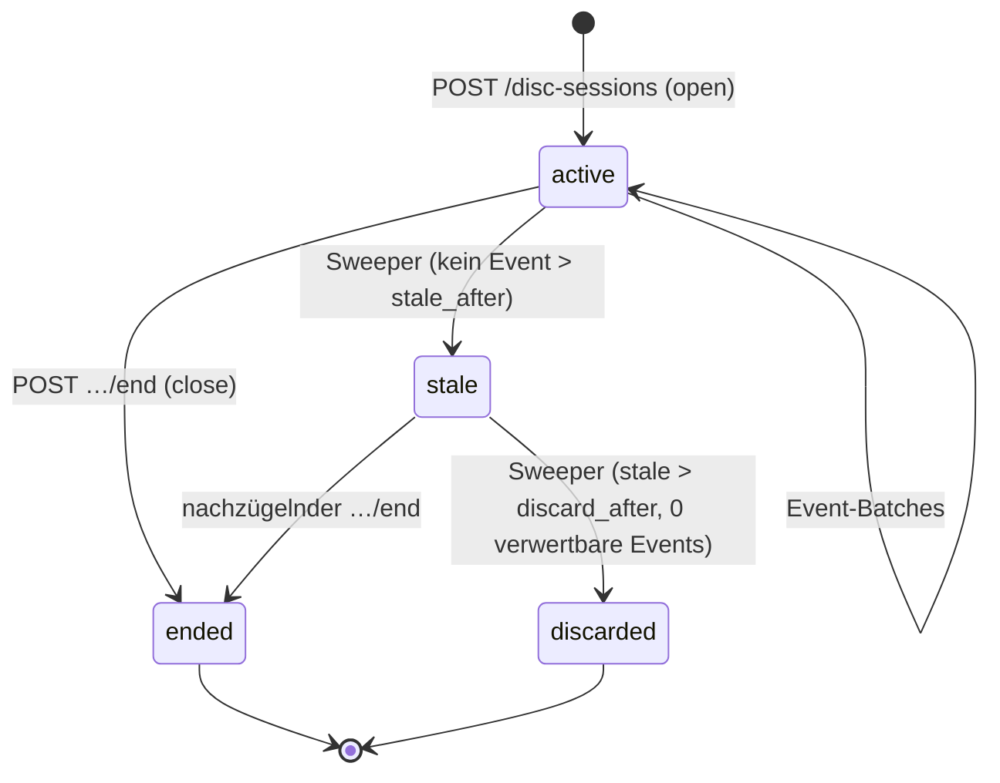

# Playback-Übersetzung: Protokoll und Algorithmen

Vertiefung zu [modules/disc-engine.md](../disc-engine.md), Abschnitte „Playback-Übersetzung" (Motivation) und „Watch-State-Übersetzung". Normativ für drei Verträge: das **Session-Protokoll** (Player → MediaForge; die REST-Seite steht in der [API-Referenz](api-reference.md)), die **Span-Rekonstruktion** (`PlaybackSpanReducer`) und die **Fortschritts-Anrechnung** (`TranslatePlaybackEventsJob`). Die Player-seitige Implementierung je Integration steht im [External-Player-Kapitel](../../connectors/external-player.md); dieses Dokument definiert, was jeder Player einhalten muss und was die Engine daraus macht.

## Session-Lebenszyklus

Eine Session bindet: Benutzer (über das Player-Token), Player-Integration (`player_kind`, `player_instance`), Ziel-Image (Auflösung siehe unten) und den deklarierten Reporting-Modus. Zustandsregeln (normativ):

* **Eröffnung** erfordert die Disc-Referenz, die der Player beim Start erhielt (signierte Öffnungs-Referenz, Modulkapitel Security) — daraus löst der Server `disc_image_id` auf. Kann der Player nur einen Pfad melden (Fremdstart außerhalb von MediaForge, z. B. Kodi spielt das ISO aus eigener Quelle), versucht der Server Pfad→`files`→`disc_images`; scheitert das, wird die Session mit `disc_image_id = NULL` angelegt und ausschließlich für Diagnose geführt (kein Watch-State-Pfad; UI-Hinweis „unbekannte Disc abgespielt").
* **Ein Image, ein Player, eine Session:** Ein zweites `open` desselben Tokens auf dasselbe Image bei aktiver Session liefert die bestehende Session zurück (idempotente Eröffnung über Client-`session_key`-ULID im Request).
* **Stale-Sweeper** (`SweepDiscSessionsJob`, periodisch alle 15 min): `active` ohne Event seit `disc_engine.session_stale_minutes` (Default 30) ⇒ `stale`; `stale` älter als `session_discard_hours` (Default 24) ohne verwertbare Events ⇒ `discarded`, sonst finalisiert der Sweeper wie ein `end` (die Wiedergabe war real, der Player ist nur unsauber gestorben — Spannen bis zum letzten Event zählen).
* Sessions sind **append-only-Nutzungsebene** (Modulkapitel Datenmodell): kein Update außer Statusfeld, keine Löschung durch Fachlogik; Aufbewahrung folgt der Audit-Retention.

## Event-Protokoll

Events kommen gebatcht (max. 100, API-Referenz) mit Client-ULIDs zur Deduplikation. Je Event: `event_type`, `playlist_ref`, `position_ms`, `occurred_at` (Player-Uhr). Normative Protokollregeln für Player-Implementierungen:

1. **Positions-Kadenz:** `position`-Events alle 10 s (± 2 s) während laufender Wiedergabe; zusätzlich unmittelbar vor `pause`, `stop`, `playlist_change`, `close` (finale Position der Spanne). Höhere Frequenz wird serverseitig nicht abgelehnt, aber per Rate-Limit gedeckelt (600/min/Token, Modulkapitel Security).
2. **Playlist-Referenz-Format:** BD fünfstellige MPLS-Nummer (`"00004"`), DVD `"VTSnn/PGCkk"` — exakt die `playlist_ref`-Formate des Datenmodells. Player, die nur Titelnummern kennen, senden `"title:NN"`; die Auflösung über `title_playlist_hints` (Formatreferenzen) übernimmt der Server. Nicht auflösbare Titel ⇒ `processing_note='unresolved_title'`, Event vorgehalten.
3. **Uhren:** `occurred_at` in UTC vom Player. Der Server erfasst `recorded_at` getrennt; bei `|occurred_at − recorded_at| > 5 min` über einen ganzen Batch wird ein konstanter Uhrenversatz angenommen und `occurred_at` um den Median-Versatz korrigiert (`clock_skew_corrected` in der Session-Diagnose) — Heimkino-Geräte mit falscher Uhr sind Alltag, und `occurred_at`-Treue ist für die Konfliktauflösung des Fundaments wichtig (Modulkapitel „Nachverrechnung").
4. **Seek-Meldung:** Ein Sprung ist **kein** eigener Event-Typ; er zeigt sich als Positions-Diskontinuität und wird serverseitig erkannt (Span-Rekonstruktion). Das hält das Protokoll minimal und toleriert Player, die Seeks nicht instrumentieren können.
5. **Menü-Navigation:** Kodi & Co. melden Menü-Playlists wie jede andere (`playlist_change` auf die Menü-MPLS). Die Engine braucht keine Menü-Sonderbehandlung: Menü-Playlists sind nie gemappt, ihre Events erzeugen keinen Fortschritt (strukturelle Ruhe statt Protokoll-Komplexität).

## Span-Rekonstruktion (`PlaybackSpanReducer`)

Pure Funktion über die Events **einer** Session, gruppiert nach `playlist_ref`. Ergebnis: kontiguierliche Wiedergabespannen `{playlist_ref, start_ms, end_ms, wall_start, wall_end}`.

Algorithmus (normativ):

1. Events je Playlist chronologisch nach `occurred_at` (Tie: Client-ULID-Ordnung — monotone Erzeugung vorausgesetzt).
2. Eine Spanne beginnt bei `play` oder beim ersten `position` nach Spannen-Ende; sie akkumuliert `position`-Events, solange die Positionsfolge **plausibel fortschreitet**: `Δpos = pos_neu − pos_alt` und `Δwall = occurred_neu − occurred_alt` mit `|Δpos − Δwall| ≤ max(4 s, 0.15 · Δwall)`. Toleranz deckt Kadenz-Jitter und leichte Player-Drift; Faktor-basiert, damit lange Meldelücken (Batch-Stau) nicht fälschlich als Seek gelten.
3. Verletzung der Plausibilität = **Seek**: Spanne endet bei `pos_alt`, neue Spanne beginnt bei `pos_neu`. Rückwärts-Seeks (Δpos < 0) ebenso — Wiederholtes Anschauen überlappender Bereiche erzeugt überlappende Spannen; die Anrechnung vereinigt später (Union, keine Doppelzählung).
4. `pause` schließt die laufende Spanne; `play`/`position` danach eröffnet neu (bei unveränderter Position: nahtlose Fortsetzung, neue Spanne — die Union macht das äquivalent).
5. `playlist_change`/`stop`/`close` schließen die Spanne bei der letzten bekannten Position.
6. Spannen < 5 s werden verworfen (`min_span_ms`, Setting — Zapping-Rauschen).

Der Reducer ist deterministisch und ordnungs-stabil: gleiche Event-Menge ⇒ gleiche Spannen, unabhängig von Batch-Grenzen (Events werden vor Reduktion immer vollständig je Session geladen — der Job arbeitet session-weise, nie batch-weise).

## Anrechnung (`TranslatePlaybackEventsJob`)

Der Vier-Schritte-Pfad des Modulkapitels, hier mit den Randfällen:

**Schritt 2-Präzisierung (Mapping-Auflösung):** Maßgeblich ist der Mapping-Zustand **zum Verarbeitungszeitpunkt** (nicht zum Abspielzeitpunkt — genau das macht Nachverrechnung möglich). Segment-Lookup: `position_ms` im halboffenen Intervall `[start_ms, end_ms)`; Positionen exakt auf einer Segmentgrenze gehören dem rechten Segment. Positionen außerhalb jedes Segments (Lücken der Partition) ⇒ Anteil zählt nicht (wie `unassigned`).

**Schritt 3-Präzisierung (Positions-Übersetzung):** Eine Spanne, die Segmentgrenzen **überquert** (Play-All: Zuschauer schaut E07 und E08 am Stück), wird an den Grenzen zerteilt; jedes Teilstück wird seiner Episode angerechnet. Teilstücke in `recap`/`intro`/`credits` mit Episoden-Mapping zählen zur Episodenabdeckung (Modulkapitel); `bonus`/`unassigned`-Teilstücke entfallen.

**Schritt 4-Präzisierung (Fortschritts-Meldung):** Pro (Session, Episode) wird die **Union** aller angerechneten Teilstücke gebildet (Intervall-Vereinigung; Doppelschauen zählt einfach). An `RecordPlaybackProgress` gehen: `covered_ranges` (Episodenzeit-Intervalle), `position_ms` (letzte Position der spätesten Spanne, übersetzt in Episodenzeit — die Resume-Position), `duration_ms` (Bezugsdauer = Segmentlänge bzw. Playlist-Dauer), `occurred_at` (Ende der spätesten Spanne), `source='external_player'` + Disc-Kontext. Die Watched-Schwelle (z. B. „90 % Abdeckung") wendet ausschließlich das Fundament an — die Engine urteilt nicht (Modulkapitel).

**Idempotenz-Mechanik:** `processed_at` markiert verarbeitete Events. Der Job verarbeitet Sessions ganzheitlich: Er lädt **alle** Events der Session (auch verarbeitete), rekonstruiert die Spannen vollständig und meldet den **Gesamtstand** je Episode — `RecordPlaybackProgress` ist als absoluter Stand (nicht Inkrement) definiert, wodurch Mehrfachverarbeitung strukturell harmlos ist. `processed_at` dient damit nur der Arbeitsvermeidung (Sweep-Query `WHERE processed_at IS NULL`), nicht der Korrektheit. Reprocessing (Mapping nachbestätigt) setzt `processed_at` der betroffenen Events auf NULL und stößt den Job an — identischer Pfad, keine Sonderlogik.

## Degradierte Modi: exakte Semantik

**`title_only`** (Modulkapitel, präzisiert): Spannen entstehen aus `play`/`stop`-Paaren je gemeldeter Playlist mit Wanduhr-Dauer. Anrechnung nur, wenn (a) Mapping der Playlist bestätigt, (b) `wall_dauer ≥ 0.95 · playlist_dauer`, (c) genau eine Playlist im Zeitfenster lief (kein Zapping). Dann wird die **volle** Playlist als abgedeckt gemeldet (`covered_ranges = [[0, dauer]]`); sonst `below_threshold`-Vorhaltung. Segment-Mappings werden im `title_only`-Modus **nie** angerechnet (ohne Position keine Segment-Zuordnung); Ausnahme: Die Playlist hat genau ein Segment-Mapping über ≥ 95 % ihrer Länge (degenerierter Fall, zählt wie Ganz-Playlist).

**`open_close_only`**: keinerlei automatische Anrechnung (Modulkapitel). Die Session erzeugt beim `close`/Sweep eine `manual_playback_ack`-Aufgabe (UI-Karte). `AcknowledgeManualPlayback` nimmt die Episoden-Auswahl des Benutzers entgegen und ruft `RecordPlaybackProgress` mit `covered_ranges = [[0, dauer]]` je bestätigter Episode, `source='manual_disc_ack'`, `occurred_at` = Session-Ende. Die Karte verfällt nach `manual_ack_expiry_days` (Default 14) unbeantwortet — verfallene Karten sind im Session-Log weiter sichtbar („nicht bestätigt").

**Modus-Wechsel innerhalb einer Session** ist verboten (der Modus ist Session-Attribut); ein Player, der zur Laufzeit bessere Daten liefern kann, beendet die Session und eröffnet neu (kommt real vor: Kodi-Add-on verbindet sich nach Playback-Start).

## Nachverrechnung und Rücknahme

**Nachverrechnung** (Mapping später bestätigt): `ReprocessPlaylistPlaybackJob` über alle Events mit `processing_note IN ('unmapped_playlist','below_threshold')` der betroffenen Playlist im `retro_credit_days`-Fenster (Default 90). Da die Anrechnung absolute Stände meldet und `occurred_at` original bleibt, integriert sich der nachgetragene Fortschritt korrekt in die Fundament-Konfliktauflösung (späterer echter Fortschritt überschreibt nicht rückwärts — Modulkapitel „Nachverrechnung").

**Mapping-Korrektur** (confirmed → superseded, neues Ziel): **keine** automatische Rücknahme (Modulkapitel, Begründung dort). Der erzeugte `metadata_conflict`-Review listet: betroffene Watch-States (aus dem Audit-Kontext der ursprünglichen `RecordPlaybackProgress`-Aufrufe rekonstruiert — der Disc-Kontext im Event macht sie auffindbar), altes und neues Ziel, Ein-Klick-Optionen „Fortschritt umbuchen" (nimmt alt zurück via `RevertPlaybackProgress`, rechnet neu an) / „beides lassen" / „nur alt zurücknehmen". Jede Option ist eine auditierte Action.

## processing_note-Katalog (normativ)

| Note | Bedeutung | Auflösbar durch |
|---|---|---|
| `unknown_playlist` | `playlist_ref` nicht in der analysierten Struktur | nie (gefälschte/fehlerhafte Referenz; Security-Log bei Häufung) |
| `unresolved_title` | `title:NN` ohne eindeutigen Hint | Struktur-Reanalyse mit besserem Hint-Deckungsgrad |
| `unmapped_playlist` | kein bestätigtes Mapping | Mapping-Bestätigung (Reprocessing) |
| `below_threshold` | title_only unter 95 % | nie automatisch; manuelle Bestätigung möglich |
| `non_progress_segment` | Position nur in bonus/unassigned | Segmentierungs-Änderung (Reprocessing) |
| `session_unresolved` | Session ohne disc_image_id | nie (Diagnose-Session) |
| `span_too_short` | Spanne < min_span | nie |

Der Sweep-Job exportiert Zählstände je Note als Metriken (`disc_events_unprocessed{note=…}`) — steigende `unmapped_playlist`-Raten sind das operative Signal „Benutzer schauen ungemappte Discs", sichtbar im [Health-Dashboard](../health-monitoring.md).

## Durchgerechnetes Beispiel

6-Episoden-BD, Play-All-Playlist `00010` segmentiert (S01E01–E06, Grenzen bei 0:00, 43:10, 86:25, …), alles bestätigt. Kodi-Session (`playlist_position`), Benutzer nutzt das Disc-Menü, schaut E02 komplett, bricht E03 nach 12 min ab und springt zurück ins Menü:

| # | Event | playlist_ref | position | Verarbeitung |
|---|---|---|---|---|
| 1 | open | — | — | Session aktiv |
| 2 | playlist_change | 00050 (Menü) | 0 | Menü: nie gemappt |
| 3–5 | position | 00050 | loop | keine Anrechnung |
| 6 | playlist_change | 00010 | 2590000 | Play-All ab E02-Anfang (43:10) |
| 7–158 | position (alle 10 s) | 00010 | 2590000 → 5185000 | eine Spanne |
| 159 | position | 00010 | 5185000 → 5905000 | Spanne läuft in E03 hinein |
| 160 | playlist_change | 00050 | — | Spanne endet bei 5905000 |
| 161 | close | — | — | Session ended |

Reducer: Spanne `[2590000, 5905000]` auf `00010` (Menü-Spannen existieren, bleiben folgenlos). Anrechnung: Zerteilung an Segmentgrenze 5185000 (E02-Ende) ⇒ E02-Anteil `[0, 2595000]` von 2595000 (100 %), E03-Anteil `[0, 720000]` von 2593000 (27,8 %, Resume 12:00). Meldungen: E02 absolut voll abgedeckt (Fundament markiert `watched`), E03 `in_progress` mit Resume. Disc-Status-View: `partial`. Die Menü-Stunde davor: null Wirkung — das Kernszenario des Moduls, hier über die Play-All-Route.

## Metriken und Diagnose

Je Session persistiert die Engine ein Diagnose-Aggregat (`disc_playback_sessions`-Erweiterungsfelder sind bewusst nicht vorgesehen; das Aggregat lebt im Health-Modul): Event-Zahl, Batch-Zahl, korrigierter Uhrenversatz, Spannen-Zahl, Seek-Zahl, angerechnete Episoden, vorgehaltene Anteile. Grenzwert-Alarme (Health-Modul): > 20 % vorgehaltene Events über 7 Tage (Mapping-Rückstau), Uhrenversatz > 1 h (Gerätefehlkonfiguration), Sessions ohne einzige Anrechnung bei bestätigten Mappings (Protokoll-Regression einer Player-Integration).

## Player-Konformität (Prüfliste für Integrationen)

Eine Player-Integration gilt als konform für `playlist_position`, wenn sie die zehn Punkte der Konformitäts-Suite erfüllt ([test-catalog.md](test-catalog.md), PB-Serie): korrekte Referenzformate, Kadenz ± Toleranz, finale Position vor Zustandswechseln, `playlist_change` bei Menü-Übergängen, idempotente Batch-Wiederholung (gleiche ULIDs), Uhrzeit in UTC, `end` bei sauberem Beenden, Wiederverbindungs-Verhalten (neue Session statt Geister-Fortsetzung), keine Events nach `end`, Batch-Größenlimit. Die Suite läuft als Vertragstest gegen den Session-Simulator — jede neue Player-Integration muss sie bestehen, bevor sie den Modus `playlist_position` deklarieren darf (sonst stuft der Connector auf `title_only`/`open_close_only` herab; Fähigkeits-Matrix im External-Player-Kapitel).
