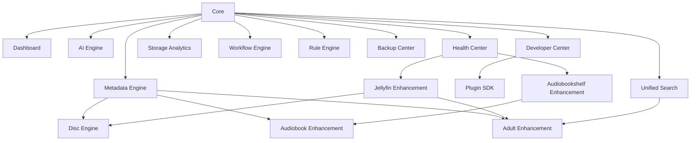

# MediaForge Modul-Katalog

Zurück zur [Masterdatei](../MediaForge_Master_Engineering.md). Detailkapitel: [Architektur](../architecture/overview.md), [Kernschema](../database/core-schema.md), [API-Katalog](../api/endpoint-catalog.md), [Design-System](../ui/design-system.md).

Dieser Katalog ist die verbindliche Schnittstelle zwischen Produktumfang und Implementierung. Er trennt die großen Module fachlich, benennt ihre Verantwortlichkeiten und verweist auf die Detaildokumente. Kein Modul ersetzt Jellyfin oder Audiobookshelf; alle Module erweitern, verbinden, analysieren oder verwalten lokale Systeme und lokale Daten.

## Core

**Zweck:** Core hält die kanonische lokale Identität, Rechte, Auditierbarkeit, Job-Konventionen und Modulgrenzen.

**Verantwortlichkeiten:** Medien- und Datei-Identität, Benutzer/Rollen, Provider-ID-Mapping, Watch-State-Fundament, Review-System, Audit-Trail, Architekturtests, gemeinsame DTOs und Actions.

**Architektur:** Modularer Laravel-Monolith mit Events, Jobs und Actions als Integrationspunkte. Direkte Zugriffe auf fremde Modulmodelle sind verboten; der Core publiziert stabile Verträge.

**Datenmodell:** `libraries`, `files`, `media_items`, `media_editions`, `provider_ids`, `users`, `user_watch_states`, `watch_state_events`, `review_tasks`, `audit_logs`, Job- und Settings-Tabellen. Details stehen in [database/core-schema.md](../database/core-schema.md).

**APIs:** Auth, Katalog, Reviews, Watch-State, Audit, Settings und Health-Basispfade aus [api/endpoint-catalog.md](../api/endpoint-catalog.md). Eigene UI nutzt Inertia, externe Konsumenten nutzen REST.

**Erweiterbarkeit:** Neue Module registrieren Service Provider, Events, Jobs, Policies, Settings, Quality Checks, Search Indexer und optionale UI-Seiten. Erweiterungen verwenden Core-Verträge statt Tabellenabkürzungen.

**Zukünftige Roadmap:** Architekturtest-Suite für Modulgrenzen, Contract-Test-Fixtures, ein vollständiges Datenwörterbuch und Upgrade-Prüfungen für alle Core-Migrationen.

## Dashboard

**Zweck:** Dashboard ist die lokale Leitwarte für Sammlung, Betrieb, Aufgaben, Health und laufende Workflows.

**Verantwortlichkeiten:** Health-Zusammenfassung, Review-Inbox, Workflow- und Queue-Status, Connector-Ampeln, Backup-Status, AI-Auslastung, Storage-Trends, Adult-sichere Sichtbarkeit.

**Architektur:** Inertia-Seiten lesen vorberechnete View Models und Widget-Konfigurationen. Widgets besitzen keine Geschäftslogik und delegieren Aktionen an Modul-Actions.

**Datenmodell:** Dashboard nutzt `metrics`, `review_tasks`, `workflow_instances`, `connector_instances`, `backup_runs`, `health_check_runs`, `user_widget_settings` und Sichtbarkeitsgrants.

**APIs:** `GET /dashboard`, Widget-Refresh-Endpunkte, konfigurierte Inertia-Props, REST nur für externe Statusabfragen. Details: [modules/admin-dashboard.md](admin-dashboard.md).

**Erweiterbarkeit:** Module registrieren Widgets mit Capability, Rollenbedarf, Datenquelle, Refresh-Budget und Empty-State. Adult-Widgets müssen Sichtbarkeitsregeln deklarieren.

**Zukünftige Roadmap:** Widget Marketplace im Developer Center, gespeicherte Dashboard-Layouts je Rolle, Drilldown-Pfade aus jedem Health- und Review-Widget.

## Metadata Engine

**Zweck:** Metadata Engine vereinheitlicht lokale, manuelle, Provider-, Connector- und AI-Metadaten ohne Provenienzverlust.

**Verantwortlichkeiten:** Enrichment, Feldhoheit, Provider-Reihenfolgen, Field Locks, Konflikte, Knowledge Graph, NFO-Export, lokale Overrides und Review-Erzeugung.

**Architektur:** Provider-Adapter liefern Payloads, Normalizer erzeugen Feldkandidaten, Resolver wenden Feldregeln an, Actions schreiben kanonische Werte mit Audit. AI darf Vorschläge liefern, aber keine offiziellen Felder überschreiben.

**Datenmodell:** `provider_payloads`, `field_provenance`, `metadata_overrides`, `metadata_conflicts`, `knowledge_edges`, `nfo_exports`, `artifacts`. Details: [modules/enrichment.md](enrichment.md), [modules/knowledge-graph.md](knowledge-graph.md), [modules/nfo-export.md](nfo-export.md).

**APIs:** Enrichment-Refresh, Provider-Suche, Konfliktlösung, Field-Lock-Aktionen, NFO-Export, Graph-Nachbarschaften.

**Erweiterbarkeit:** Neue Provider registrieren Mapping, Feldabdeckung, Rate Limits, Confidence-Regeln und Contract-Fixtures. Neue Felder brauchen Schema-, UI- und Suchindex-Erweiterung.

**Zukünftige Roadmap:** Datenwörterbuch pro Feld, provider-spezifische Drift-Berichte, visuelle Provenienz-Matrix und bessere Import-Assistenten.

## Unified Search

**Zweck:** Unified Search findet lokale Medien, Hörbücher, Adult-Inhalte, Personen, Performer, Studios, Collections, Reviews und Systemobjekte in einer sichtbarkeitssicheren Suche.

**Verantwortlichkeiten:** Lexikalische Suche, semantische Suche, Facetten, Rechtefilter, Herkunftsanzeige, Adult-Sicherheitsgrenzen, Indexaktualisierung und Ranking-Erklärung.

**Architektur:** PostgreSQL FTS und pgvector laufen gemeinsam; ein RRF-Merger kombiniert Treffer. Indexer werden durch Events aktualisiert und über AI-Embedding-Jobs ergänzt.

**Datenmodell:** `search_documents`, `search_embeddings`, `search_facets`, `provider_ids`, `people`, `adult_performers`, `adult_studios`, `collections`.

**APIs:** `GET /search`, Facetten-Endpunkte, Typeahead, semantische Suche, Index-Rebuild-Jobs. Details: [modules/search.md](search.md) und [modules/search/embedding-spec.md](search/embedding-spec.md).

**Erweiterbarkeit:** Module liefern `SearchDocumentProvider`, Sichtbarkeitsfilter, Facetten und Ergebnisrenderer. Kein Modul darf sensible Treffer erst nach dem Rendering ausblenden.

**Zukünftige Roadmap:** Query-Erklärungen im Developer Center, gespeicherte Suchansichten, weitere Embedding-Profile und Cross-Media-Relationen als Ranking-Signal.

## AI Engine

**Zweck:** AI Engine bündelt lokale und optional externe Modelle für Analyse, Vorschläge, Embeddings, Audioverbesserung und Assistenzfunktionen.

**Verantwortlichkeiten:** Modellregistry, Worker-Protokoll, Job-Routing, Ressourcenlimits, Parameterprotokoll, Ergebniskennzeichnung, Safety-Grenzen und Kosten-/Laufzeitmetriken.

**Architektur:** Laravel orchestriert Jobs, dedizierte Worker-Container rechnen. Ergebnisse sind Vorschläge oder Artefakte mit Provenienz; kein AI-Pfad darf Originale überschreiben.

**Datenmodell:** `ai_models`, `ai_jobs`, `ai_artifacts`, `ai_metrics`, `search_embeddings`, `audio_upscale_runs`.

**APIs:** Modellverwaltung, Job-Start, Status, Ergebnisannahme/-ablehnung, Embedding-Rebuild. Details: [modules/ai-engine.md](ai-engine.md), [modules/audio-upscaler.md](audio-upscaler.md).

**Erweiterbarkeit:** Neue Modelle deklarieren Capabilities, Ressourcenbedarf, Eingabe-/Ausgabeschema, Datenschutzklasse und Contract-Tests.

**Zukünftige Roadmap:** lokale LLM-Profile, Modell-Benchmarks, bessere GPU-Scheduling-Regeln und UI-gestützte A/B-Reviews.

## Health Center

**Zweck:** Health Center macht System-, Connector-, Job-, Daten- und Inhaltsgesundheit sichtbar und handlungsfähig.

**Verantwortlichkeiten:** Checks, Scores, Incident-Status, Runbooks, Connector-Verfügbarkeit, Queue-Rückstände, Backup-Frische, Index-Drift, Adult-Sichtbarkeitsverletzungen.

**Architektur:** Registrierte Health Checks laufen geplant oder eventgetrieben; Ergebnisse werden aggregiert und mit Runbooks verknüpft.

**Datenmodell:** `health_checks`, `health_check_runs`, `health_incidents`, `metrics`, `connector_health`, `backup_runs`.

**APIs:** Health-Übersicht, Check-Details, Incident-Acknowledge, Recheck, Runbook-Links. Details: [modules/health-monitoring.md](health-monitoring.md).

**Erweiterbarkeit:** Module registrieren Checks mit Scope, Schwellwerten, Frequenz, Runbook-Link und Sichtbarkeitsklasse.

**Zukünftige Roadmap:** Incident-Historie mit Trendanalyse, Preflight-Checks vor Upgrades und Connector-Konformitäts-Dashboards.

## Storage Analytics

**Zweck:** Storage Analytics erklärt lokale Speicherbelegung, Wachstum, Redundanz, Dubletten, Artefakte und Qualitätsrisiken.

**Verantwortlichkeiten:** Bibliotheksgrößen, Wachstumstrends, Datei-Lebenszyklus, Duplicate-Cluster, Codec-/Bitraten-Auswertungen, Artefakt-Kosten, Backup-Auswirkung.

**Architektur:** Scanner und Fingerprinting liefern Fakten, Analytics-Jobs aggregieren in Metriken, UI zeigt Trends statt Live-Vollscans.

**Datenmodell:** `files`, `file_fingerprints`, `duplicate_clusters`, `metrics`, `storage_snapshots`, `artifacts`.

**APIs:** Storage-Übersichten, Bibliotheksdrilldown, Duplicate-Aktionen, Snapshot-Rebuild. Details: [features/storage-analytics.md](../features/storage-analytics.md), [modules/dedup-fingerprinting.md](dedup-fingerprinting.md).

**Erweiterbarkeit:** Neue Analysearten registrieren Metrik-Keys, Aggregationsjobs und Dashboard-Widgets.

**Zukünftige Roadmap:** Was-wäre-wenn-Berichte für Artefaktbereinigung, cold-storage-Empfehlungen und Backup-Kostenprognosen.

## Workflow Engine

**Zweck:** Workflow Engine steuert lange, mehrstufige Verarbeitungsketten mit Wiederaufnahme, Review-Wartepunkten und Kompensation.

**Verantwortlichkeiten:** Definitionen als Code, Instanzen, Schritte, Signale, Batch-Starts, Retry, Pause, Cancel, Versionierung und Audit.

**Architektur:** Workflow-Definitionen sind PHP-Klassen; Instanzen persistieren Zustand und warten auf Events oder Reviews. Regeln dürfen Workflows starten, aber nicht deren interne Fachlogik ersetzen.

**Datenmodell:** `workflow_definitions`, `workflow_instances`, `workflow_steps`, `workflow_signals`, `workflow_batches`.

**APIs:** Start, Batch-Start, Signal, Retry, Cancel, Detailansicht. Details: [modules/workflow-engine.md](workflow-engine.md), [modules/workflow-engine/definitions-catalog.md](workflow-engine/definitions-catalog.md).

**Erweiterbarkeit:** Module liefern Definitionen, Step Handler, Signaltypen, UI-Renderer und Contract-Tests.

**Zukünftige Roadmap:** grafische Definition-Inspektion, bessere Batch-Drosselung und Export von Workflow-Traces für Debugging.

## Rule Engine

**Zweck:** Rule Engine ermöglicht deklarative, begrenzte Automatisierung über den lokalen Katalog.

**Verantwortlichkeiten:** Prädikate, Aktionen, SQL/In-Memory-Doppelform, Dämpfung, Cooldowns, Simulation, Trace und Sicherheitsgrenzen.

**Architektur:** Regeln sind Daten, Prädikate und Aktionen sind registrierter Code. Keine Regel darf Watch-State, Mapping-Bestätigungen oder destruktive Löschungen direkt ausführen.

**Datenmodell:** `rules`, `rule_runs`, `rule_traces`, `rule_action_log`, Predicate-Registry.

**APIs:** Regel-Schema, Regel-CRUD, Simulation, Aktivierung, Run-Historie. Details: [modules/rule-engine.md](rule-engine.md), [modules/rule-engine/predicate-reference.md](rule-engine/predicate-reference.md).

**Erweiterbarkeit:** Module registrieren Prädikate, sichere Aktionen, UI-Parametereditoren und Tests für SQL/In-Memory-Gleichheit.

**Zukünftige Roadmap:** Regel-Vorlagen, Konfliktanalyse zwischen Regeln und visuelle Trace-Auswertung.

## Backup Center

**Zweck:** Backup Center schützt lokale Konfiguration, Datenbank, Artefakte, Metadaten und Wiederherstellbarkeit.

**Verantwortlichkeiten:** Backup-Pläne, Restore-Proben, Verschlüsselung, Retention, Integritätsprüfung, Export/Import von Konfiguration und Notfall-Runbooks.

**Architektur:** Jobs erzeugen versionierte, prüfbare Backup-Sets. Restore wird als eigener Workflow mit Preflight, Dry Run und Audit behandelt.

**Datenmodell:** `backup_plans`, `backup_runs`, `backup_artifacts`, `restore_runs`, `settings_exports`.

**APIs:** Planverwaltung, Run starten, Restore-Dry-Run, Restore, Prüfergebnis. Details: [modules/backup-restore.md](backup-restore.md).

**Erweiterbarkeit:** Module deklarieren Backup-Inhalte, Restore-Hooks, Preflight-Checks und Datenklassifikation.

**Zukünftige Roadmap:** verschlüsselte Offsite-Ziele als optionale Erweiterung, automatische Restore-Proben und Upgrade-Backup-Gates.

## Developer Center

**Zweck:** Developer Center macht Verträge, Module, Plugins, Jobs, Events, APIs und Teststatus für Entwickler sichtbar.

**Verantwortlichkeiten:** API-Dokumentation, Event-/Job-Inventar, Plugin-Verwaltung, Contract-Test-Ergebnisse, Runbooks, Schema-Drift und Debug-Ansichten.

**Architektur:** Developer Center liest registrierte Metadaten aus Modulen und erzeugt technische UI-Seiten; es schreibt nur über klar definierte Admin-Actions.

**Datenmodell:** `developer_checks`, `plugin_manifests`, `contract_test_runs`, `api_contract_snapshots`, `event_catalog_entries`.

**APIs:** Developer-Status, Plugin-Install/Disable, Contract-Test-Trigger, API-Schema-Export. Details: [features/developer-center.md](../features/developer-center.md), [developer-handbook/module-cookbook.md](../developer-handbook/module-cookbook.md).

**Erweiterbarkeit:** Jedes Modul registriert Self-Description-Metadaten: Name, Version, Capabilities, Events, Jobs, Settings, Widgets und Tests.

**Zukünftige Roadmap:** Modul-Dependency-Graph im UI, Contract-Diff vor Releases und Plugin-Sandbox-Diagnose.

## Plugin SDK

**Zweck:** Plugin SDK definiert, wie Erweiterungen sicher, lokal und versioniert in MediaForge eingebunden werden.

**Verantwortlichkeiten:** Manifest, Capabilities, Trust-Modell, Hooks, Connector-Erweiterungen, UI-Erweiterungspunkte, Migrationen, Settings und Tests.

**Architektur:** Plugins laufen innerhalb definierter Extension Points; gefährliche Fähigkeiten brauchen explizite Grants. Plugin-Code darf Core-Invarianten nicht umgehen.

**Datenmodell:** `plugins`, `plugin_capabilities`, `plugin_settings`, `plugin_migrations`, `plugin_audit_events`.

**APIs:** Plugin-Liste, Install/Update/Disable, Settings, Capability Grants, Health. Details: [developer-handbook/plugin-sdk.md](../developer-handbook/plugin-sdk.md), [adr/0012-plugin-trust-model.md](../adr/0012-plugin-trust-model.md).

**Erweiterbarkeit:** Das SDK ist selbst die Erweiterbarkeitsfläche: Connectoren, Provider, Widgets, Actions, Checks und Exporter können registriert werden.

**Zukünftige Roadmap:** lokale Plugin-Galerie, Signaturprüfung, Kompatibilitätsmatrix und härtere Sandbox-Profile.

## Disc Engine

**Zweck:** Disc Engine macht Blu-ray-, UHD- und DVD-Images episodengranular analysierbar und abspielbar, ohne selbst Streaming-Server zu sein.

**Verantwortlichkeiten:** Strukturparse, Playlist-/PGC-Modell, Klassifikation, Episoden-Mapping, Disc-Sets, externes Player-Protokoll, Segment-Playback-Übersetzung, Reviews.

**Architektur:** Analyzer lesen Navigationsdaten, nicht Streams. Mappings bleiben getrennt von Struktur und können manuell bestätigt werden. Playback kommt über externe Player zurück.

**Datenmodell:** `disc_images`, `disc_playlists`, `disc_clips`, `disc_segments`, `disc_mappings`, `disc_sets`, `disc_playback_sessions`, `disc_events`.

**APIs:** Disc-Scan, Mapping, Set-Verwaltung, Player-Session, Event-Batches. Details: [modules/disc-engine.md](disc-engine.md) und Unterkapitel.

**Erweiterbarkeit:** Neue Analyzer, Player-Integrationen, Klassifikationsregeln und Review-Renderer werden registriert und per Testkatalog abgesichert.

**Zukünftige Roadmap:** weitere Player-Adapter, bessere Obfuskationsdiagnose, Disc-Set-Assistent und mehr Konformitätstests.

## Audiobook Enhancement

**Zweck:** Audiobook Enhancement verbessert Hörbuchverwaltung rund um Audiobookshelf, ohne Audiobookshelf als Player und Bibliotheksoberfläche zu ersetzen.

**Verantwortlichkeiten:** Kapitel-Assembler, Track-Sequenzierung, CUE/M4B-Artefakte, ABS-kompatibler Export, Fortschrittssync, Hörbuch-UI-Verbesserungen und Audio-Upscaling.

**Architektur:** MediaForge erzeugt nachvollziehbare Artefakte aus unveränderten Originalen und exportiert sie ABS-kompatibel. Audiobookshelf bleibt Wiedergabe- und Bibliothekskern.

**Datenmodell:** `audiobook_assemblies`, `chapter_sets`, `chapter_markers`, `artifacts`, `audio_analysis_runs`, `audio_upscale_runs`, ABS-Provider-IDs.

**APIs:** Assembly, Sequenzierung, Kapitelreview, Artefaktbau, ABS-Sync, Audio-Upscale. Details: [modules/audiobook-assembler.md](audiobook-assembler.md), [connectors/audiobookshelf.md](../connectors/audiobookshelf.md).

**Erweiterbarkeit:** Neue Kapitelquellen, Exportformate, Audioanalyseprofile und ABS-nahe Automatisierungen können registriert werden.

**Zukünftige Roadmap:** weitere offizielle Kapitelquellen, bessere Sprecherwechsel-Erkennung, Serien-Assistenten und Exportprofile.

## Adult Enhancement

**Zweck:** Adult Enhancement ist ein eigenständiges großes Enhancement-Modul für lokale Adult-Sammlungen. Es ist kein Unterpunkt von Jellyfin und keine Pflichtabhängigkeit zu Stash.

**Verantwortlichkeiten:** eigene UI, Metadaten, Performer, Studios, Szenen, Batch-Bearbeitung, AI-Vorschläge, Analytics, Health, Search und Collections.

**Architektur:** Jellyfin kann lokale Adult-Bibliotheken bereitstellen; MediaForge modelliert darüber eine eigene Adult-Domäne mit Sichtbarkeit, Metadaten, Reviews und Workflows. Stash ist optionaler Importer.

**Datenmodell:** `adult_scenes`, `adult_performers`, `adult_studios`, `adult_scene_performers`, `adult_collections`, `adult_visibility_grants`, `adult_metadata_sources`, `adult_ai_suggestions`.

**APIs:** Szenen, Performer, Studios, Collections, Batch-Aktionen, Search, AI-Suggestions, Health und Import. Details: [modules/adult-enhancement.md](adult-enhancement.md), [enhancements/adult-enhancement.md](../enhancements/adult-enhancement.md).

**Erweiterbarkeit:** Provider, Importer, AI-Tagger, Scene-Health-Checks, Collection-Builder und UI-Widgets sind eigenständige Extension Points.

**Zukünftige Roadmap:** bessere Performer-Deduplizierung, Studio-Hierarchien, lokale Scraper-Profile, sensitive Backup-Policies und adult-spezifische Analytics.

## Jellyfin Enhancement

**Zweck:** Jellyfin Enhancement verbessert lokale Jellyfin-Installationen mit Metadaten, UI, Watch-State, Search, Health, Disc-Playback und Adult-Bibliotheksintegration.

**Verantwortlichkeiten:** Connector, bidirektionaler Watch-State, Medien-ID-Mapping, UI-Enhancements, Health-Checks, Library-Scans, Disc-Status und optionaler Plugin-/Upstream-Pfad.

**Architektur:** Jellyfin bleibt Streaming- und Playback-Kern. MediaForge spiegelt und erweitert lokale Zustände, schreibt nur über dokumentierte Connector-Actions und löst Konflikte nachvollziehbar.

**Datenmodell:** `connector_instances`, `provider_ids`, `connector_cursors`, `connector_outbox`, `jellyfin_item_mappings`, Watch-State-Events.

**APIs:** Jellyfin-Connector-Setup, Sync, Webhook, Outbox, Health, Mapping-Reparatur. Details: [connectors/jellyfin.md](../connectors/jellyfin.md), [enhancements/jellyfin-enhancements.md](../enhancements/jellyfin-enhancements.md).

**Erweiterbarkeit:** Jellyfin-Plugins, UI-Links, Library-spezifische Policies und weitere Sync-Fähigkeiten werden über Connector SDK und Compatibility Policy angebunden.

**Zukünftige Roadmap:** optionales Jellyfin-Plugin für tiefere UI-Verlinkung, bessere Conflict-UX und Release-Kompatibilitätstests gegen Jellyfin-Versionen.

## Audiobookshelf Enhancement

**Zweck:** Audiobookshelf Enhancement ergänzt Audiobookshelf um Assembly, Metadatenqualität, Artefaktbau, Fortschrittssync, Suche und UI-Verbesserungen.

**Verantwortlichkeiten:** ABS-Connector, Fortschritt, Bibliotheksmapping, Export-Scan-Trigger, Hörbuch-Dashboard, Kapitelqualität und ABS-kompatible Artefakte.

**Architektur:** Audiobookshelf bleibt Player und primäre Hörbuchbibliothek. MediaForge baut, bewertet und exportiert Artefakte, synchronisiert Fortschritt und dokumentiert Herkunft.

**Datenmodell:** `audiobook_assemblies`, `chapter_sets`, `artifacts`, `connector_instances`, `audiobookshelf_item_mappings`, `user_watch_states`.

**APIs:** ABS-Setup, Sync, Progress, Export-Trigger, Assembly-Übergabe. Details: [connectors/audiobookshelf.md](../connectors/audiobookshelf.md), [enhancements/audiobookshelf-enhancements.md](../enhancements/audiobookshelf-enhancements.md).

**Erweiterbarkeit:** zusätzliche ABS-nahe Exportformate, Kapitelquellen, Serienregeln und UI-Komponenten können über Modul- und Plugin-SDK ergänzt werden.

**Zukünftige Roadmap:** Podcast-spezifische Regeln, bessere ABS-Scan-Diagnose, Kapitelvergleich im UI und Serien-/Reihen-Assistenten.
