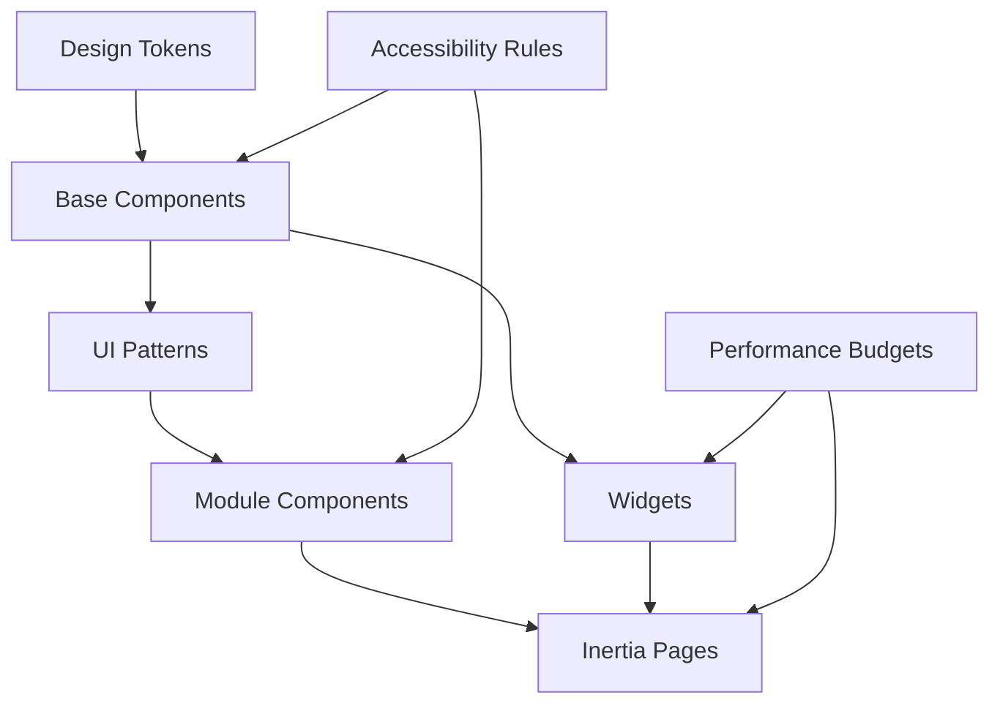

# UI-/UX Design-System

Zurück zur [Masterdatei](../MediaForge_Master_Engineering.md) und zur bestehenden Detailreferenz [ui/design-system.md](../ui/design-system.md).

MediaForge entwickelt kein einfaches Theme. MediaForge entwickelt ein vollständiges Design System, damit Jellyfin, Audiobookshelf, Adult Enhancement und MediaForge-Verwaltungsbereiche wie eine konsistente lokale Premium-Medienumgebung wirken, obwohl die Kernsysteme getrennt und updatefähig bleiben.

## Component Library

Die Component Library liegt in `resources/js/components/base/` und bildet die gemeinsame UI-Sprache: Buttons, Icon Buttons, Inputs, Selects, Comboboxes, Tabs, Tabellen, virtuelle Listen, Cards, Dialoge, Drawers, Toasts, Skeletons, Review Panels, Status Chips, Confidence Badges, Progress Rings, Audit Timelines, Diff Views und Dashboard Widgets. Modulkomponenten dürfen spezialisiert sein, müssen aber auf diesen Basiskomponenten aufbauen.

## Design Tokens

Tokens sind semantisch, nicht dekorativ: Farbe, Typografie, Spacing, Radius, Schatten, Z-Index, Motion, Breakpoints, Status, Confidence, Herkunft, Sichtbarkeit und Adult-Schutzklassen. Light und Dark Mode werden aus denselben Bedeutungen abgeleitet. Ein neues Token braucht mindestens zwei Modulnutzer oder eine dokumentierte Accessibility-/Security-Begründung.

## UI Patterns

Verbindliche Patterns sind Master/Detail, Review Inbox, Bulk Preview, Compare/Diff, Wizard, Faceted Search, Drilldown, Timeline, Health Incident, Empty State, Loading State, Permission Boundary, Adult Visibility Boundary und Destructive Confirmation. Patterns definieren Datenfluss, Fehlerzustände und erwartete Komponenten; sie sind keine losen Beispiele.

## UX Guidelines

Die Oberfläche priorisiert wiederkehrende Verwaltung: scannbare Tabellen, klare Filter, kurze Wege von Warnung zu Ursache, keine versteckten Nebenwirkungen, kein stilles Überschreiben und immer sichtbare Herkunft. Jellyfin und Audiobookshelf bleiben als Spezialisten erkennbar, MediaForge macht deren Zustände zusammenhängend handhabbar.

## Animation Guidelines

Animationen sind funktional: Orientierung bei Zustandswechseln, Drawer-Übergängen, Review-Auflösung, Batch-Fortschritt und Skeleton-Loading. Dauer: 120-200 ms für Mikrointeraktionen, 200-320 ms für Layoutwechsel. Keine Animation darf Health-, Error-, Adult- oder Security-Hinweise verzögern oder verdecken. `prefers-reduced-motion` schaltet auf minimale Übergänge.

## Accessibility Guidelines

Alle interaktiven Elemente sind per Tastatur erreichbar, Fokuszustände sind sichtbar, Kontraste erfüllen WCAG AA, Dialoge besitzen Fokusfalle und Escape-Verhalten, Tabellen haben semantische Header, Status ist nicht nur Farbe, und Adult-/Restricted-Inhalte leaken nicht über versteckte Labels, Tooltips, Browser-Titel oder Screenreader-only-Texte.

## Responsive Guidelines

Das UI unterstützt Desktop, Tablet und schmale mobile Verwaltungsansichten. Große Tabellen wechseln auf priorisierte Spalten plus Detail-Drawer; Dashboard-Widgets haben stabile Größen; Review-Flows bleiben bedienbar, ohne horizontales Scrollen für Kernaktionen zu erzwingen. Disc-Mapping-Matrizen und lange Performer-/Studio-Listen verwenden Virtualisierung.

## Performance Guidelines

Interaktive UI-Queries bleiben unter den Budgets des [Query-Katalogs](../database/query-catalog.md). Komponenten vermeiden Live-Vollscans, N+1-Requests, unvirtualisierte XL-Listen und teure Re-Renders. Widgets deklarieren Refresh-Budget und Cache-Strategie. Skeletons zeigen Struktur, nicht falsche Daten.

## Theme Architecture

Themes sind konfigurierte Token-Sets, keine alternativen Komponenten. System-, Light-, Dark- und High-Contrast-Varianten teilen dieselbe Component Library. Modul-Branding darf Akzente setzen, aber Status-, Confidence-, Herkunfts- und Visibility-Farben bleiben systemweit gleich.

## Widget Architecture

Widgets registrieren Name, Modul, Datenquelle, Rollenbedarf, Sichtbarkeitsklasse, Refresh-Intervall, Empty State, Error State und Drilldown-Ziel. Adult-Widgets müssen ihren Sichtbarkeitsfilter serverseitig deklarieren. Widgets dürfen keine Fachentscheidungen treffen; Aktionen führen zu Modul-Actions.

Alle Komponenten sind wiederverwendbar und müssen lokale Daten, Berechtigungen, Sichtbarkeit und Herkunftskennzeichnung korrekt anzeigen.

## Querverweise

Die bestehende normative Detailreferenz ist [ui/design-system.md](../ui/design-system.md), der Seiten- und Komponenten-Katalog [ui/page-catalog.md](../ui/page-catalog.md). Accessibility- und Performance-Regeln stehen in [accessibility.md](accessibility.md) und [performance.md](performance.md).

## Akzeptanzkriterien

- Neue Komponenten verwenden bestehende Tokens, bevor neue Tokens eingeführt werden.
- Herkunft, AI-Kennzeichnung, Health und Sichtbarkeit sind visuell konsistent.
- Light und Dark Mode sind gleichwertig, nicht nacheinander gepflegte Varianten.
- Module dürfen lokale Spezialkomponenten haben, müssen aber Systemmuster wiederverwenden.
- Widgets deklarieren Datenquelle, Rollenbedarf, Refresh-Budget und Drilldown-Ziel.
- Responsive, Accessibility und Performance werden als Abnahmekriterien jedes UI-PRs geprüft.
